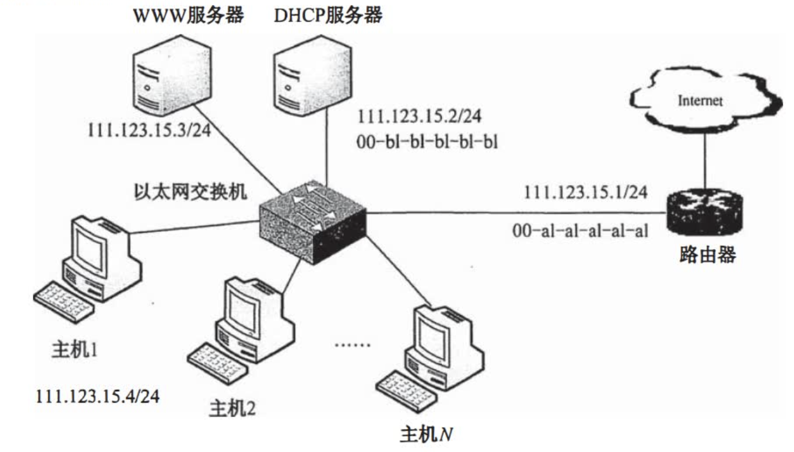

# IPv4

2022.08.15

[toc]

## IPv4分组

### IPv4分组格式

1. 版本（1字节）：IPv4是4

2. 首部长度（1字节）

   1. 可以表示0-15，以**4字节**为单位。
   2. 当首部长度字段为15，首部的长度最长为$$15\cdot 4B=60B$$，常用的首部长度为**20B**。

3. 区分服务

4. 总长度（4字节）

   1. 单位是**1字节**
   2. 数据报最长长度为$$2^{16}-1=65535B$$
   3. **以太网帧长最大为1500B**。
   3. **以太网最小帧长为64B**。
   3. **以太网传送内容最小为46B**。

5. 标识（16bits）

   它是一个计数器，每产生一个数据报就加1，并赋值给标识字段。但它并不是“序号”（因为IP是无连接服务）。当一个数据报的长度超过网络的MTU时，必须分片，此时每个数据报片都复制一次标识号，以便能正确重装成原来的数据报。

6. 标志（3bits）：[保留, DF, MF]

   > 妙计——🍨巴旦木：B(保留)，D(DF)，M(MF)

   1. MF(More Fragment)：最低字段。MF=1代表还有后边分片，MF=0代表是最后一个分片。
   2. DF(Don't Fragment)：中加字段。DF=1，不允许分片；DF=0，允许分片。
   3. 最高字段，保留。

7. 片偏移（13bits）：

   1. 单位**8字节**
   2. 代表本分片在原分片中的位置

8. 生存时间TTL（8bits）：跳数，转发一次减一个一。TTL=0时丢弃。

9. 协议（8bits）

   1. ICMP：1
   2. IGMP：2
   3. TCP：6
   4. UDP：17
   5. EGP：8
   6. IGP：9
   7. IPv6：41
   8. OSPF：89

   > 所有IP协议号总结：
   > * [Wiki：IP协议号列表](https://zh.wikipedia.org/wiki/IP%E5%8D%8F%E8%AE%AE%E5%8F%B7%E5%88%97%E8%A1%A8)
   > * [博客园搬运](https://blog.csdn.net/intelligentgirl/article/details/107808972)

10. 首部校验和（16bits）：只验证首部

11. 源IP地址（32bits）

12. 目的IP地址（32bits）

13. 例题：一个IPv4分组到达一个结点时，其首部信息（以十六进制表示）为：`0x4500 0054 0003 5850 2006 FFF0 7C4E 0302 B40E 0F02`。请回答：

    1)分组的源IP地址和目的IP地址各是什么(点分十进制表示法)？

    【答案】

    **第一行-"版首区总"：版本(1B)+首部长度(1B)+区分服务(2B)+总长度(4B)**

    **第二行-分片相关：标识(4B)+标志(3bits)+片偏移(剩余部分)**

    **第三行：生存时间(2B)+协议(2B)+首部校验和(4B)**

    **第四行：源IP地址**

    **第五行：目的IP地址**

    2)该分组数据部分的长度是多少？

    【答案】

    `0x4[5]00 [0054] 0003 5850 2006 FFF0 7C4E 0302 B40E 0F02`

    注意这里，54并不是真正的54😭，0x54->5\*16+4-5\*4(首4)=64B

    3)该分组是否已经分片？如果有分片，那么偏移量是多少？

    【答案】不能分片

### IP数据报分片

1. 案例：4000B(20B+3980B)的IP数据报，要发送到**MTU=1500B**的链路上：

   原：

   [20+3980]{标识:777, MF=0, DF=0}，将**3980分成1480+1480+1020**

   分片后：

   [20+1480]{标识:777, MF=1, DF=0, 片偏移=0}

   [20+1480]{标识:777, MF=1, DF=0, 片偏移=185}, **1480/8=185**

   [20+1020]{标识:777, MF=0, DF=0, 片偏移=370}

2. 【2018】假设主机192.168.1.1向主机192.168.1.208发送一个总长度为1500B的IP分组，IP分组的头部长度为20B,路由器在通过接口F1转发该IP分组时进行了分片。若分片时尽可能分为最大片，则一个最大IP分片封装数据的字节数是多少？至少需要分为几个分片？每个分片的片偏移量是多少？

   

   **注意!!!!!!分片数据部分需要是8字节的整数倍**
   $$
   \begin{align}
   800-20&=780\\
   \frac{780}{8}&=97.5\to97\\
   97\cdot 8&=776\\
   \end{align}
   $$
   封装数据的最大字节数776字节，分成两个片，片偏移是**0和97**

3. 下列对P分组的分片和重组的描述中，正确的是(B)。

   A.IP分组可以被源主机分片，并在中间路由器进行重组

   B.IP分组可以被路径中的路由器分片，并在目的主机进行重组

   C.IP分组可以被路径中的路由器分片，并在中间路由器上进行重组

   D.IP分组可以被路径中的路由器分片，并在最后一跳的路由器上进行重组

4. 如果到达的分组的片偏移值为100，分组首部中的首部长度字段值为5，总长度字段值为100，那么数据部分第一个字节的编号是多少？能够确定数据部分最后一个字节的编号吗？ 

   答案：800和879！编号是从零开始的😭

### IPv4地址

A,B,C类的网络号分别为1，2，3字节！（包括前边的“0”，“10”，“110”）

**A：1-126**

**B：128-191**

**C：192-223**

**D：240-255**

|                             含义                             | 网络号 | 主机号 | 作为源地址 | 作为目的地址 |
| :----------------------------------------------------------: | :----: | :----: | :--------: | :----------: |
|                          **网络号**                          |        |        |            |              |
|                            本网络                            |  全0   |        |            |    **x**     |
|                            某网络                            | 特定值 |        |            |              |
|                           还回测试                           |  127   |        |            |              |
|                           整个网络                           |  全1   |        |   **x**    |              |
|                          **主机号**                          |        |        |            |              |
|                       网络地址/本主机                        |        |  全0   |            |              |
|                        网络内主机地址                        |        | 特定值 |            |              |
|                        网络内所有主机                        |        |  全1   |            |              |
|                           **组合**                           |        |        |            |              |
| i. 本网络本主机 （DHCP,主机没接入网络, 主机号全0） ii. 路由表中表示默认路由 （整个Internet网络） |  全0   |  全0   |     √      |      x       |
|                       本网络的特定主机                       |  全0   | 特定值 |     √      |      x       |
|                         本网络内广播                         |  全0   |  全1   |     x      |      x       |
|                            某网络                            | 特定值 |  全0   |     x      |      √       |
|                         某网络某主机                         | 特定值 | 特定值 |     √      |      √       |
|                         某网络内广播                         | 特定值 |  全1   |     x      |      √       |
|                                                              |  全1   |  全0   |     x      |              |
|                                                              |  全1   | 特定值 |     x      |              |
| 受限广播地址， 整个TCP/IP内广播 但因为路由器不转发， 所以等同于本网络广播 |  全1   |  全1   |     x      |              |

> 参考链接：
> * [几类特殊的IP地址，全0，全1的组合使用情况](https://blog.csdn.net/Debbie_wxg/article/details/78020875)
> * [IP地址0.0.0.0究竟表示什么的一些看法](https://blog.csdn.net/lzgyou/article/details/6508454)

* 例题：一台主机有两个IP地址，一个地址是192.168.11.25，另一个地址可能是（）。

  A.192.168.11.0

  B.192.168.11.26

  C.192.168.13.25

  D.192.168.11.24

  如果一台主机有两个或两个以上的IP地址，那么说明这台主机属于两个或两个以上的逻辑网络。值得注意的是，在同一时刻一个合法的IP地址只能分配给一台主机，否则就会引起P地址突。IP地址192.168.11.25属于C类IP地址，所以A、B、D同属于一个逻辑网络，只有C的网络号不同，表明它在不同的逻辑网络。

* 访问因特网的每台主机都需要分配IP地址（假定采用默认子网掩码)，下列可以分配给主机的IP地址是()。

  A.192.46.10.0

  B.110.47.10.0

  C.127.10.10.17

  D.211.60.256.21

  A是C类地址，掩码为255.255.255.0，由此得知A地址的主机号为全0（未使用CIDR),因此不能作为主机地址。C是为回环测试保留的地址。D是语法错误的地址，不允许有256。B为A类地址，其网络号是110，主机号是47.10.0。

### 网络地址转换-NAT

1. NAT转换表(举例)

   [WAN](../数据链路层/广域网.md)端是对外的，[LAN](../数据链路层/局域网.md)端是对内的
   
   W代表“Wide”，L代表“Local”

|      WAN端       |      LAN端       |
| :--------------: | :--------------: |
| 138.76.29.7:5001 | 192.168.0.2:2233 |
| 138.76.29.7:5060 | 192.168.0.3:1234 |
|        ..        |        ..        |

2. 三类私有IP地址, 专用互联网/本地互联网

   * **A:10.0.0.0~10.255.255.255**
   * **B:172.16.0.0~172.31.255.255**
   * **C:192.168.0.0~192.168.255.255**

3. 假定一个NAT路由器的公网地址为205.56.79.35，并且有如下表项：

   | 转换端口 | 源IP地址       | 源端口 |
   | -------- | -------------- | ------ |
   | 2056     | 192.168.32.56  | 21     |
   | 2057     | 192.168.32.56  | 20     |
   | 1892     | 192.168.46.26  | 80     |
   | 2256     | 192.168.55.106 | 80     |

   它收到一个源IP地址为192.168.32.56、源端口为80的分组，其动作是()。

   A.转换地址，将源IP变为205.56.79.35，端口变为2056，然后发送到公网

   B.添加一个新的条目，转换P地址及端口然后发送到公网

   C.不转发，丢弃该分组

   D.直接将分组转发到公网

   【答案：C】NAT的表项需要管理员添加，这样才能控制一个内网到外网的网络连接。题目中主机发送的分组在NAT表项中找不到（端口80从源端口而非转换端口找），所以服务器不转发该分组。

4. 【2020】 (9分)某校园网有两个局域网，通过路由器R1、R2和R3互联后接入Internet,S1和S2为以太网交换机。局域网采用静态IP地址配置，路由器部分接口以及各主机的IP地址如下图所示。

   

   若H2主动访问Web服务器时，将HTTP请求报文封装到IP数据报P中发送，则H2发送P的源IP地址和目的IP地址分别是什么？经过R3转发后，IP的源IP地址和目的IP地址分别是什么？经过R2转发后，IP的源IP地址和目的IP地址分别是什么？

   192.168.1.2 $\to$ 203.10.2.2

   203.10.2.6 $\to$ 203.10.2.2

   203.10.2.6 $\to$ 192.168.1.1

   > 注意⚠️！第三问答案并没有改变源IP！
   >
   > 我的理解：NAT就是里边可以看见外边，外边看不见里边，从而达到隐藏身份

## 子网划分与子网掩码、CIDR

### 子网划分与子网掩码

1. IP地址={网络号，子网号，主机号}

2. IP地址和子网掩码与运算得到网络号
   $$
   \begin{align}
   &192.168.5.56\ \&\ 255.255.255.0:\\
   &01100000.01011000.00000101.00111000\ IP地址\\
   \&&11111111.11111111.11111111.00000000\ 子网掩码\\
   =&01100000.01011000.00000101.00000000\ 网络号
   \end{align}
   $$

3. 【2019统考真题】若将101.200.16.0/20划分为5个子网，则可能的最小子网的可分配IP地址数是()。

   A.126

   B.254

   C.510

   D.1022
   $$
   \begin{align}
   101.200.0001|0000.0/20\\
   101.200.00010|000.0/21\\
   101.200.000110|00.0/22\\
   101.200.0001110|0.0/23\\
   101.200.00011101|.0/24\\
   101.200.00011100|.0/24\\
   2^8-2=254\to B
   \end{align}
   $$

4. 【2016统考真题】如下图所示，假设H1与H2的默认网关和子网掩码均分别配置为192.168.3.1和255.255.255.128，H3和H4的默认网关和子网掩码均分别配置为192.168.3.254和255.255.255.128，则下列现象中可能发生的是()。

   A.H1不能与H2进行正常IP通信

   B.H2与H4均不能访问Internet

   C.H1不能与H3进行正常IP通信

   D.H3不能与H4进行正常IP通信

   答案：C。因为子网掩码都是255.255.255.128，所以主机号是最后7位。可以看到H2的ip是192.168.3.3，和H4的ip是192.168.3.252，不属于一个子网。H2、H1与H3、H4通过交换机连接，交换机不能连通不同子网。

5. 【2016统考真题】在题35图（上一题）中，假设连接R1、R2和R3之间的点对点链路使用地址201.1.3.x/30,当H3访问Web服务器S时，R2转发出去的封装HTTP请求报文的IP分组是源IP地址和目的IP地址，它们分别是（）。

   A.192.168.3.251,130.18.10.1

   B.192.168.3.251,201.1.3.9

   C.201.1.3.8,130.18.10.1

   D.201.1.3.10,130.18.10.1

   答案：D。因为R1、R2和R3之间的点对点链路使用地址201.1.3.x/30，主机号为后两位。R1下边写了一个“201.31.3.9”，可以得到子网号，201.31.3.8/30，对应的主机号只有，201.31.3.9/30，201.31.3.10/30两个。

6. 现有一公司需要创建内部网络，该公司包括工程技术部、市场部、财务部和办公室4个部门，每个部门有20~30台计算机。试问：

   1)若要将几个部门从网络上分开，如果分配给该公司使用的地址为一个C类地址，网络地址为192.168.161.0，那么如何划分网络？可以将几个部门分开？

   2)确定各部门的网络地址和子网掩码，并写出分配给每个部门网络中的主机IP地址范围。

   答案：注意，**子网号和主机号不能全0全1**

   | 序号 | 网络            |
   | ---- | --------------- |
   | 0    | 192.168.161.32  |
   | 1    | 192.168.161.64  |
   | 2    | 192.168.161.96  |
   | 3    | 192.168.161.128 |

7. 【2009】47. (9分)某网络拓扑如下图所示，路由器R1通过接口E1、E2分别连接局域网1、局域网2，通过接口L0连接路由器R2,并通过路由器R2连接域名服务器与互联网。R1的L0接口的IP地址是202.118.2.1，R2的L0接口的IP地址是202.118.2.2，L1接口的IP地址是130.11.120.1，E0接口的IP地址是202.118.3.1，域名服务器的IP地址是202.118.3.2。

   

   R1和R2的路由表结构为

   

   1)将IP地址空间202.118.1.0/24划分为2个子网分别分配给局域网1、局域网2，每个局域网需分配的IP地址数不少于120个。请给出子网划分结果，说明理由或给出必要的计算过程。

   【答案】：120+2=122->2^7, 202.118.1.0/25, 202.118.1.128/25

   2)请给出R1的路由表，使其明确包括到局域网1的路由、局域网2的路由、域名服务器的主机路由和互联网的路由。

   【答案】

   |  目的网络IP   |    子网掩码     | 下一跳IP地址 | 接口 |
   | :-----------: | :-------------: | :----------: | :--: |
   |  202.118.1.0  | 255.255.255.128 |      -       |  E1  |
   | 202.118.1.128 | 255.255.255.128 |      -       |  E2  |
   |  202.118.3.2  | 255.255.255.255 | 202.118.2.2  |  L0  |
   |    0.0.0.0    |     0.0.0.0     | 202.118.2.2  |  L0  |

   > **注意⚠️：最后一行是默认路由！！**

   3)请采用路由聚合技术，给出R2到局域网1和局域网2的路由。

   【答案】
   $$
   \begin{cases}
   202.118.1.1\\
   202.118.1.0 
   \end{cases}
   \to202.118.1.0
   $$

   | 目的网络IP  |    子网掩码     | 下一跳IP地址 | 接口 |
   | :---------: | :-------------: | :----------: | :--: |
   | 202.118.1.0 | 255.255.255.128 | 202.118.2.1  |  L0  |

8. 【2018统考真题】某公司的网络如下图所示。IP地址空间192.168.1.0/24均分给销售部和技术部两个子网，并已分别为部分主机和路由器接口分配了IP地址，销售部子网的MTU=1500B,技术部子网的MTU=800B。

   

   回答下列问题：

   销售部子网的广播地址是什么？技术部子网的子网地址是什么？若每台主机仅分配一个IP地址，则技术部子网还可以连接多少台主机？

   【答案】
   $$
   \begin{align}
   192.168.1.0/24\\
   \to 192.168.1.0/25\\
   \to 192.168.1.1/25\\
   广播地址: 192.168.1.127\\
   子网地址: 192.168.1.128\\
   注意要减去路由器😭: 254-208-1=45
   \end{align}
   $$
   

### 无分类编址CIDR

1. IP地址={网络前缀，主机号}

2. 斜线记法：128.14.32.5/20，代表前边20位是网络号。

3. 网络前缀相同的连续IP地址组成“CIDR地址块”，一个CIDR地址块可以表示很多地址，这种地址的聚合称为路由聚合/构成超网。

4. CIDR查找路由表的方法：为了更加有效地查找最长前缀匹配，通常将无分类编址的路由表存放在一种层次式数据结构中，然后自上而下地按层次进行查找。这里最常用的数据结构就是**二叉线索**。

5. 转发表包含：{目的网络，下一条地址}

6. 采用CIDR编址时，如果一个分组在转发表中可以找到多个匹配的前缀，那么应当选择前缀最长的一个作为匹配的前缀，称为**最长前缀匹配**。网络前缀越长，其地址块就越小，因而路由就越精准。为了更快地查找转发表，可以按照前缀的长短，将前缀**最长的排在第1行，按前缀长度的降序排列**。这样，从第1行最长的开始查找，只要检索到匹配的，就不必再继续查找。

7. **两种特殊的路由**：

   1)**主机路由**：对特定目的主机的IP地址专门指明一个路由，以方便网络管理员控制和测试网络。若特定主机的IP地址是a.b.c.d,则转发表中对应项的目的网络是**a.b.c.d/32**。**/32表示的子网掩码没有意义**，但这个特殊的前缀可以用在转发表中。

   2)**默认路由**：用特殊前缀0.0.0.0/0表示默认路由，全0掩码和任何目的地址进行按位与运算，结果必然为全0，即必然和转发表中的0.0.0.0/0相匹配。只要目的网络是其他网络（不在转发表中)，就一律选择默认路由。

8. 路由器执行的分组转发算法如下：
   1. 从收到的IP分组的首部**提取**目的主机的IP地址D(即**目的地址**)。
   2. 若**查找到特定主机路由**（目的地址为D),就按照这条路由的下一跳转发分组：否则从转发表中的下一条（即按前缀长度的顺序)开始检查，执行步骤3)。
   3. （**最长前最匹配**）将这一行的子网掩码与目的地址D进行按位与运算。若运算结果与本行的前缀匹配，则查找结束，按照“下一跳”指出的进行处理（或者直接交付本网络上的目的主机，或通过指定接口发送到下一跳路由器)。否则，若转发表还有下一行，则对下一行进行检查，重新执行步骤3)。否则，执行步骤4)。
   4. 若转发表中有一个**默认路由**，则把分组传送给默认路由：否则，报告转发分组出错。值得注意的是，转发表（或路由表）并未给分组指明到某个网络的完整路径（即先经过哪个路由器，然再经过哪个路由器等)。转发表指出，到某个网络应当先到某个路由器（即下一跳路由器)，在到达下一跳路由器后，再继续查找其转发表，知道下一步应当到哪个路由器。这样一步一步地查找下去，直到最后到达目的网络。

9. 【最长前最匹配例题】路由器R0的路由表见下表。若进入路由器R0的分组的目的地址为132.19.237.5，该分组应该被转发到( )下一条路由器。

   |    目的网络     | 下一跳 |
   | :-------------: | :----: |
   |   132.0.0.0/8   |   R1   |
   |  132.19.0.0/11  |   R2   |
   | 132.10.232.0/22 |   R3   |
   |    0.0.0.0/0    |   R4   |

   【答案】R2
   $$
   \begin{align}
   &132.0010011.11101101.0.0\\
   &132|.19.0.0√\\
   &132.001|0011.0.0√\\
   &132.0001010.232.0/22\times\\
   \end{align}
   $$

## ARP、DHCP与ICMP

|        |   ARP    |  DHCP  |  ICMP  |
| :----: | :------: | :----: | :----: |
|   层   |  网络层  | 应用层 | 网络层 |
| 封装于 | 以太网帧 |  UDP   |   IP   |

### ARP

Address Resolution Protocol

1. 过程：无论网络层使用什么协议，在实际网络的链路上传送数据帧时，最终必须使用硬件地址。所以需要一种方法来完成IP地址到MAC地址的映射，这就是地址解析协议(Address ResolutionProtocol,.ARP)。每台主机都设有一个**ARP高速缓存**，用来存放本局域网上各<u>主机和路由器的IP地址到MAC地址的映射表，称ARP表</u>。使用ARP来动态维护此ARP表。

   ARP工作在**网络层**，其工作原理如下：主机A欲向本局域网上的某台主机B发送IP数据报时，先在其ARP高速缓存中查看有无主机B的IP地址。

   * 如果有，就可查出其对应的硬件地址，再将此硬件地址写入MAC帧，然后通过局域网将该MAC帧发往此硬件地址。
   * 如果没有，那么就通过使用目的MAC地址为**FF-FF-FF-FF-FF-FF**的帧来封装并广播**ARP请求分组**（广播发送），使同一个局域网里的所有主机都收到此ARP请求。

   主机B收到该ARP请求后，向主机A发出**ARP响应分组**（单播发送），分组中包含主机B的IP与MAC地址的映射关系，主机A收到ARP响应分组后就将此映射写入ARP缓存，然后按查询到的硬件地址发送MAC帧。

   > ARP由于“看到了”IP地址，所以它工作在网络层
   >
   > NAT路由器由于“看到了”端口，所以它工作在传输层。

   注意：ARP用于解决同一个局域网上的主机或路由器的IP地址和硬件地址的映射问题。如果所要找的主机和源主机不在同一个局域网上，那么就要通过ARP找到一个位于本局域网上的某个路由器的硬件地址，然后把分组发送给这个路由器，让这个路由器把分组转发给下一个网络。

2. 【例题】下列情况需要启动 ARP 请求的是（）。
   A. 主机需要接收信息，但ARP表中没有源IP地址与MAC 地址的映射关系
   B. 主机需要接收信息，但ARP表中已有源IP地址与 MAC 地址的映射关系
   C. 主机需要发送信息，但ARP表中没有目的IP地址与 MAC 地址的映射关系
   D. 主要需要发送信息，但ARP表中已有目的IP地址与 MAC 地址的映射关系

   【答案】：C

3. 【例题】ARP 的工作过程中，ARP请求是(）发送，ARP 响应是（）发送。
   A.单播
   B.组播
   C.广播

   【答案】：C、A

4. 【例题】主机发送IP 数据报给主机 B，途中经过了5个路由器。请问在此过程中总共使用了（）次ARP.
   A. 5
   B. 6
   C. 10
   D. 11

   【答案】：主机先使用 ARP 来查询本网络路由器的地址，然后每个路由器使用 ARP 来寻找下一跳路由的地址，总共使用了 4 次ARP从主机A网络的路由器到达主机 B 网络的路由器。然后，主机B网络的路由器使用 ARP 找到主机 B，所以总共使用了 1+4+1=6次 ARP.-> B

### DHCP

1. 简介：动态主机配置协议(Dynamic Host Configuration Protocol,DHCP)常用于给主机动态地分配IP地址，它提供了即插即用的联网机制，这种机制允许一台计算机加入新的网络和获取IP地址而不用手工参与。**DHCP是应用层协议，它是基于UDP的**。

2. DHCP的工作原理如下：**使用客户/服务器模式**。需要IP地址的主机在启动时就向DHCP服务器广播发送发现报文，这时该主机就成为DHCP客户。本地网络上所有主机都能收到此广播报文，但只有DHCP服务器才回答此广播报文。DHCP服务器先在其数据库中查找该计算机的配置信息。若找到，则返回找到的信息。若找不到，则从服务器的IP地址池中取一个地址分配给该计算机。DHCP服务器的回答报文称为提供报文。

3. DHCP服务器和DHCP客户端的交换过程如下：

   * DHCP客户机广播**“DHCP发现”**消息，试图找到网络中的DHCP服务器，以便从DHCP服务器获得一个IP地址。源地址为**0.0.0.0**，目的地址为**255.255.255.255**。
   * DHCP服务器收到“DHCP发现”消息后，广播**“DHCP提供”**消息，其中包括提供给DHCP客户机的IP地址。源地址为DHCP服务器地址，目的地址为255.255.255.255。
   * DHCP客户机收到“DHCP提供”消息，如果接受该IP地址，那么就广播**“DHCP请求”**消息向DHCP服务器请求提供IP地址。源地址为**0.0.0.0**，目的地址为**255.255.255.255**。
   * DHCP服务器广播“DHCP确认”消息，将IP地址分配给DHCP客户机。源地址为DHCP服务器地址，目的地址为255.255.255.255。DHCP允许网络上配置多台DHCP服务器，当DHCP客户机发出“DHCP发现”消息时，有可能收到多个应答消息。这时，DHCP客户机只会挑选其中的一个，通常挑选最先到达的。

   | 报文     | 源IP     | 目的IP          | client ip | your client ip | next server ip | relay agent ip |
   | -------- | -------- | --------------- | --------- | -------------- | -------------- | -------------- |
   | DHCP发现 | 0.0.0.0  | 255.255.255.255 | -         | -              | -              | -              |
   | DHCP提供 | 服务器IP | 255.255.255.255 | -         | 分配的IP       | 服务器IP       | -              |
   | DHCP请求 | 0.0.0.0  | 255.255.255.255 | -         | -              | -              | -              |
   | DHCP确认 | 服务器IP | 255.255.255.255 | -         | 分配的IP       | 服务器IP       | -              |

4. 租用期：DHCP服务器分配给DHCP客户的IP地址是临时的，因此DHCP客户只能在一段有限的时间内使用这个分配到的IP地址。DHCP称这段时间为租用期。租用期的数值应由DHCP服务器自己决定，DHCP客户也可在自已发送的报文中提出对租用期的要求。
5. DHCP的客户端和服务器端需要通过广播方式来进行交互，原因是在DHCP执行初期，客户端不知道服务器端的IP地址，而在执行中间，客户端并未被分配IP地址，从而导致两者之间的通信必须采用广播的方式。采用UDP而不采用TCP的原因也很明显：TCP需要建立连接，如果连对方的IP地址都不知道，那么更不可能通过双方的套接字建立连接。
6. DHCP是应用层协议，因为它是通过客户/服务器模式工作的，DHCP客户端向DHCP服务器请求服务，而其他层次的协议是没有这两种工作方式的。
7. 【2015】47.(9分)某网络拓扑如下图所示，其中路由器内网接口、DHCP服务器、WWW服务器与主机1均采用静态IP地址配置，相关地址信息见图中标注；主机2~主机N通过DHCP服务器动态获取IP地址等配置信息。

请回答下列问题。

1)DHCP服务器可为主机2~主机N动态分配IP地址的最大范围是什么？主机2使用DHCP协议获取IP地址的过程中，发送的封装DHCP Discover报文的IP分组的源IP地址和目的IP地址分别是什么？

【答案】
$$
\begin{align}
主机1&: 111.123.15|4/24\\
网络号&:111.123.15|0/24\\
可以分配的IP范围&:111.123.15.5-111.123.15.254\\
DHCP发现 源IP&:0.0.0.0\\
DHCP发现 目的IP&:255.255.255.255
\end{align}
$$

2)若主机2的ARP表为空，则该主机访问Internet时，发出的第一个以太网帧的目的MAC地址是什么？封装主机2发往Internet的IP分组的以太网帧的目的MAC地址是什么？

【答案】

FF:FF:FF:FF:FF:FF

00:a1:a1:a1:a1:a1

3)若主机1的子网掩码和默认网关分别配置为255.255.255.0和111.123.15.2，则该主机是否能访问WWW服务器？是否能访问Internet?请说明理由。

【答案】

可以访问WWW服务器，**不**可以访问Internet

主机1能访问WWW服务器，但不能访问Internet。由于主机1的子网掩码配置正确而默认网关IP地址被错误地配置为111.123.15.2（正确IP地址是111.123.15.1)，所以主机1可以访问在同一个子网内的WWW服务器，但当主机1访问Internet时，主机1发出的IP分组会被路由到错误的默认网关(111.123.15.2)，从而无法到达目的主机。

### ICMP

1. 简介：为了提高IP数据报交付成功的机会，在网络层使用了网际控制报文协议(Internet Control Message Protocol, ICMP)来让主机或路由器报告差错和异常情况。**ICMP报文作为IP层数据报的数据**，加上数据报的首部，组成IP数据报发送出去。**ICMP是IP层协议**。
2. ICMP报文的种类有两种，即ICMP差错报告报文和ICMP询问报文。
   * **ICMP差错报告报文**用于目标主机或到目标主机路径上的路由器向源主机报告差错和异常情况。共有以下5种类型：
     * **终点不可达**。当路由器或主机不能交付数据报时，就向源点发送终点不可达报文。
     * **源点抑制**。当路由器或主机由于<u>拥塞</u>而丢弃数据报时，就向源点发送源点抑制报文，使源点知道应当把数据报的发送速率放慢。
     * **时间超过**。当路由器收到生存时间(TTL)为零的数据报时，除丢弃该数据报外，还要向源点发送时间超过报文。当终点在预先规定的时间内不能收到一个数据报的全部数据报片时，就把已收到的数据报片都丢弃，并向源点发送时间超过报文。
     * **参数问题**。当路由器或目的主机收到的数据报的首部中有的字段的值不正确时，就丢弃该数据报，并向源点发送参数问题报文。
     * **改变路由（重定向）**。路由器把改变路由报文发送给主机，让主机知道下次应将数据报发送给另外的路由器（可通过更好的路由）。
   * 不应发送ICMP差错报告报文的几种情况如下：
     * 对ICMP差错报告报文不再发送ICMP差错报告报文。
     * 对第一个分片的数据报片的所有后续数据报片都不发送ICMP差错报告报文。
     * 对具有[组播](./IP组播.md)地址的数据报都不发送ICMP差错报告报文。
     * 对具有特殊地址（如127.0.0.0或0.0.0.0）的数据报不发送ICMP差错报告报文。
   * **ICMP询问报文**有4种类型：**回送请求和回答报文**、**时间戳请求和回答报文**、**地址掩码请求和回答报文**、**路由器询问和通告报文**，最常用的是前两类。
   * ICMP的两个常见应用是分组网间探测PING(用来测试两台主机之间的连通性)和Traceroute(UNIX中的名字，在Windows中是Tracert,可以用来跟踪分组经过的路由)。其中**PING使用了ICMP回送请求和回答报文**, **Traceroute(Tracert)使用了ICMP时间超过报文**。注意：**PING工作在应用层**，它直接使用网络层的ICMP, 而未使用传输层的TCP或UDP。**Traceroute/Tracert工作在网络层**。
