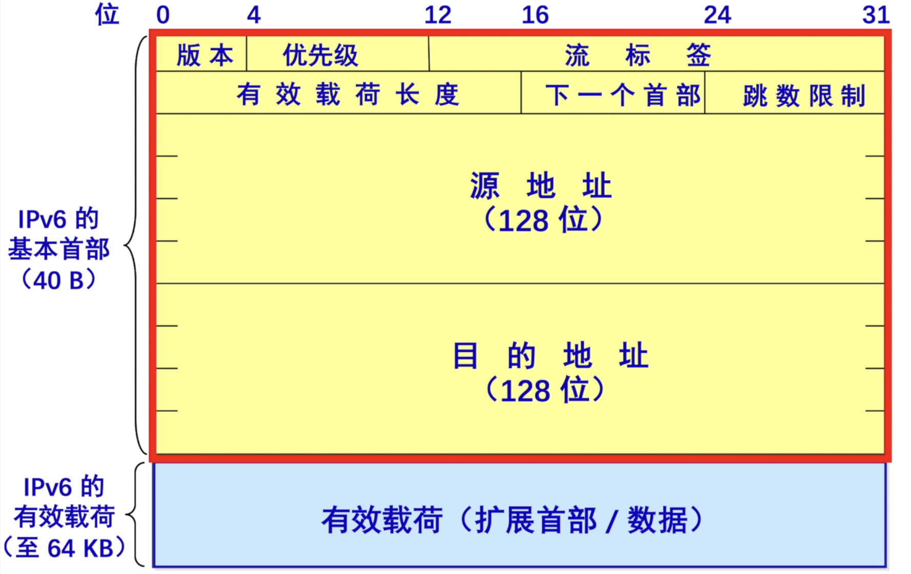

# IPv6

2022.2.10

* 数据报

  * **128位地址**
  * **首部长度是8B整数倍**（IPv4是4B整数倍）
  * 只能在主机处分片->也可以说**IPv6不能分片**（IPv4是主机和路由器处分片）
  * **没有检验和字段**

  

* IPV6数据报的目的地址可以是以下**三种基本类型地址**之一：

  * **单播**。单播就是传统的点对点通信。
  * **多播**。多播是一点对多点的通信，分组被交付到一组计算机的每台计算机。
  * **任播**。这是IPV6增加的一种类型。任播的目的站是一组计算机，但数据报在交付时只交付其中的一台计算机，通常是距离最近的一台计算机。

* **表示法**：IPV4地址通常使用点分十进制表示法。如果IPv6也使用这种表示法，那么地址书写起来将会相当长。在IPV6标准中指定了一种比较紧凑的表示法，即把地址中的每4位用一个十六进制数表示，并用冒号分隔每16位，如:$$4BF5:AA12:0216:FEBC:BA5F:039A:BE9A:2170$$

  通常可以把P6地址缩写成更紧凑的形式。当16位域的**开头有一些0**时，可以采用一种缩写表示法，但在域中必须至少有一个数字。例如，可以把地址4BF5:0000:0000:0000:BA5F:039A:000A:2176缩写为4BF5:0:0:0:BA5F:39A:A:2176。

  当有相继的0值域时，还可以进一步缩写。这些域可以用**双冒号**缩写(::)。当然，双冒号表示法在一个地址中**仅能出现一次**，因为0值域的个数没有编码，需要从指定的总的域的个数来推算。这样一来，前述地址可被更紧凑地书写成4BF5::BA5F:39A:A:2176。

* IPv6扩展了IPv4地址的分级概念，它使用以下3个等级：
  * 第一级（顶级）指明全球都知道的公共拓扑：
  * 第二级（场点级)指明单个场点；
  * 第三级指明单个网络接口。PV6地址采用多级体系主要是为了使路由器能够更快地查找路由。
* IPv4向IPv6过渡只能采用逐步演进的办法，同时还必须使新安装的IPv6系统能够向后兼容。IPV6系统必须能够接收和转发IPv4分组，并且能够为Pv4分组选择路由。IPv4向IPv6过渡可以采用**双协议栈**和**隧道技术**两种策略：双协议栈技术是指在一台设备上同时装有IPv4和IPv6协议栈，那么这台设备既能和IPv4网络通信，又能和IPv6网络通信。如果这台设备是一个路由器，那么在路由器的不同接口上分别配置了IPv4地址和IPv6地址，并很可能分别连接了IPv4网络和IPv6网络：如果这台设备是一台计算机，那么它将同时拥有PV4地址和IPv6地址，并具备同时处理这两个协议地址的功能。隧道技术是将整个IPv6数据报封装到IPv4数据报的数据部分，使得IPv6数据报可以在IPv4网络的隧道中传输。