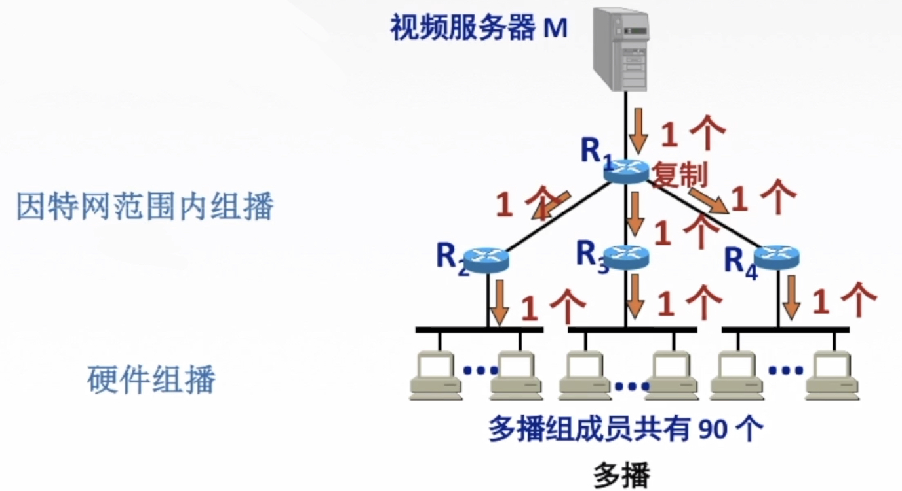
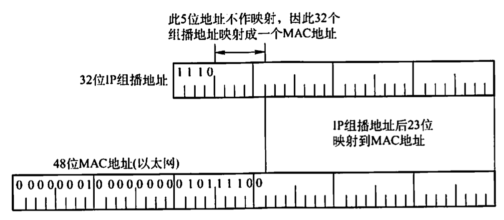

# IP组播

2022.3.12

[toc]

## 组播的概念

为了能够支持像视频点播和视频会议这样的多媒体应用，网络必须实施某种有效的组播机制。使用多个单播传送来仿真组播总是可能的，但这会引起主机上大量的处理开销和网络上太多的交通量。人们所需要的组播机制是让源计算机一次发送的单个分组可以抵达用一个组地址标识的若干目标主机，并被它们正确接收。

组播一定仅应用于**UDP**,它对将报文同时送往多个接收者的应用来说非常重要。而TCP是一个面向连接的协议，它意味着分别运行于两台主机（由IP地址来确定）内的两个进程（由端口号来确定)之间存在一条连接，因此会一对一地发送。

使用组播的缘由是，有的应用程序要把一个分组发送给多个目的地主机。不是让源主机给每个目的地主机都发送一个单独的分组，而是让源主机把单个分组发送给一个组播地址，该组播地址标识一组地址。网络（如因特网）把这个分组的副本投递给该组中的每台主机。主机可以选择加入或离开一个组，因此一台主机可以同时属于多个组。

因特网中的IP组播也使用组播组的概念，每个组都有一个特别分配的地址，要给该组发送的计算机将使用这个地址作为分组的目标地址。在IPv4中，这些地址在D类地址空间中分配，而IPv6也有一部分地址空间保留给组播组。

主机使用一个称为**IGMP**(因特网组管理协议)的协议加入组播组。它们使用该协议通知本地网络上的路由器关于要接收发送给某个组播组的分组的愿望。通过扩展路由器的路由选择和转发功能，可以在许多路由器互联的支持硬件组播的网络上面实现因特网组播。

需要注意的是，主机组播时仅发送一份数据，只有数据在传送路径出现分岔时才将分组复制后继续转发。因此，对发送者而言，数据只需发送一次就可发送到所有接收者，大大减轻了网络的负载和发送者的负担。组播需要路由器的支持才能实现，能够运行组播协议的路由器称为组播路由器。单播与组播的比较如图所示。

## IP组播地址

IP组播使用**D类地址格式**。D类地址的前四位是1110，因此D类地址范围是224.0.0.0~239.255.255.255。每个D类IP地址标志一个组播组。

组播数据报和一般的IP数据报的区别是，前者使用D类IP地址作为目的地址，并且首部中的<u>协议字段值是2</u>，表明使用IGMP。需要注意的是：

1)组播数据报也是“尽最大努力交付”，不提供可靠交付。

2)组播地址<u>只能用于目的地址</u>，而不能用于源地址。

3)对组播数据报<u>不产生ICMP差错报文</u>。因此，若在PING命令后面键入组播地址，将永远不会收到响应。

4)并非所有的D类地址都可作为组播地址。

IP组播可以分为两种：一种<u>只在本局域网</u>上进行硬件组播：另一种则<u>在因特网的范围</u>内进行组播。在因特网上进行组播的最后阶段，还是要把组播数据报在局域网上用硬件组播交付给组播组的所有成员。下面讨论这种硬件组播。

LAN拥有的以太网组播地址的范围是从**01-00-5E**-00-00-00到**01-00-5E**-7F-FF-FF。不难看出，在每个地址中，只有23位可用作组播。这只能和D类P地址中的23位有一一对应关系。D类IP地址可供分配的有28位，可见在这28位中，前5位不能用来构成以太网的硬件地址，例如，IP组播地址224.128.64.32（即E0-80-40-20)和另一个IP组播地址224.0.64.32（即E0-00-40-20)转换成以太网的硬件组播地址都是01-00-5E-00-40-20。由于组播IP地址与以太网硬件地址的映射关系不是唯一的，因此收到组播数据报的主机，还要在IP层利用软件进行过滤，把不是本主机要接收的数据报丢弃。

01.以下关于组播概念的描述中，错误的是（C)。

A.在单播路由选择中，路由器只能从它的一个接口转发收到的分组

B.在组播路由选择中，路由器可以从它的多个接口转发收到的分组

C.用多个单播仿真一个组播时需要更多的带宽

D.用多个单播仿真一个组播时时延基本上是相同的

02.在设计组播路由时，为了避免路由环路，(B)。

A.采用了水平分割技术

B.构造组播转发树

C.采用了IGMP

D.通过生存时间(TTL)字段

03.以太网组播IP地址224.215.145.230应该映射到的组播MAC地址是(A)。

A.01-00-5E-57-91-E6

B.01-00-5E-D7-91-E6

C.01-00-5E-5B-91-E6

D.01-00-5E-55-91-E6

【答案】：01-00-5E + 1bit的0 + IP地址

215.145.230

 -> 1101 0111. 1001 0001. 1110 0111

 -> 0101 0111. 1001 0001. 1110 0111

 -> 57-91-E6

04.下列地址中，(B)是组播地址。

A.10.255.255.255

B.228.47.32.45

C.192.32.44.59

D.172.16.255.255

## IGMP

要使路由器知道组播组成员的信息，需要利用**因特网组管理协议**(Internet Group Management Protocol,IGMP)。连接到局域网上的组播路由器还必须和因特网上的其他组播路由器协同工作，以便把组播数据报用最小代价传送给所有组成员，这就需要使用组播路由选择协议。

IGMP并不是在因特网范围内对所有组播组成员进行管理的协议。IGMP不知道IP组播组包含的成员数，也不知道这些成员分布在哪些网络上。IGMP让连接到本地局域网上的组播路由器知道本局域网上是否有主机参加或退出了某个组播组。

IGMP应视为网际协议IP的一个组成部分，其工作可分为两个阶段。

* 第一阶段：当某台主机加入<u>新的组播组时，该主机应向组播组的组播地址发送一个IGMP报文</u>，声明自己要成为该组的成员。本地的组播路由器收到IGMP报文后，将组成员关系转发给因特网上的其他组播路由器。

* 第二阶段：因为组成员关系是动态的，<u>本地组播路由器要周期性地探询本地局域网上的主机，以便知道这些主机是否仍继续是组的成员</u>。只要对某个组有一台主机响应，那么组播路由器就认为这个组是活跃的。但一个组在经过几次的探询后仍然没有一台主机响应时，则不再将该组的成员关系转发给其他的组播路由器。

组播路由选择实际上就是要找出以源主机为根结点的**组播转发树**，其中每个分组在每条链路上只传送一次（即在组播转发树上的路由器不会收到重复的组播数据报）。不同的多播组对应于不同的多播转发树：同一个多播组，对不同的源点也会有不同的多播转发树。

在许多由路由器互联的支持硬件多点传送的网络上实现因特网组播时，主要有三种路由算法：<u>第一种是基于链路状态的路由选择</u>；<u>第二种是基于距离-向量的路由选择</u>；<u>第三种可以建立在任何路由器协议之上，因此称为**协议无关的组播**(PIM)</u>。