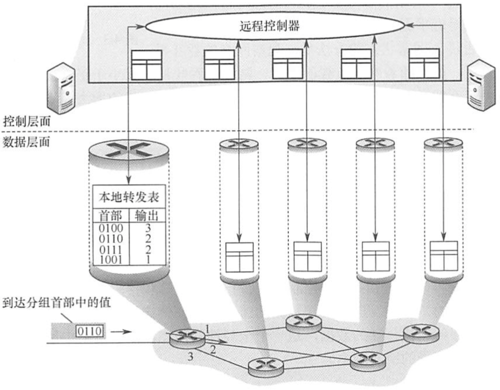

# 网络层的功能

2022.3.12

## 协议名称整理与专题链接

* 网络层的功能

  * **异构网络互联**

  * **路由与转发**

  * **SDN基本概念**

  * **拥塞控制**
* [路由算法](./路由算法.md)
  * **静态路由**（手工配置）
  * **动态路由**
    * **距离向量路由算法**
      * **RIP路由协议**
    * **链路状态路由算法**
      * **OFPS路由协议**
    * **层次路由**
      * **自治系统**
      * **内部网关协议/域内路由选择（IGP）**
        * RIP与OFPS
      * **外部网关协议/域间路由选择（EGP）**
        * **BGP路由协议**
* [IPv4](./IPv4.md)
  * **IPv4分组**
  * **IPv4地址（传统分类）**
  * **网络地址转换NAT**
  * **子网划分与子网掩码**
  * **无分类编址CIDR**
  * **路由聚合/构成超网**
  * **ARP**
  * **DHCP**
  * **ICMP**

* IPv6
  * **IPv6的主要特点;IPv6地址**

* IP组播
  * **组播的概念**
  * **IP组播地址**
  * **IGMP**

* 移动IP
  * 移动IP的概念
  * 移动IP通信过程

* 网络层设备

路由器的组成和功能;路由表与路由转发

## 网络层功能

1. 异构网络互联——物理层与链路层都不一样的异构网络

2. 路由与转发

3. SDN（软件定义网络）

   1. 集中式控制面板（Openflow协议等），分布式数据面板
   2. **北向接口**：对**上层应用的开发者**, 北向接口提供了一系列丰富的API,开发者不用关心硬件细节
   3. **南向接口**：**SDN控制器和转发设备建立双向会话**的接口称为南向接口,通过不同的南向接协议(如 Openflow),SDN控制器就可兼容不同的硬件设备,同时可以在设备中实现上层用的逻辑。
   4. **东西接口**：**SDN控制器集群内部控制器之间**的通信接口称为东西向接口,用于增强整个控制层面的可靠性和可拓展性。

   

4. 拥塞控制

   1. **全局性**的问题,涉及网络中所有的主机、路由器及导致网络传输能力下降的所有因素。
   2. 开环控制（在运行前分配好）与闭环控制（运行中调控）

5. 【例题】在路由器互联的多个局域网的结构中,要求每个局域网(C)

   A.物理层协议可以不同,而数据链路层及其以上的高层协议必须相同

   B.物理层、数据链路层协议可以不同,而数据链路层以上的高层协议必须相同

   C.**物理层、数据链路层、网络层协议可以不同,而网络层以上的高层协议必须相同**

   D.物理层、数据链路层、网络层及高层协议都可以不同