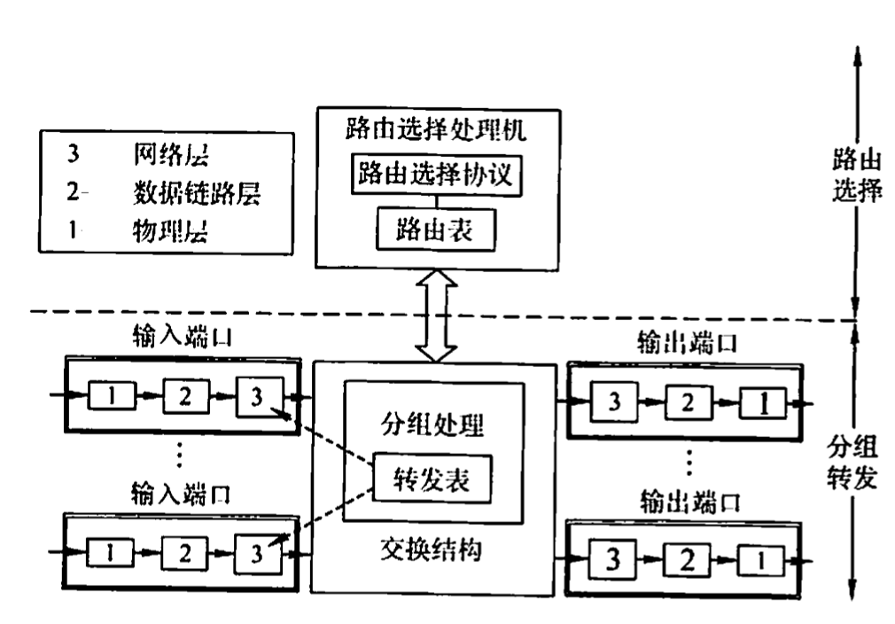
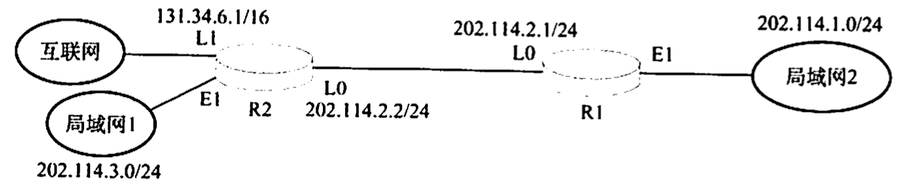
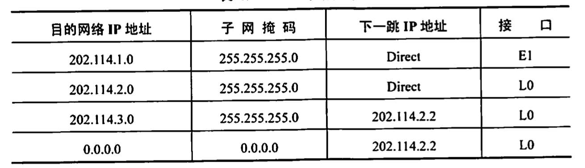

# 网络层设备

2022.3.12

## 路由器的组成和功能

路由器是一种具有多个输入/输出端口的专用计算机，其任务是连接不同的网络（连接异构网络)并完成路由转发。在多个逻辑网络（即多个广播域）互联时必须使用路由器。

当源主机要向目标主机发送数据报时，路由器先检查源主机与目标主机是否连接在同一个网络上。如果源主机和目标主机在同一个网络上，那么直接交付而无须通过路由器。如果源主机和目标主机不在同一个网络上，那么路由器按照转发表（路由表）指出的路由将数据报转发给下一个路由器，这称为间接交付。可见，在同一个网络中传递数据无须路由器的参与，而跨网络通信必须通过路由器进行转发。例如，路由器可以连接不同的LAN,连接不同的VLAN,连接不同的WAN,或者把LAN和WAN互联起来。路由器隔离了广播域。

从结构上看，路由器由路由选择和分组转发两部分构成，如图4.15所示。而从模型的角度看，路由器是网络层设备，它实现了网络模型的下三层，即物理层、数据链路层和网络层。

注意：如果一个存储转发设备实现了某个层次的功能，那么它就可以互联两个在该层次上使用不同协议的网段（网络)。如网桥实现了物理层和数据链路层，那么网桥可以互联两个物理层和数据链路层不同的网段；但中继器实现了物理层后，却不能互联两个物理层不同的网段，这是因为中继器不是存储转发设备，它属于直通式设备。

**路由选择部分也称控制部分**，其核心构件是**路由选择处理机**。路由选择处理机的任务是根据所选定的路由选择协议构造出**路由表**，同时经常或定期地和相邻路由器交换路由信息而不断更新和维护路由表。

**分组转发部分**由三部分组成：**交换结构、一组输入端口和一组输出端口**。输入端口在从物理层接收到的比特流中提取出数据链路层帧，进而从帧中提取出网络层数据报，输出端口则执行怡好相反的操作。交换结构是路由器的关键部件，它根据转发表对分组进行处理，将某个输入端口进入的分组从一个合适的输出端口转发出去。有三种常用的交换方法：通过存储器进行交换、通过总线进行交换和通过互联网络进行交换。交换结构本身就是一个网络。

**路由器主要完成两个功能：一是分组转发，二是路由计算**。前者处理通过路由器的数据流，关键操作是转发表查询、转发及相关的队列管理和任务调度等；后者通过和其他路由器进行基于路由协议的交互，完成路由表的计算。路由器和网桥的重要区别是：网桥与高层协议无关，而路由器是面向协议的，它依据网络地址进行操作，并进行路径选择、分段、帧格式转换、对数据报的生存时问和流量进行控制等。现今的路由器一般都提供**多种协议的支持**，包括OSI、TCPIP、IPX 等。

## 路由表与路由转发

路由表是根据路由选择算法得出的，主要用途是路由选择。从历年统考真题可以看出，标准的路由表有4个项目：目的网络IP地址、子网掩码、下一跳P地址、接口。在如图所示的网络拓扑中，R1的路由表见表，该路由表包含到互联网的默认路由。

转发表是从路由表得出的，其表项和路由表项有直接的对应关系。但转发表的格式和路由表的格式不同，其结构应使查找过程最优化（而路由表则需对网络拓扑变化的计算最优化）。转发表中含有一个分组将要发往的目的地址，以及分组的下一跳（即下一步接收者的目的地址，实际为MAC地址)。为了减少转发表的重复项目，可以使用一个默认路由代替所有具有相同“下一跳”的项目，并将默认路由设置得比其他项目的优先级低。路由表总是用软件来实现的：转发表可以用软件来实现，甚至也可以用特殊的硬件来实现

注意**转发和路由选择**的区别：“转发”是路由器根据转发表把收到的IP数据报从合适的端口转发出去，它仅涉及一个路由器。而“路由选择”测涉及很多路由器，路由表是许多路由器协同工作的结果。这些路由器按照复杂的路由算法，根据从各相邻路由器得到的关于网络拓扑的变化情况，动态地改变所选择的路由，并由此构造出整个路由表。注意，在讨论路由选择的原理时，往往不去区分转发表和路由表的区别，但要注意路由表不等于转发表。分组的实际转发是靠直接查找转发表，而不是直接查找路由表。

* 【2012统考真题】下列关于P路由器功能的描述中，正确的是()。

  I.运行路由协议，设备路由表

  Ⅱ.监测到拥塞时，合理丢弃P分组

  Ⅱ.对收到的P分组头进行差错校验，确保传输的IP分组不丢失

  V.根据收到的P分组的目的P地址，将其转发到合适的输出线路上

  A.仅Ⅲ、V

  B.仅I、Ⅱ、I

  C.仅I、I、IV

  D.I、I、II、V

  【答案】：C。不能确保IP分组不丢失