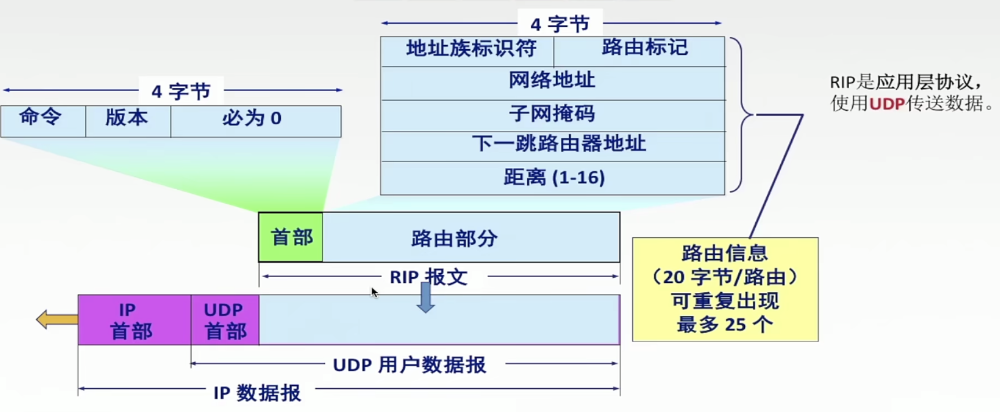
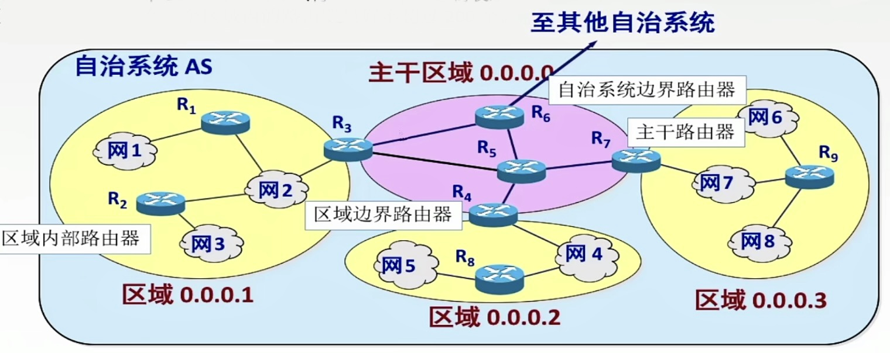

# 路由算法

2022.3.2

## 静态路由与动态路由

1. **静态路由算法(又称非自适应路由算法)**。手工配置路由信息。适用于小型网络（小型军事/商业网络）。

2. **动态路由算法(又称自适应路由算法)**。路由器之间交换信息,然后按照算法优化出来适应不断变化的网络。增加了网络负担。

3. 静态动态最主要的区别：动态路由选择可随网络的通信量或拓扑变化而自适应地调整,而静态路由选择则需要手工去调整相关的路由信息。

4. 下列关于路由算法的描述中,(B)是错误的

   A.静态路由有时也被称为非自适应的算法

   B.静态路由所使用的路由选择一旦启动就不能修改

   C.动态路由也称自适应算法,会根据网络的拓扑变化和流量变化改变路由决策

   D.动态路由算法需要实时获得网络的状态

   

## 距离-向量路由算法

1. 交换信息方式：和**邻居**交换信息

1. 交换信息内容：信息包括**[每条路径的目的地(另一节点)，路径的代价(距离)]**

3. 信息更新时间：一般情况**30s**更新一次

4. [**RIP算法**](https://baike.baidu.com/item/RIP%E5%8D%8F%E8%AE%AE/5994476)：采用**“跳数”**作为距离的度量，跳数最多为15，**跳数=16代表网络不可达**

5. RIP是**应用层**协议，使用**UDP**进行传输。

6. 缺点：适合**小**的网络，大的网络交换的路由信息会很大；可能遇到“环路”问题

7. 环路问题原因：在距离向量路由协议中,()最可能导致路由回路的问题。

   A.由于网络带宽的限制,某些路由更新数据报被丢弃

   B.由于路由器不知道整个网络的拓扑结构信息,当收到一个路由更新信息时,又将该更新信息发回自己发送该路由信息的路由器

   C.当一个路由器发现自己的一条直接相邻链路断开时,未能将这个变化报告给其他路由器

   D.慢收敛导致路由器接收了无效的路由信息

   【解析】在距离向量路由协议中,“好消息传得快,而坏消息传得慢”,（造成坏消息传得慢，好消息传得快，因为好消息可能时坏消息之前产生的，坏消息发送前，好消息又会传回来把坏消息覆盖。）这就导致了当路由信息发生变化时,该变化未能及时地被所有路由器知道,而仍然可能在路由器之间进行传递,这就是“慢收敛”现象。**慢收敛是导致发生路由回路的根本原因**。

8. **直接交付：路由器与目的网络直接相连**

   **间接交付**：路由器与目的网络间接相连，需要传给下一跳路由器

   * 例题：(未使用CIDR)当一个IP分组进行直接交付时,要求发送方和目的站具有相同的（）

     A.IP地址

     B.主机号

     C.端口号

     D.子网地址

     【解析】判断一个IP分组的交付方式是直接交付还是间接交付,路由器需要根据分组的目的IP地址和该路由器接收端口的IP地址是否属于同一个子网来进行判断。具体来说,将该分组的源IP地址和目的IP地址分别与子网掩码进行“与”操作,如果得到的子网地址相同,那么该分组就采用直接交付方式,否则采用间接交付方式。

   * 例题：下列关于路由器交付的说法中，错误的是()。

     Ⅰ.路由选择分直接交付和间接交付

     Ⅱ.直接交付时，两台机器可以不在同一物理网段内

     Ⅲ.间接交付时，不涉及直接交付

     IV.直接交付时，不涉及路由器

     A.I和II

     B.II和II

     C.III和V

     D.I和IV

     【答案】：B。发送站与目的站在同一网段内时可以直接交付。间接交付的最后一个路由器是直接交付。

8. RIP帧格式

   

## 链路状态路由算法

1. 摘要

   1. 和谁发信息：每个节点拥有完整的拓网拓扑信息；把自己所知道的**全部信息**交换给**所有节点**（除了刚发给自己的那个节点），**洪泛法**。
   2. 交换什么：发送的信息就是与本路由器相邻的所有路由器的链路状态(本路由器和哪些路由器相邻,以及该链路的度量/代价一一费用、距离、时延、带宽等)。（不只是跳数）
   3. 什么时候发信息：链路状态**变化时发消息**;每隔30分钟也刷新一次。（RIP是30s发一次）

2. 链路状态路由算法/**OFPS算法**的过程

   1. 每个路由器发现它的邻居结点【**HELLO问候分组**】,并了解邻居节点的网络地址。
   2. 设置到它的每个邻居的成本度量 **metric**。
   3. 构造【**DD数据库描述分组**】,向邻站给出自己的链路状态数据库中的所有链路状态项目的**摘要信息**。
   4. 如果DD分组中的摘要自己都有,则邻站不做处理;如果有没有的或者是更新的,则发送【**LSR链路状态请求分组**】请求自己没有的和比自己更新的信息。
   5. 收到邻站的LSR分组后,发送【**LSU链路状态更新分组**】进行更新。
   6. 更新完毕后,邻站返回一个【**LSACK链路态确认分组**】进行确认。
   7. 路由器获取全部信息后，利用**Dijkstra算法**算出路由。

   只要一个路由器的链路状态发生变化

   1. 泛洪发送【LSU链路状态更新分组】进行更新。

   2. 更新完毕后,其他站返回一个【LSACK链路状态确认分组】进行确认。
   3. 路由器获取全部信息后，利用Dijkstra算法算出路由。

3. **OFPS区域**

   为了使OSPF能够用于规模很大的网络,OPF将一个自治系统再划分为若干个更小的范围,叫做区域。每一个区域都有一个32位的区域标识符(用点分十进制表示)。区域也不能太大,在一个区域内的路由器最好不超过200个。

   

4. OFPS属于**网络层**(考纲)或传输层(另一种说法)协议，使用IP数据报传输。

5. 例题：关于链路状态协议的描述,(A)是错误的

   A.仅相邻路由器需要交换各自的路由表

   B.全网路由器的拓扑数据库是一致的

   C.采用洪泛技术更新链路变化信息

   D.具有快速收敛的优点

## 层次路由

1. 将一个大网络分成众多“**自治系统（AS）**”（一个自治系统可以包含很多局域网），每个自治系统决定内部用那种路由算法
2. **内部网关协议/域内路由选择（IGP）**：自治系统内部的自己可决定的协议，常见的为OFPS与RIP协议。
3. **外部网关协议/域间路由选择（EGP）**：常见的有**BGP**。
4. 一个自治系统分成很多区域（Area），那个路由器知道本区域内把分组转交目的地的方案，但不用知道其他区域的结构。