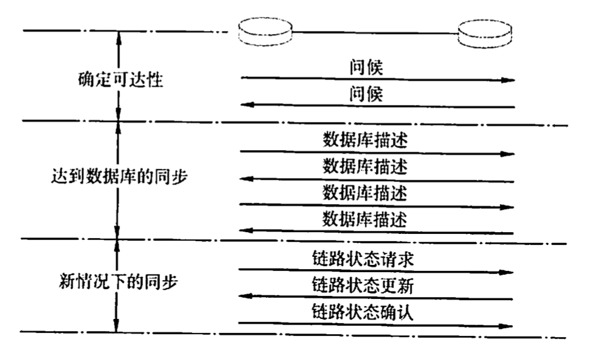
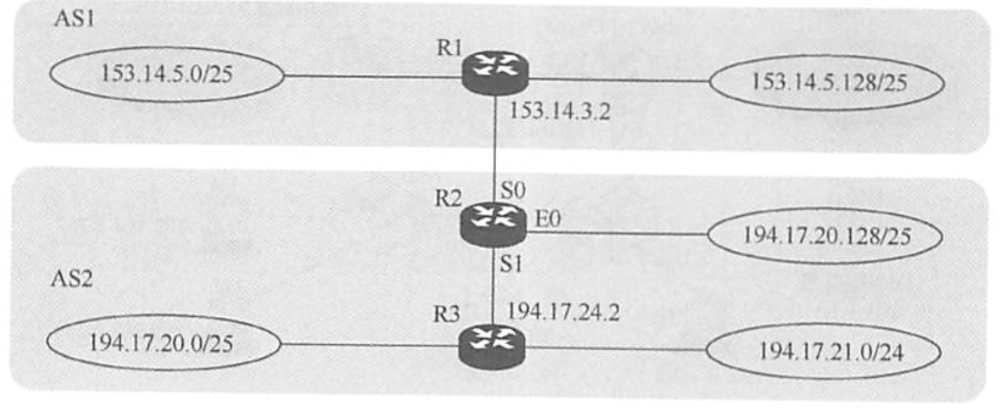
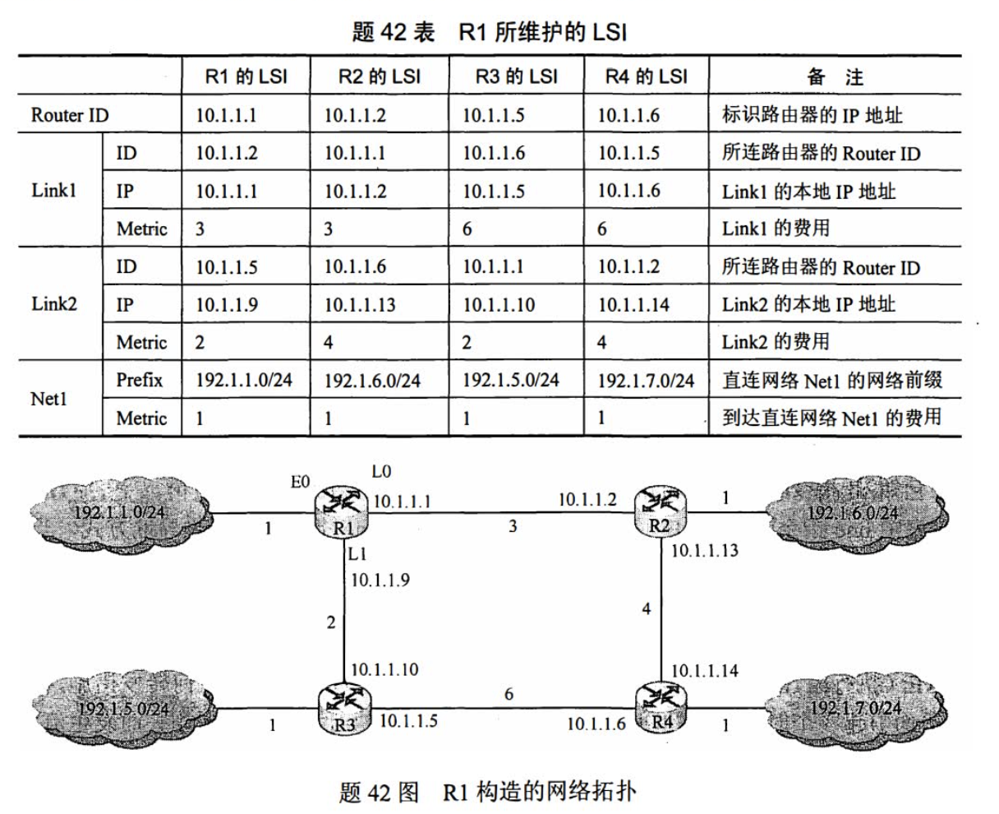

# 路由算法

2022.3.11

## 静态路由与动态路由

1. **静态路由算法(又称非自适应路由算法)**。

   1. 手工配置路由信息。适用于小型网络（小型军事/商业网络）。
   2. [默认路由](https://baike.baidu.com/item/%E9%BB%98%E8%AE%A4%E8%B7%AF%E7%94%B1/8990860):一种特殊的静态路由。

2. **动态路由算法(又称自适应路由算法)**。路由器之间交换信息,然后按照算法优化出来适应不断变化的网络。增加了网络负担。

3. 静态动态最主要的区别：动态路由选择可随网络的通信量或拓扑变化而自适应地调整,而静态路由选择则需要手工去调整相关的路由信息。

4. 下列关于路由算法的描述中,(B)是错误的

   A.静态路由有时也被称为非自适应的算法

   B.静态路由所使用的路由选择一旦启动就不能修改

   C.动态路由也称自适应算法,会根据网络的拓扑变化和流量变化改变路由决策

   D.动态路由算法需要实时获得网络的状态

   

## 距离向量路由算法

### RIP协议

1. 距离向量：自身到其他每个目的网络的距离记录

2. 条数：采用**“跳数”**作为距离的度量，跳数最多为15，**跳数=16代表网络不可达**

3. 30s广播一次路由更新信息

4. RIP2之前不支持子网掩码的广播，RIP2之后支持变长子网掩码和CIDR

5. RIP是**应用层**协议，使用**UDP**进行传输，端口520。

6. RIP最大的优点是实现简单、开销小、收敛过程较快。RIP的缺点如下：

   1. RIP限制了网络的规模，它能使用的最大距离为15(16表示不可达)。
   2. 路由器之间交换的是路由器中的完整路由表，因此网络规模越大，开销也越大。
   3. 网络出现故障时，会出现慢收敛现象（即需要较长时间才能将此信息传送到所有路由器)，俗称“坏消息传得慢”，使更新过程的收敛时间长。RIP是应用层协议，它使用UDP传送数据(端口520)。RIP选择的路径不一定是时间最短的，但一定是具有最少路由器的路径。因为它是根据最少跳数进行路径选择的。
   4. 可能遇到**“环路”**问题

7. 环路问题原因：在距离向量路由协议中,()最可能导致路由回路的问题。

   A.由于网络带宽的限制,某些路由更新数据报被丢弃

   B.由于路由器不知道整个网络的拓扑结构信息,当收到一个路由更新信息时,又将该更新信息发回自己发送该路由信息的路由器

   C.当一个路由器发现自己的一条直接相邻链路断开时,未能将这个变化报告给其他路由器

   D.慢收敛导致路由器接收了无效的路由信息

   【解析】在距离向量路由协议中,“好消息传得快,而坏消息传得慢”,（造成坏消息传得慢，好消息传得快，因为好消息可能时坏消息之前产生的，坏消息发送前，好消息又会传回来把坏消息覆盖。）这就导致了当路由信息发生变化时,该变化未能及时地被所有路由器知道,而仍然可能在路由器之间进行传递,这就是“慢收敛”现象。**慢收敛是导致发生路由回路的根本原因**。

8. **直接交付：路由器与目的网络直接相连**

   **间接交付**：路由器与目的网络间接相连，需要传给下一跳路由器

   * 例题：(未使用CIDR)当一个IP分组进行直接交付时,要求发送方和目的站具有相同的（）

     A.IP地址

     B.主机号

     C.端口号

     D.子网地址

     【解析】判断一个IP分组的交付方式是直接交付还是间接交付,路由器需要根据分组的目的IP地址和该路由器接收端口的IP地址是否属于同一个子网来进行判断。具体来说,将该分组的源IP地址和目的IP地址分别与子网掩码进行“与”操作,如果得到的子网地址相同,那么该分组就采用直接交付方式,否则采用间接交付方式。

   * 例题：下列关于路由器交付的说法中，错误的是()。

     Ⅰ.路由选择分直接交付和间接交付

     Ⅱ.直接交付时，两台机器可以不在同一物理网段内

     Ⅲ.间接交付时，不涉及直接交付

     IV.直接交付时，不涉及路由器

     A.I和II

     B.II和II

     C.III和V

     D.I和IV

     【答案】：B。发送站与目的站在同一网段内时可以直接交付。间接交付的最后一个路由器是直接交付。

9. RIP帧格式

   

### RIP特点

1. 交换信息方式：和**邻居**交换信息
2. 交换信息内容：信息包括**[每条路径的目的地(另一节点)，路径的代价(距离)]**

3. 信息更新时间：一般情况**30s**更新一次

### 距离向量算法

每个路由表项目都有三个关键数据：<目的网络N,距离d,下一跳路由器地址X>。对于每个相邻路由器发送过来的RIP报文，执行如下步骤：

* 对地址为X的相邻路由器发来的RIP报文，先修改此报文中的所有项目：把“下一跳”字段中的地址都改为X,并把所有“距离”字段的值加1。
* 对修改后的IP报文中的每个项目，执行如下步骤：
  * 当原路由表中没有目的网络N时，把该项目添加到路由表中。
  * 当原路由表中有目的网络N,且下一跳路由器的地址是X时，用收到的项目替换原路由表中的项目。
  * 当原路由表中有目的网络N,且下一跳路由器的地址不是X时，如果收到的项目中的距离小于路由表中的距离，那么就用收到的项目替换原路由表中的项目：否则什么也不做。
* 如果180秒（RP默认超时时间为180秒)还没有收到相邻路由器的更新路由表，那么把此相邻路由器记为不可达路由器，即把距离设置为16（距离为16表示不可达）。
* 返回。

## 链路状态路由算法

1. 摘要

   1. 和谁发信息：每个节点拥有完整的拓网拓扑信息；把自己所知道的**全部信息**交换给**所有节点**（除了刚发给自己的那个节点），**洪泛法**。
   2. 交换什么：发送的信息就是与本路由器相邻的所有路由器的链路状态(本路由器和哪些路由器相邻,以及该链路的度量/代价一一费用、距离、时延、带宽等)。（不只是跳数）
   3. 什么时候发信息：链路状态**变化时发消息**;每隔30分钟也刷新一次。（RIP是30s发一次）

2. 链路状态路由算法/**OFPS协议**的过程

   1. 每个路由器发现它的邻居结点【**HELLO问候分组**】,并了解邻居节点的网络地址。
   2. 设置到它的每个邻居的成本度量 **metric**。
   3. 构造【**DD数据库描述分组**】,向邻站给出自己的链路状态数据库中的所有链路状态项目的**摘要信息**。
   4. 如果DD分组中的摘要自己都有,则邻站不做处理;如果有没有的或者是更新的,则发送【**LSR链路状态请求分组**】请求自己没有的和比自己更新的信息。
   5. 收到邻站的LSR分组后,发送【**LSU链路状态更新分组**】进行更新。
   6. 更新完毕后,邻站返回一个【**LSACK链路态确认分组**】进行确认。
   7. 路由器获取全部信息后，利用**Dijkstra算法**算出路由。

   只要一个路由器的链路状态发生变化

   1. 泛洪发送【LSU链路状态更新分组】进行更新。
   2. 更新完毕后,其他站返回一个【LSACK链路状态确认分组】进行确认。
   3. 路由器获取全部信息后，利用Dijkstra算法算出路由。

   

3. OFPS特点

   1. OSPF对不同的链路可根据IP分组的不同服务类型(TOS)而设置成不同的代价。因此，OSPF对于不同类型的业务可计算出不同的路由，十分灵活。

      10Mbps的以太网的链路开销是10，16Mbps令牌环网的链路开销是6，FDDI或快速以太网的开销是1，2M串行链路的开销是48，56KB串行线路的开销为1785（[原文链接](https://zhidao.baidu.com/question/299217373.html)）

   2. 如果到同一个目的网络有多条相同代价的路径，那么可以将通信量分配给这几条路径。这称为多路径间的负载平衡。

   3. 所有在OSPF路由器之间交换的分组都具有鉴别功能，因而保证了仅在可信赖的路由器之间交换链路状态信息。

   4. 支持可变长度的子网划分和无分类编址CIDR。

   5. 每个链路状态都带上一个32位的序号，序号越大，状态就越新。

4. **OFPS区域**

   为了使OSPF能够用于规模很大的网络,OPF将一个自治系统再划分为若干个更小的范围,叫做区域。每一个区域都有一个32位的区域标识符(用点分十进制表示)。区域也不能太大,在一个区域内的路由器最好不超过200个。

   

5. OFPS属于**网络层**(考纲)或传输层(另一种说法)协议，使用IP数据报传输。

6. 例题：关于链路状态协议的描述,(A)是错误的

   A.仅相邻路由器需要交换各自的路由表

   B.全网路由器的拓扑数据库是一致的

   C.采用洪泛技术更新链路变化信息

   D.具有快速收敛的优点

### 协议对比

|            |             RIP              |                          OFPS                          |                  BGP                   |
| :--------: | :--------------------------: | :----------------------------------------------------: | :------------------------------------: |
|     层     |            应用层            |                         网络层                         |                 应用层                 |
| 用什么传输 |             UDP              |                           IP                           |                  TCP                   |
|  协议字段  |              -               |                           89                           |                                        |
|    端口    |             520              |                           -                            |                                        |
|    算法    |         **距离**向量         |                        链路状态                        |              **路径**向量              |
| 和谁发消息 |          相邻路由器          |                     AS内所有路由器                     |               相邻路由器               |
| 发什么消息 | 路由表中全部的<目的地, 跳数> |              摘要信息/路由表部分全部信息               | 首次：全部路由表 更新：有变化部分 |
|  计算方法  |           跳数最少           |                        综合计算                        |                                        |
| 什么时候发 |   30s一次，180s记为不可达    | 信息更新立刻广播，10s一次问候分组，30min更新一次数据库 |                                        |
|            |                              |                                                        |                                        |

## 层次路由

1. 简介

   1. 将一个大网络分成众多“**自治系统（AS）**”（一个自治系统可以包含很多局域网），每个自治系统决定内部用那种路由算法
   2. **内部网关协议/域内路由选择（IGP）**：自治系统内部的自己可决定的协议，常见的为OFPS与RIP协议。
   3. **外部网关协议/域间路由选择（EGP）**：常见的有**BGP**。
   4. 一个自治系统分成很多区域（Area），那个路由器知道本区域内把分组转交目的地的方案，但不用知道其他区域的结构。

2. BGP简介

   边界网关协议(BGP)只能力求寻找一条能够到达目的网络且比较好的路由（不能兜圈子），而并非寻找一条最佳路由。BGP采用的是路径向量路由选择协议，它与距离向量协议和链路状态协议有很大的区别。BGP是应用层协议，它是基于TCP的。

3. BGP的工作原理

   每个自治系统的管理员要选择至少一个路由器（可以有多个)作为该自治系统的“BGP发言人”。一个BGP发言人与其他自治系统中的BGP发言人要交换路由信息，就要先建立TCP连接（可见BGP报文是通过TCP传送的也就是说BGP报文是TCP报文的数据部分)，然后在此连接上交换BGP报文以建立BGP会话，再利用BGP会话交换路由信息。当所有BGP发言人都相互交换网络可达性的信息后，各BGP发言人就可找出到达各个自治系统的较好路由。

   每个BGP发言人除必须运行BGP外，还必须运行该AS所用的内部网关协议，OSPF或RIP。BGP所交换的网络可达性信息就是要到达某个网络（用网络前缀表示）所要经过的一系列AS。

4. BGP特点
   1. 【BGP之间信息少】BGP交换路由信息的结点数量级是自治系统的数量级，要比这些自治系统中的网络数少很多。
   2. 【BGP内部信息少】每个自治系统中BGP发言人（或边界路由器）的数目是很少的。这样就使得自治系统之间的路由选择不致过分复杂。
   3. 【BGP路由表】BGP支持CIDR,因此BGP的路由表也就应当包括目的网络前缀、下一挑路由器，以及到达该目的网络所要经过的各个自治系统序列。
   4. 【变化时更新】在BGP刚运行时，BGP的邻站交换整个BGP路由表，但以后只需在发生变化时更新有变化的部分。这样做对节省网络带宽和减少路由器的处理开销都有好处。

5. 四种BGP报文

   1)**打开(Open)报文**。用来与相邻的另一个BGP发言人建立关系。

   2)**更新(Update)报文**。用来发送某一路由的信息，以及列出要撤销的多条路由。

   3)**保活(Keepalive)报文**。用来确认打开报文并周期性地证实邻站关系。

   4)**通知(Notification)报文**。用来发送检测到的差错。

6. 【2013统考真题】假设Internet的两个自治系统构成的网络如下图所示，自治系统AS1由路由器R1连接两个子网构成；自治系统AS2由路由器R2、R3互联并连接3个子网构成。各子网地址、R2的接口名、R1与R3的部分接口IP地址如下图所示。

   请回答下列问题：

   1)假设路由表结构如下表所示。利用路由聚合技术，给出R2的路由表，要求包括到达图中所有子网的路由，且路由表中的路由项尽可能少。

   【答案】😭AS1里边的两个网络进行聚合，AS2里边的两个网络进行聚合，而不是和路由器聚合！

   
   $$
   \left.\begin{matrix} 153.14.5.0/25&\to153.14.5.0|0000000\\
   153.14.5.128/25&\to153.14.5.1|0000000 \end{matrix}\right\}=153.14.5.0/24
   $$

   $$
   \left.\begin{matrix} 194.17.20.0/25&\to194.17.00010100.0\\
   194.17.21.0/24&\to194.17.00010101.0 \end{matrix}\right\}=194.17.20.0/23
   $$

   

   

   |     目的网络     |   下一跳    | 接口 |
   | :--------------: | :---------: | :--: |
   |  153.14.5.0/24   | 153.14.3.2  |  S0  |
   |  194.17.20.0/23  | 194.17.24.2 |  S1  |
   | 194.17.20.128/25 |      -      |  E0  |

   2)若R2收到一个目的1P地址为194.17.20.200的IP分组，R2会通过那个接口转发该IP分组？

   【答案】：（最长前缀匹配原则）E0

   3)R1与R2之间利用哪个路由协议交换路由信息？该路由协议的报文被封装到哪个协议的分组中进行传输

   【答案】：AS间，用BGP，封装在TCP中

7. 【2014】42.(10分)某网络中的路由器运行OSP℉路由协议，题42表是路由器R1维护的主要链路状态信息(LSI),题42图是根据题42表及R1的接口名构造出来的网络拓扑。

   

   1)假设路由表结构如下表所示，请给出题42图中R1的路由表，要求包括到达题42图中子网192.1.x.x的路由，且路由表中的路由项尽可能少。

   找到最短路径，192.1.6和7从L1，原来只有这两个才用CIDR，而不是四个一起用😭
   $$
   \left.\begin{matrix} 192.1.6.0/24&\to192.1.00000110.0\\
   192.1.7.0/24&\to192.1.00000111.0 \end{matrix}\right\}=153.14.6.0/23
   $$
   

   | 目的网络             | 下一跳    | 端口 |
   | -------------------- | --------- | ---- |
   | 192.1.1.0/24（照抄） | -         | E0   |
   | 192.1.5.0/24（照抄） | 10.1.1.10 | L1   |
   | 153.14.6.0/23        | 10.1.1.2  | L0   |

   2)当主机192.1.1.130向主机192.1.7.211发送一个TTL=64的IP分组时，R1通过哪个接口转发该IP分组？主机192.1.7.211收到的IP分组TTL是多少？

   【答案】L0，61

   3)若R1增加一条Metric为10的链路连接Internet,则题42表中R1的LSI需要增加哪些信息

   【答案】Net2：Prefix **0.0.0.0**（😭Internet网络前缀默认是0.0.0.0，要背的） Metric 10