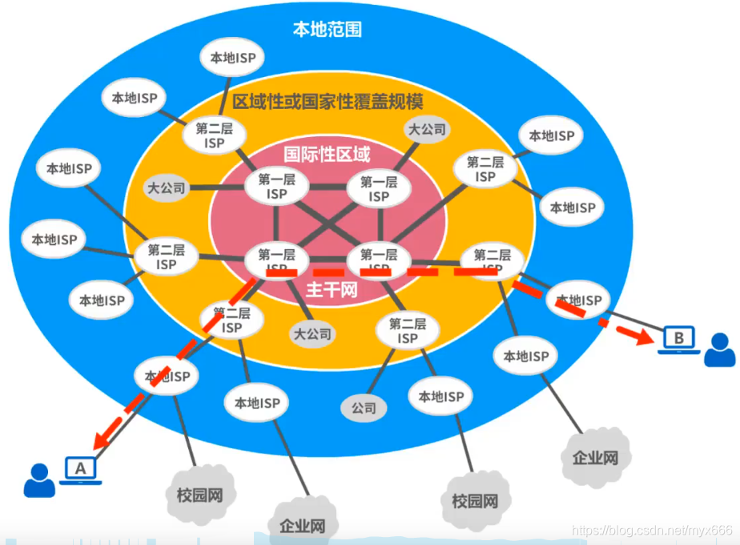

# 主干ISP、地区ISP、本地ISP？

2022.2.11

[toc]

### 笔记

#### 三种ISP

根据提供服务的**覆盖面积大小以及所拥有的2P地址数目**的不同，ISP也分为不同层次的ISP:主干ISP、地区ISP和本地ISP。

**主干ISP**由几个专门的公司创建和维持，服务面积最大（一般都能够覆盖国家范围），并且还拥有高速主干网（例如10Gbit/s或更高）。有一些区ISP网可直接与主干ISP相连。

**地区ISP**是一些较小ISP。这些地区ISP通过一个或多个主干ISP连接起来。它们位于等级中的第二层，数据率也低一些。

**本地ISP**给用户提供直接服务（这些户有时称端用户，强调是末端户） 本地ISP可以连接到地区ISP,也可直接连接到主干ISP。绝大多数的用户都是连接到本地ISP的。本地ISP可以是一个提供互联网服务的公司，也可以是一个拥有网络并向自己的雇员提供服务的企业，或者是一个运行自己的网络的非营利机构（如学院或大学）。本地ISP可以与地区ISP或主干ISP连接。

#### 五个层级

第一层级（这里层级理解为接入级，即接入到因特网中的层级）：NAP（Network Acess Point，网络接入点）

第二层级：是多个大公司经营的国家主干网，也是ISP

第三层级：地区ISP

第四层级：本地ISP

第五层级（最底层）：校园网、企业网、家庭PC机上网用户

底层就是广大企业单位和网民，上一级的本地ISP就相当于区县级接入点、再上一级的地区ISP就相当省市级接入点、再上一级的主干ISP就相当于局部覆盖少数省的接入点（比如苏浙网、两广网等）、而最高级的NAP就相当于大范围覆盖多个省的接入点（比如华东网、华中网、华南网、西北王、西南网等），因此现在的因特网是基于ISP和NAP的多层次结构。

### 参考资料：

 <iframe  
 height=200 
 width=40% 
 src="https://blog.csdn.net/irxlinpw/article/details/10963955"  
 frameborder=0  
 allowfullscreen>
 </iframe>

<iframe  
 height=200 
 width=40% 
 src="https://blog.csdn.net/myx666/article/details/119540312"  
 frameborder=0  
 allowfullscreen>
 </iframe>
