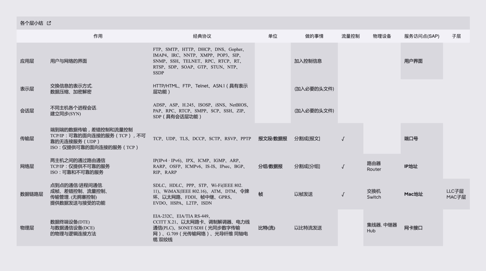
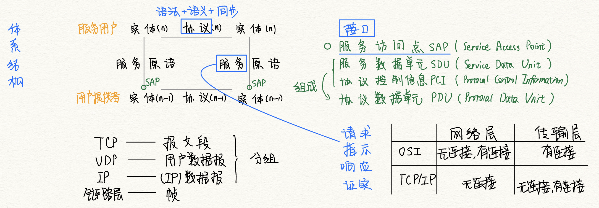

# 计算机网络体系结构

2022.07.09

[toc]

## 体系结构总结

### 物理媒介

传输信息所利用的一些物理媒体,如双绞线、光缆、无线信道等,并不在物理层协议之内而在物理层协议下面。因此,有人把物理媒体当作第0层。

### 物理层（Physical Layer）

* 传输单位：比特
* 任务：透明传输
* 定义内容：数据终端设备（DTE），数据通信设备（DCE），前两者的逻辑连接方法
* 标准：EIA-232C、EIA/TIA RS-449、CCITT的X.21

### 数据链路层（Data Link layer）

* 传输单位：帧
* 功能：成帧、差错检测、流量控制、传输管理
* 协议：SDLC->HDLC，SLIP-><u>PPP</u>，[STP](https://baike.baidu.com/item/STP/2813395)，帧中继

### 网络层（Network Layer）

* 传输单位：数据报
* 主要任务：IP到IP
* 功能：路由选择、流量控制、<u>拥塞控制</u>、差错控制、网际互联
* 协议：IP、IPX、ICMP、IGMP、ARP、RARP、OSPF

### 传输层（Transport Layer）

* 传输单位：<u>报文段（TCP）、用户数据报（UDP）</u>
* 只要任务：端到端
* 功能：复用和分用

### 会话层（Session Layer）

* 建立同步SYN
* 功能：建立管理与终止进程间的会话。利用**校验点**，使通信失效时恢复通信，实现数据同步。

### 表示层（Presentation Layer）

* 编码、数据结构、数据压缩、加密解密

### 应用层（Application Layer）

FTP、SMTP、HTTP...

## 知识点小结

> OSI与TCP-IP模型异同妙记：
>
> OSI希望把什么都做好，在网络层的时候就做了有连接与无连接的功能，所以传输层就只做有连接的了。因为有无连接的区分已经在底层做好了。
>
> TCP/IP在网络层只有IP，有无连接的功能都在传输层去做。
