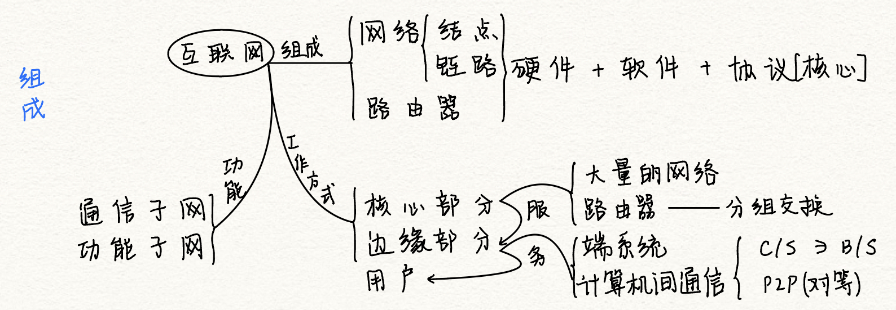

# 计算机网络概述

2022.6.09

[TOC]

## 计算机网络的概念

1. **广义观点**：可以进行远程信息处理，进一步达到资源共享
2. **资源共享观点**：
   1. 目的：资源共享
   2. 组成单元：不同地理位置的自治计算机
   3. 统一规则：网络协议
3. **用户透明观点**：存在“网络操作系统”，用户使用网络就像使用一台超级计算机

## 计算机网络的组成

1. 组成：**硬件+软件+协议**
2. 工作方式：**边缘+核心**
3. 功能：**通信子网+资源子网**

## 计算机网络的功能

1. 数据通信：最基本
2. 资源共享：可以是<u>软件共享也可以是硬件共享</u>
3. 分布式处理：复杂任务给别的计算机
4. 提高可靠性：网络中计算机互为替代机
5. 负载均衡：工作均衡的分给各个计算机

## 计算机网络的分类

1. 按范围

   1. **广域网WAN**：也叫远程网，采用**交换技术**
   2. **城域网MAN**：多采用**以太网技术**
   3. **局域网LAN**：采用**广播技术**
   4. 个人区域网PAN

2. 按传输技术

   1. **广播式网络**：共享信道；局域网使用广播式网络；广域网的无线、卫星也是广播式网络
   2. **点对点网络**
   3. **主要区别是，是否采用存储转发和路由机制**

3. 按拓扑结构

   1. 按网络的拓扑结构，主要分为总线形、星形、环形和网状网络
   2. **星形、总线形和环形网络多用于局域网，网状网络多用于广域网。**

   

4. 按交换技术

   

## 计算机网络的性能指标

