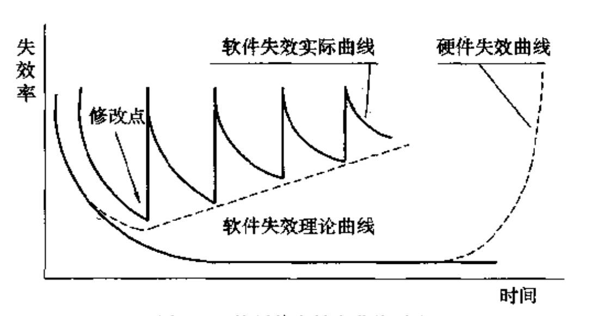
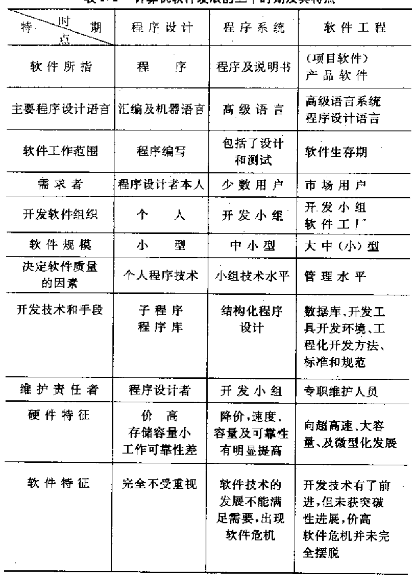
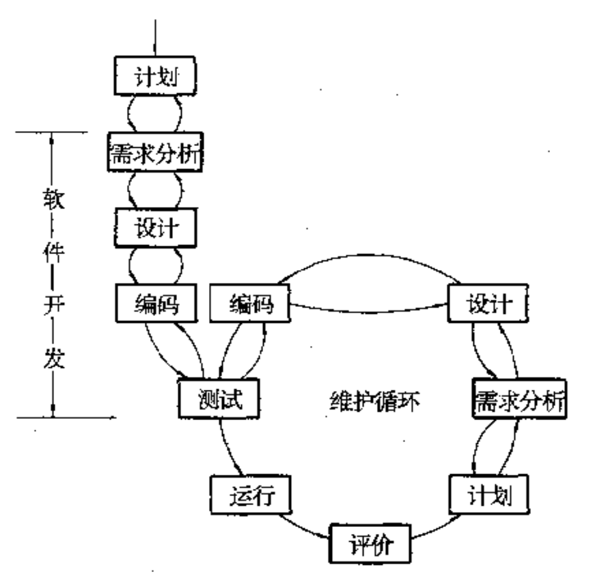

# 软件工程概述

2023.02.04

[toc]

主要内容：软件开发工程化【计划、需求分析、软件设计、软件编写、测试、运行维护】

1. 软件的特点与分类

   1. 特点：逻辑非物理；批量生产(复制)简单；软件需维护(下图)；受硬件限制；“手工定制”；复杂——伴随其他专业知识；昂贵；社会因素(政治、文化等)

   

   2. 分类
      1. 功能：系统软件、支撑软件、应用软件
      2. 规模：小中大等等
      3. 方式：实时、交互式、分时、批处理
      4. 对象：项目软件(对象为一个或几个，如卫星，导弹)，产品软件(为市场服务)
      5. 频度
      6. 失效影响

2. 软件发展与软件危机

   

3. 软件开发工程化和软件生命周期

   1. **计划（功能目标）、需求分析（详细需求+说明书）、软件设计（模块设计）、程序编写、测试、运行和维护**
   2. 

4. 软件工程项目的目标

   1. 略