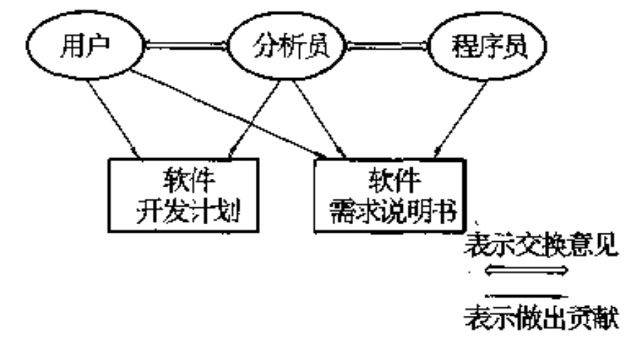
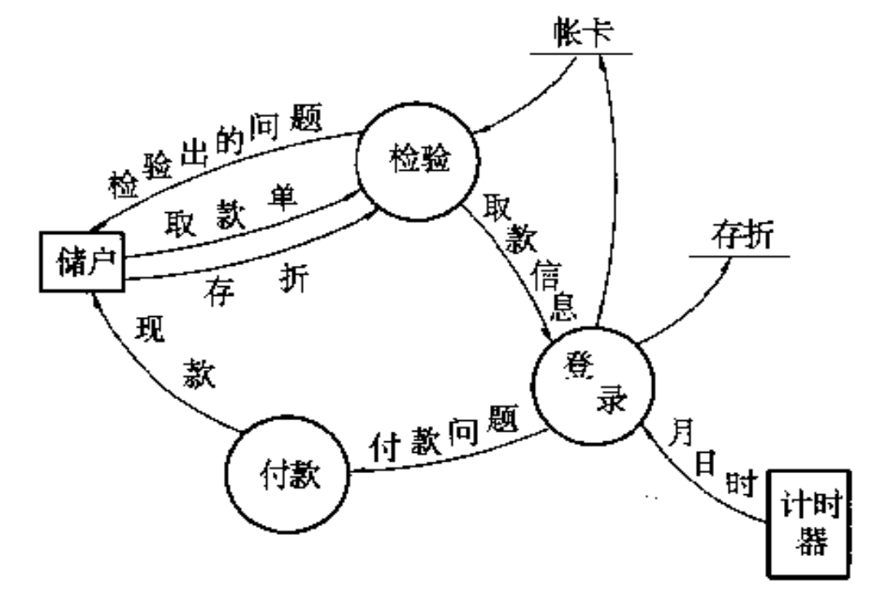
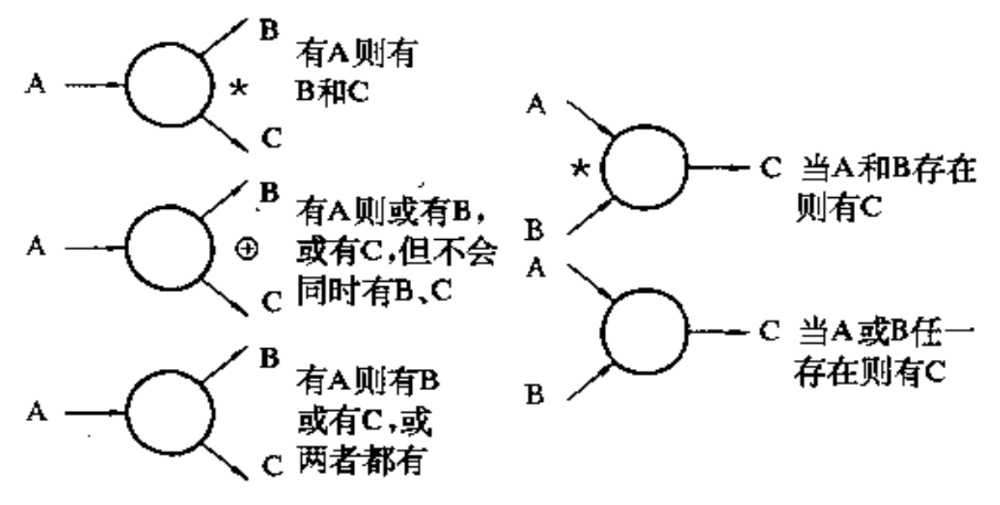
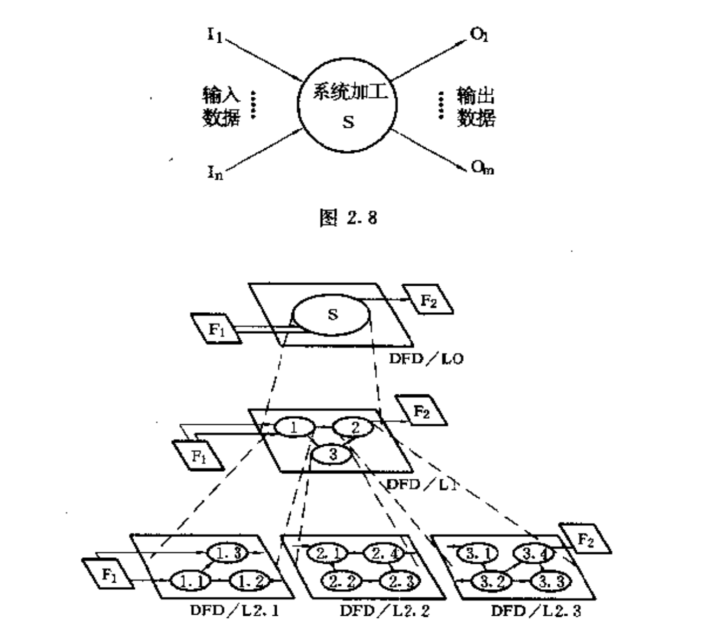

# 软件需求分析

2023.02.08

[toc]

## 软件需求阶段的任务

1. 调查：系统、市场、用户、考察现场

2. 需求：功能、性能、可靠性、安全、资源、费用

   ⚠️注意非功能性的需求

   可行性：技术、经济、社会

3. 描述需求（写成文件）

4. 需求分析复审

## 软件需求分析的原则

1. 信息域（信息流、信息内容、信息结构）、功能域
2. 分解问题

## 分析员与用户的责任

## 软件规格说明书

略

## 结构化分析方法

* 判定表
* 判定树
* 数据流图
* 数据辞典
* 结构化语言

## 数据流图

### 数据流图

数据流：因上常是命名的箭头。
加工：内有加工名的圆圈。
文件：标有名字的短粗线。
数据源点或数据终点：以方形框表示。

### 多个数据流的关系

### 多层数据流图

## 数据辞典

