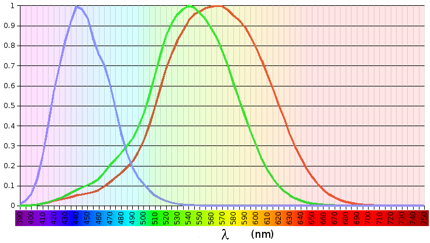
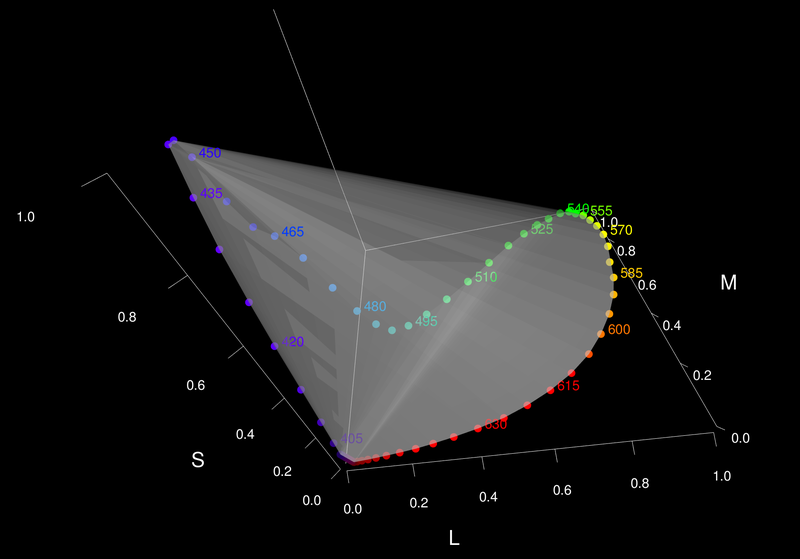
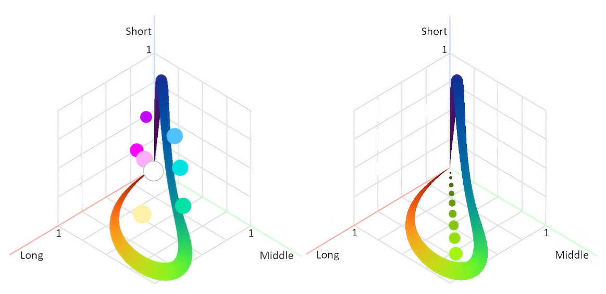
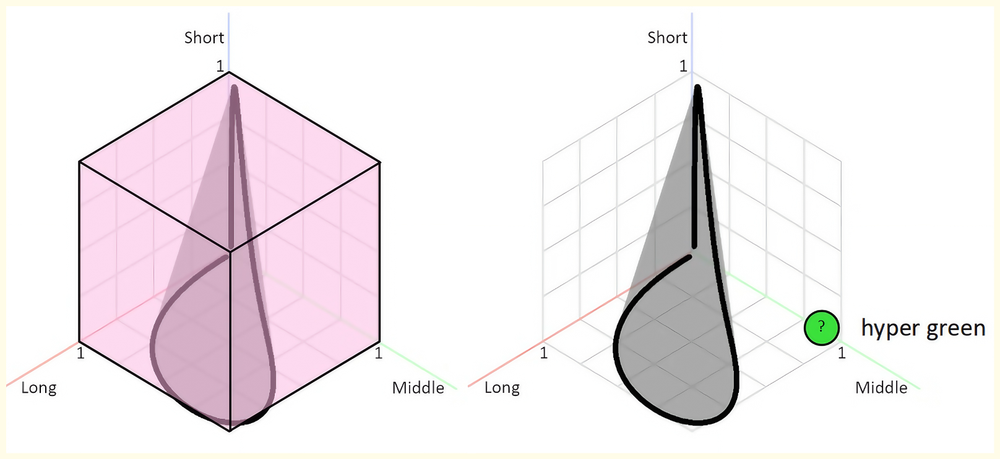

# LMS

2000年，Stockman和Sharpe根据人眼视锥细胞的规律，提出了一套基于生理学的LMS功能，在 2006 年 CIE 的技术报告 （CIE 170） 中发布。

LMS代表 **Long**（长波长，对应红色）、**Medium**（中波长，对应绿色）和 **Short**（短波长，对应蓝色）。建立一个坐标系，坐标轴是三种细胞对某种光刺激的响应值。然后扫描光谱，把不同频率的光对应的响应值绘制在坐标系中。

LMS Response over the light wavelength (from Wikipedia). L is roughly centered on red, M on green and S on blue. Note that the responses overlap significantly, especially for the L and M cones.[1]
<!--https://upload.wikimedia.org/wikipedia/commons/d/d1/Cone_spectral_sensitivities.png-->

人眼的三种视锥细胞对光的响应值的公式如下\[3]，视锥响应函数 $\bar{l}(\lambda), \bar{m}(\lambda), \bar{s}(\lambda)$是LMS颜色空间的颜色匹配函数：

$$L=\int_0^\infty J(\lambda)\bar{l}(\lambda)d\lambda$$
$$M=\int_0^\infty J(\lambda)\bar{m}(\lambda)d\lambda$$
$$S=\int_0^\infty J(\lambda)\bar{s}(\lambda)d\lambda$$

下图[2,3]是LMS的色彩空间，其中边缘代表了所有的纯色。

<!--https://commons.wikimedia.org/wiki/File:3D_Graph_of_LMS_Color_Space.png-->

利用这些纯色相互组合，就可以构造出所有的人可以看到的颜色。体现在下图中\[4]，任意两点，连成一条线，这条线就是可以被这两个纯色插值出来的所有颜色。

<!--https://www.youtube.com/watch?v=gnUYoQ1pwes-->

以上我们就得到了所有的人眼可见的颜色。但是注意，还有好多人眼不可见的区域也在这个正方体中，比如“超绿色”。因为对于某些频率，人的两种视锥细胞同时被刺激到，而并不会只刺激到一种。比如频率为 550Hz 的光，红色和绿色的视锥细胞都会有反应值。

<!--https://www.youtube.com/watch?v=gnUYoQ1pwes-->
<!--https://www.bilibili.com/video/BV1U34y1G7wa/?t=1851-->

进一步，想象由坐标轴三个顶点进行连线，将颜色空间切开。这个切面的三个点就是三个最极限的纯色，三角形内部的点就是三个顶点插值的结果。另外，三角形上任意一点与原点相连，可以提现亮度的变化（原点是黑色，三角形上一点是某一颜色的最亮）\[5]

<!-- https://www.bilibili.com/video/BV1U34y1G7wa/?t=1973 -->

XYZ 其实就是 LMS 的线性变换，XYZ 保持了LMS 的很多性质，比如颜色由三色光组成。但是这个变换让上边的那个三角形扭曲了，得到了 XYZ 里边的三角形，但其原理不变：三维空间某个纯颜色在三角形上投影，这个投影的颜色绘制为这个纯颜色在二维上的表示。

得到了我们熟悉的 CIE颜色图（CIE chromaticity diagram）。

The Chromaticity Diagram\[6]

CIE颜色图中上半边曲线是所有频率颜色，也就是前边说的纯颜色，红橙黄绿青蓝紫。图中的下半边直线以及区域内部的点均是插值得到的结果！

1. [https://daltonlens.org/opensource-cvd-simulation/](https://daltonlens.org/opensource-cvd-simulation/)
2. [https://upload.wikimedia.org/wikipedia/commons/5/5d/3D\_Graph\_of\_LMS\_Color\_Space.png](https://upload.wikimedia.org/wikipedia/commons/5/5d/3D\_Graph\_of\_LMS\_Color\_Space.png)
3. https://github.com/mittimithai/colorspacegraphs
4. [https://www.youtube.com/watch?v=gnUYoQ1pwes](https://www.youtube.com/watch?v=gnUYoQ1pwes)
5. https://www.bilibili.com/video/BV1U34y1G7wa/?t=1973
6.  [https://www.youtube.com/watch?v=O0nYJ0Mjx10](https://www.youtube.com/watch?v=O0nYJ0Mjx10)