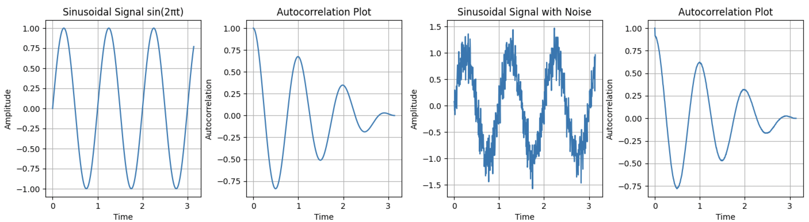

```python
import statsmodels.api as sm
import matplotlib.pyplot as plt
import numpy as np

# 定义正弦波函数
def sin_wave(t):
    return np.sin(2*np.pi*t)

# 生成时间序列
t = np.arange(0, np.pi, 0.005)

# 添加噪声
noise = np.random.normal(0, 0.2, len(t))

# 合并信号和噪声
signal = sin_wave(t)
signal_with_noise = signal + noise

# Calculate autocorrelations
acf_res1 = sm.tsa.acf(signal,nlags=len(signal))
acf_res2 = sm.tsa.acf(signal_with_noise,nlags=len(signal))

# 绘制带有噪声的正弦波
plt.figure(figsize=(15, 4))
plt.subplot(1,4,1)
plt.plot(t, signal, label='Signal')
plt.title('Sinusoidal Signal sin(2πt)')
plt.xlabel('Time')
plt.ylabel('Amplitude')
plt.grid(True)

plt.subplot(1,4,2)
plt.plot(t, acf_res1)
plt.title('Autocorrelation Plot')
plt.xlabel('Time')
plt.ylabel('Autocorrelation')
plt.grid(True)

plt.subplot(1,4,3)
plt.plot(t, signal_with_noise, label='Signal with Noise')
plt.title('Sinusoidal Signal with Noise')
plt.xlabel('Time')
plt.ylabel('Amplitude')
plt.grid(True)

plt.subplot(1,4,4)
plt.plot(t, acf_res2)
plt.title('Autocorrelation Plot')
plt.xlabel('Time')
plt.ylabel('Autocorrelation')
plt.grid(True)
plt.show()
```
