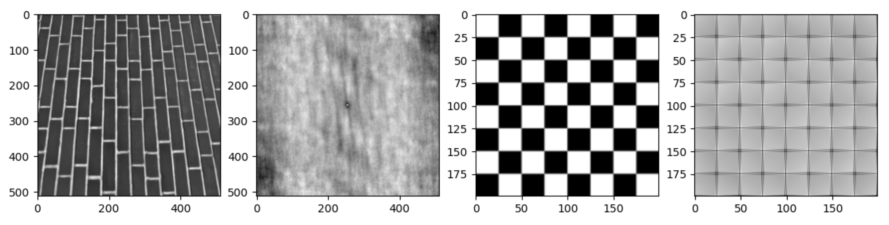

```python
from skimage import data
import matplotlib.pyplot as plt
import numpy as np

def calculate(image):
    # 创建一个与图像大小相同的零矩阵
    (Ni, Nj) = image.shape
    corr_mat = np.zeros(image.shape)
    
    # 遍历图像中的每个像素点
    assert(image.shape[0]%2 == 1)
    assert(image.shape[1]%2 == 1)
    half = int(image.shape[1]/2)
    for _x in range(image.shape[0]):
        for _y in range(image.shape[1]):
            # 计算公式中的参数
            x = _x - half # 因为公式里边的 x 和 y 是 matlab 的
            y = _y - half # 所以要从 1 开始
            si = 1 if x>= 0 else 1-x
            ei = Ni-x if x>=0 else Ni
            sj = 1 if y>=0 else 1-y
            ej = Nj-y if y>=0 else Nj

            # 计算 rho
            a = (Ni-np.abs(x))*(Nj-np.abs(y))
            b = Ni*Nj
            c = np.sum(image[si-1:ei,sj-1:ej] * image[si-1+x:ei+x,sj-1+y:ej+y])
            d = np.sum(image[:Ni,:Nj]**2)
            corr_mat[_x, _y] = (c*b)/(d*a)
    
    # 返回自相关函数
    return corr_mat

# image = data.brick()[:400:2,:400:2][:-1,:-1] # Quicker
image = data.brick()[:-1,:-1]
plt.subplot(1,4,1)
plt.imshow(image,cmap='gray')
plt.subplot(1,4,2)
corr_mat = calculate(image)
# corr_mat[99,99] = 1.17  # Quicker
corr_mat[255,255] = 1.17 # Just For Vis
plt.imshow(corr_mat,cmap='gray')

image = data.checkerboard()[:-1,:-1]
plt.subplot(1,4,3)
plt.imshow(image,cmap='gray')
plt.subplot(1,4,4)
corr_mat = calculate(image)
plt.imshow(corr_mat,cmap='gray')
plt.show()
```
