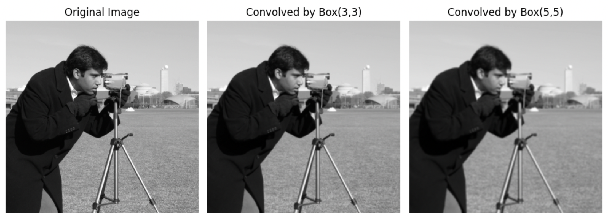

```python
from matplotlib import pyplot as plt
from scipy.ndimage import convolve
import skimage.data as data
import numpy as np

image = data.camera().astype(np.float32)

convolved_image1 = convolve(image, np.ones((3,3))/9.0, mode='reflect')
convolved_image2 = convolve(image, np.ones((5,5))/25.0, mode='reflect')

plt.figure(figsize=(10, 5))
plt.subplot(1, 3, 1)
plt.imshow(image, cmap='gray')
plt.title('Original Image')
plt.axis('off')

plt.subplot(1, 3, 2)
plt.imshow(np.abs(convolved_image1), cmap='gray')
plt.title('Convolved by Box(3,3)')
plt.axis('off')

plt.subplot(1, 3, 3)
plt.imshow(np.abs(convolved_image2), cmap='gray')
plt.title('Convolved by Box(5,5)')
plt.axis('off')

plt.tight_layout()
plt.show()
```