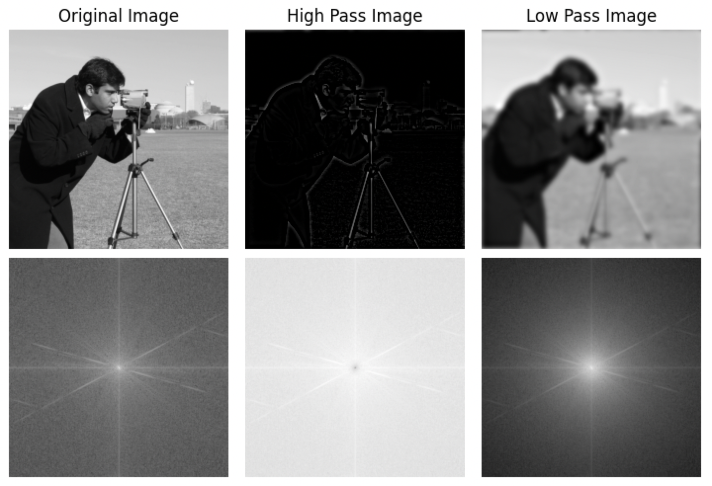

```python
from skimage import data, filters
import numpy as np
import matplotlib.pyplot as plt

def fft(img):
    f = np.fft.fft2(img)
    return np.fft.fftshift(f)

m1 = data.camera()
f1 = fft(m1)
m2 = filters.butterworth(m1,high_pass=True,cutoff_frequency_ratio=0.04)
f2 = fft(m2)
m3 = filters.butterworth(m1,high_pass=False,cutoff_frequency_ratio=0.04)
f3 = fft(m3)

plt.subplot(2,3,1)
plt.imshow(m1,cmap='gray',vmax=255,vmin=0)
plt.title("Original Image")
plt.axis('off')
plt.subplot(2,3,2)
plt.imshow(m2,cmap='gray',vmax=255,vmin=0) # type: ignore
plt.title("High Pass Image")
plt.axis('off')
plt.subplot(2,3,3)
plt.imshow(m3,cmap='gray') # type: ignore
plt.title("Low Pass Image")
plt.axis('off')
plt.subplot(2,3,4)
plt.imshow(np.log(np.abs(f1)),cmap='gray')
plt.axis('off')
plt.subplot(2,3,5)
plt.imshow(np.log(np.abs(f2)),cmap='gray')
plt.axis('off')
plt.subplot(2,3,6)
plt.imshow(np.log(np.abs(f3)),cmap='gray')
plt.axis('off')
plt.tight_layout()
plt.show()
```