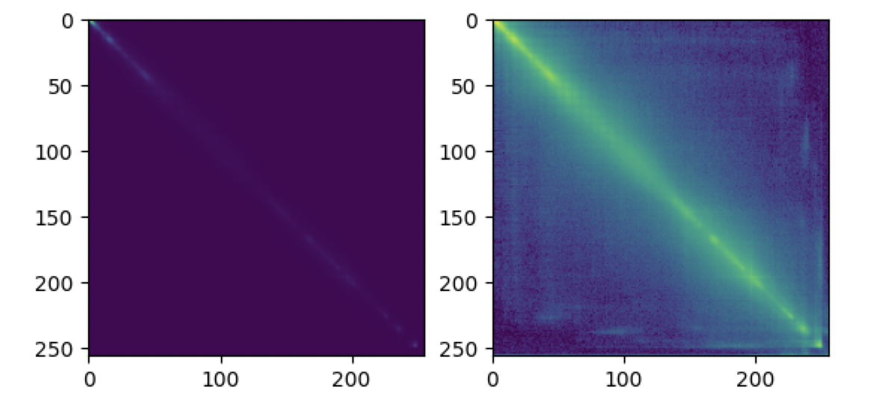

```python
import numpy as np
from skimage.data import coffee
from matplotlib import pyplot as plt
def isValid(X, Y, point):
    """
    判断某个像素是否超出图像空间范围
    """
    if point[0] < 0 or point[0] >= X:
        return False
    if point[1] < 0 or point[1] >= Y:
        return False
    return True
def getNeighbors(X, Y, x, y, dist):
    """
    Find pixel neighbors according to various distances
    """
    cn1 = (x + dist, y + dist)
    cn2 = (x + dist, y)
    cn3 = (x + dist, y - dist)
    cn4 = (x, y - dist)
    cn5 = (x - dist, y - dist)
    cn6 = (x - dist, y)
    cn7 = (x - dist, y + dist)
    cn8 = (x, y + dist)
    points = (cn1, cn2, cn3, cn4, cn5, cn6, cn7, cn8)
    Cn = []
    for i in points:
        if isValid(X, Y, i):
            Cn.append(i)
    return Cn
def corrlogram(image,dist):
    XX,YY,tt=image.shape
    cgram=np.zeros((256,256),dtype=np.uint32)
    for x in range(XX):
        for y in range(YY):
            for t in range(tt):
                color_i=image[x,y,t]
                neighbors_i=getNeighbors(XX,YY,x,y,dist)
                for j in neighbors_i:
                    j0=j[0]
                    j1=j[1]
                    color_j=image[j0,j1,t]
                    cgram[color_i,color_j]=cgram[color_i,color_j]+1
    return cgram

image=coffee()
dist=4
cgram=corrlogram(image,dist)
plt.subplot(1,2,1)
plt.imshow(cgram)
plt.subplot(1,2,2)
plt.imshow(np.log(cgram+1))# 看不清，所以用 log 减少一下像素亮度差异
plt.show()
```
