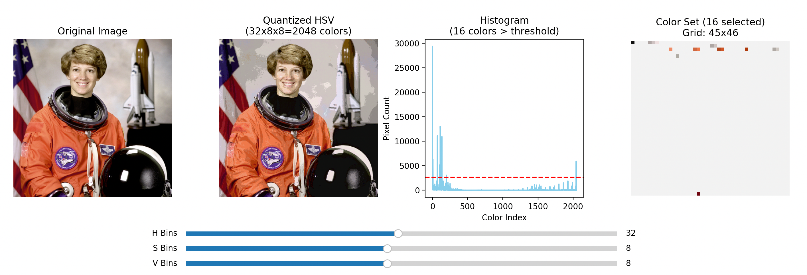

```python
from skimage import data, color
from matplotlib import pyplot as plt
from matplotlib.widgets import Slider
import numpy as np
import math

# 加载示例图像
image = data.astronaut()

# 1. 将图像从RGB转换到HSV颜色空间
hsv_image = color.rgb2hsv(image)

# 初始参数
h_bins_init = 32
s_bins_init = 8
v_bins_init = 8

# 创建图形和子图布局
fig = plt.figure(figsize=(16, 8))

# 为滑动条留出空间，并稍微调整顶部以容纳标题
plt.subplots_adjust(left=0.05, right=0.95, bottom=0.25, top=0.85, wspace=0.3)

# 定义四个子图的位置
ax1 = plt.subplot(1, 4, 1)
ax2 = plt.subplot(1, 4, 2)
ax3 = plt.subplot(1, 4, 3)
ax4 = plt.subplot(1, 4, 4)

# 存储当前的直方图和颜色集数据，以便最后打印
current_data = {
    'h_bins': h_bins_init,
    's_bins': s_bins_init,
    'v_bins': v_bins_init,
    'hist': None,
    'color_set': None,
    'threshold': 0
}

def update(val):
    h_bins = int(slider_h.val)
    s_bins = int(slider_s.val)
    v_bins = int(slider_v.val)
    
    # 更新全局数据
    current_data['h_bins'] = h_bins
    current_data['s_bins'] = s_bins
    current_data['v_bins'] = v_bins
    
    # 2. 量化HSV颜色空间
    # 计算每个像素的量化索引
    # 注意：需要处理边界值，因为HSV范围是[0, 1]，乘法后可能等于bins，导致索引越界
    h_quantized = np.floor(hsv_image[:, :, 0] * h_bins).astype(int)
    s_quantized = np.floor(hsv_image[:, :, 1] * s_bins).astype(int)
    v_quantized = np.floor(hsv_image[:, :, 2] * v_bins).astype(int)
    
    h_quantized = np.clip(h_quantized, 0, h_bins - 1)
    s_quantized = np.clip(s_quantized, 0, s_bins - 1)
    v_quantized = np.clip(v_quantized, 0, v_bins - 1)
    
    # 合并为一个颜色索引
    total_bins = h_bins * s_bins * v_bins
    color_indices = h_quantized * (s_bins * v_bins) + s_quantized * v_bins + v_quantized
    
    # 3. 计算颜色直方图
    hist, bins = np.histogram(color_indices.flatten(), bins=np.arange(total_bins + 1))
    
    # 4. 设置阈值生成颜色集
    # 阈值设为总像素数的1%
    threshold = image.shape[0] * image.shape[1] * 0.01
    color_set = (hist >= threshold).astype(int)
    
    current_data['hist'] = hist
    current_data['color_set'] = color_set
    current_data['threshold'] = threshold
    
    # 更新子图1：原始图像 (只画一次)
    if not ax1.images:
        ax1.imshow(image)
        ax1.set_title('Original Image')
        ax1.axis('off')
    
    # 更新子图2：量化后的HSV图像（转换回RGB显示）
    # 使用区间中心值来代表该颜色
    h_quantized_disp = (h_quantized.astype(float) + 0.5) / h_bins
    s_quantized_disp = (s_quantized.astype(float) + 0.5) / s_bins
    v_quantized_disp = (v_quantized.astype(float) + 0.5) / v_bins
    quantized_hsv = np.stack([h_quantized_disp, s_quantized_disp, v_quantized_disp], axis=-1)
    quantized_rgb = color.hsv2rgb(quantized_hsv)
    
    ax2.clear()
    ax2.imshow(quantized_rgb)
    ax2.set_title(f'Quantized HSV\n({h_bins}x{s_bins}x{v_bins}={total_bins} colors)')
    ax2.axis('off')
    
    # 更新子图3：颜色直方图
    ax3.clear()
    # 如果bin太多，用plot代替bar以提高性能
    if total_bins > 200:
        ax3.plot(hist, color='skyblue')
        ax3.fill_between(np.arange(len(hist)), hist, color='skyblue', alpha=0.3)
    else:
        ax3.bar(np.arange(len(hist)), hist, color='skyblue', alpha=0.7)
    ax3.axhline(y=threshold, color='red', linestyle='--', label=f'Threshold: {threshold:.0f}')
    ax3.set_title(f'Histogram\n({np.sum(color_set)} colors > threshold)')
    ax3.set_xlabel('Color Index')
    ax3.set_ylabel('Pixel Count')
    if total_bins <= 50:
        ax3.legend()
    # 强制设置直方图的 aspect ratio 为 1 (正方形)，与图像保持一致
    # 注意：因为x/y轴数据范围差异巨大，需要使用 'box' aspect 或调整坐标轴缩放
    # set_box_aspect(1) 是让绘图区域变成正方形
    ax3.set_box_aspect(1)
    
    # 更新子图4：颜色集（二进制表示）
    ax4.clear()
    # 动态计算网格大小，使其尽量接近正方形
    grid_side = int(math.ceil(math.sqrt(total_bins)))
    grid_rows = int(math.ceil(total_bins / grid_side))
    
    # 创建显示网格，初始化为浅灰色（未选中）
    # 这里的颜色可以直接存RGB值
    display_grid = np.ones((grid_rows, grid_side, 3)) * 0.95
    
    # 填充颜色
    for i in range(total_bins):
        r = i // grid_side
        c = i % grid_side
        if color_set[i] == 1:
            h_idx = i // (s_bins * v_bins)
            s_idx = (i % (s_bins * v_bins)) // v_bins
            v_idx = i % v_bins
            
            # 使用中心值显示
            h_val = (h_idx + 0.5) / h_bins
            s_val = (s_idx + 0.5) / s_bins
            v_val = (v_idx + 0.5) / v_bins
            rgb_val = color.hsv2rgb([h_val, s_val, v_val])
            display_grid[r, c] = rgb_val
    
    ax4.imshow(display_grid)
    ax4.set_title(f'Color Set ({np.sum(color_set)} selected)\nGrid: {grid_rows}x{grid_side}')
    ax4.axis('off')
    
    fig.canvas.draw_idle()

# 添加滑动条
ax_h = plt.axes([0.25, 0.15, 0.5, 0.03])
ax_s = plt.axes([0.25, 0.1, 0.5, 0.03])
ax_v = plt.axes([0.25, 0.05, 0.5, 0.03])


slider_h = Slider(ax_h, 'H Bins', 1, 64, valinit=h_bins_init, valstep=1)
slider_s = Slider(ax_s, 'S Bins', 1, 16, valinit=s_bins_init, valstep=1)
slider_v = Slider(ax_v, 'V Bins', 1, 16, valinit=v_bins_init, valstep=1)


slider_h.on_changed(update)
slider_s.on_changed(update)
slider_v.on_changed(update)


# 初始化显示
update(None)


plt.show()


# 6. 打印最终颜色集信息 (基于最后一次选择)
print("\nFinal Color Set Details (from last update):")
print("=" * 50)


final_h_bins = current_data['h_bins']
final_s_bins = current_data['s_bins']
final_v_bins = current_data['v_bins']
final_hist = current_data['hist']
final_color_set = current_data['color_set']


if final_hist is not None:
    selected_indices = np.where(final_color_set == 1)[0]
    for idx in selected_indices:
        h_idx = idx // (final_s_bins * final_v_bins)
        s_idx = (idx % (final_s_bins * final_v_bins)) // final_v_bins
        v_idx = idx % final_v_bins
        
        h_val = (h_idx + 0.5) / final_h_bins
        s_val = (s_idx + 0.5) / final_s_bins
        v_val = (v_idx + 0.5) / final_v_bins
        rgb_color = color.hsv2rgb([h_val, s_val, v_val])
        
        print(f"Index {idx:4d}: H={h_idx}/{final_h_bins}, S={s_idx}/{final_s_bins}, V={v_idx}/{final_v_bins}")
        print(f" HSV≈({h_val:.2f}, {s_val:.2f}, {v_val:.2f})")
        print(f" RGB≈({rgb_color[0]:.2f}, {rgb_color[1]:.2f}, {rgb_color[2]:.2f})")
        print(f" Pixel count: {final_hist[idx]}")
        print("-" * 50)
```