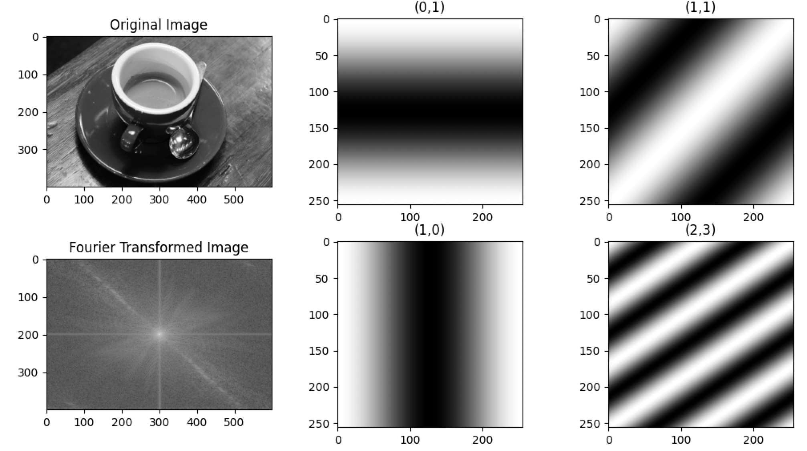

```python
import numpy as np
import matplotlib.pyplot as plt
from skimage import data, color

# 使用skimage的案例图片：camera
image = np.clip(color.rgb2gray(data.coffee())*255.0,0,255).astype(np.uint8)

# 图像尺寸
rows, cols = image.shape

# 变换结果
f = np.fft.fft2(image)
fshift = np.fft.fftshift(f)

# 显示原始图像和变换后的图像
fig, axs = plt.subplots(2, 3, figsize=(20, 10))

# 原始图像
axs[0][0].imshow(image, cmap='gray')
axs[0][0].set_title('Original Image')

# 变换后的图像
axs[1][0].imshow(np.log(np.abs(fshift)), cmap='gray')
axs[1][0].set_title('Fourier Transformed Image')

def function_im(m, n):
    N = 256
    x, y = np.meshgrid(np.arange(N), np.arange(N))
    im = np.exp(-2j * np.pi * (m * x / N + n * y / N)).real
    if m == 0 and n == 0:
        im = np.round(im)
    return im

axs[0][1].imshow(function_im(0,1),cmap='gray')
axs[0][1].set_title("(0,1)")
axs[1][1].imshow(function_im(1,0),cmap='gray')
axs[1][1].set_title("(1,0)")
axs[0][2].imshow(function_im(1,1),cmap='gray')
axs[0][2].set_title("(1,1)")
axs[1][2].imshow(function_im(2,3),cmap='gray')
axs[1][2].set_title("(2,3)")

plt.show()
```
