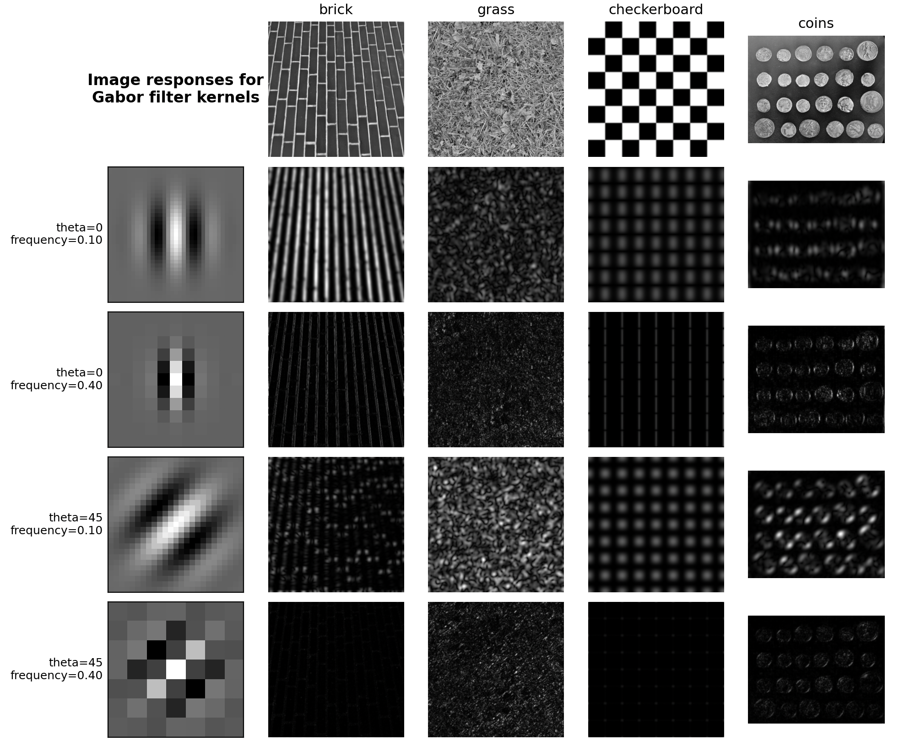

```python
import matplotlib.pyplot as plt
import numpy as np
from scipy import ndimage as ndi
from skimage import data
from skimage.filters import gabor_kernel


def compute_feats(image, kernels):
    feats = np.zeros((len(kernels), 2), dtype=np.double)
    for k, kernel in enumerate(kernels):
        filtered = ndi.convolve(image, kernel, mode='wrap')
        feats[k, 0] = filtered.mean()
        feats[k, 1] = filtered.var()
    return feats

def match(feats, ref_feats):
    min_error = np.inf
    min_i = None
    for i in range(ref_feats.shape[0]):
        error = np.sum((feats - ref_feats[i, :])**2)
        if error < min_error:
            min_error = error
            min_i = i
    return min_i

# 准备Gabor卷积核
kernels = []
for theta in range(4):
    theta = theta / 4. * np.pi
    for sigma in (1, 3):
        for frequency in (0.05, 0.25):
            kernel = np.real(gabor_kernel(frequency, theta=theta,
                                          sigma_x=sigma, sigma_y=sigma))
            kernels.append(kernel)

shrink = (slice(0, None, 3), slice(0, None, 3))
brick = data.brick().astype(np.float64)
grass = data.grass().astype(np.float64)
checkerboard = data.checkerboard().astype(np.float64)
coins = data.coins().astype(np.float64)


image_names = ('brick', 'grass', 'checkerboard', 'coins')
images = [brick, grass, checkerboard, coins]


# 准备参考特征 - 改为动态计算，适应任意数量的图片
ref_feats = np.zeros((len(images), len(kernels), 2), dtype=np.double)
for i, img in enumerate(images):
    ref_feats[i, :, :] = compute_feats(img, kernels)

def power(image, kernel):
    # Normalize images for better comparison. 05
    image = (image - image.mean()) / image.std()
    return np.sqrt(ndi.convolve(image, np.real(kernel), mode='wrap')**2 +
                   ndi.convolve(image, np.imag(kernel), mode='wrap')**2)

# Plot a selection of the filter bank kernels and their responses.
results = []
kernel_params = []
for theta in (0, 1):
    theta = theta / 4. * np.pi
    for frequency in (0.1, 0.4):
        kernel = gabor_kernel(frequency, theta=theta)
        params = 'theta=%d\nfrequency=%.2f' % (theta * 180 / np.pi, frequency)
        kernel_params.append(params)
        # Save kernel and the power image for each image
        results.append((kernel, [power(img, kernel) for img in images]))

# 增加figsize以确保有足够的空间显示内容，同时增加了一列
fig, axes = plt.subplots(nrows=5, ncols=5, figsize=(12, 12))
plt.gray()


axes[0][0].axis('off')
# 在左上角空白子图添加标题
axes[0][0].text(0.5, 0.5, 'Image responses for\nGabor filter kernels',
                ha='center', va='center', fontsize=12, fontweight='bold')

# Plot original images
for label, img, ax in zip(image_names, images, axes[0][1:]):
    ax.imshow(img)
    ax.set_title(label, fontsize=11)
    ax.axis('off')

for label, (kernel, powers), ax_row in zip(kernel_params, results, axes[1:]):
    # Plot Gabor kernel
    ax = ax_row[0]
    ax.imshow(np.real(kernel), interpolation='nearest')
    # 使用ylabel代替xlabel，因为xlabel容易被下方的图遮挡，或者需要增加hspace
    # 或者我们使用 text 在左侧
    ax.set_ylabel(label, fontsize=9, rotation=0, ha='right', va='center')
    ax.set_xticks([])
    ax.set_yticks([])
    
    # Plot Gabor responses with the contrast normalized for each filter
    vmin = min([np.min(item) for item in powers])
    vmax = max([np.max(item) for item in powers])
    for patch, ax in zip(powers, ax_row[1:]):
        ax.imshow(patch, vmin=vmin, vmax=vmax)
        ax.axis('off')

# 使用tight_layout自动调整子图参数，使之填充整个图像区域
plt.tight_layout(rect=[0.05, 0.03, 1, 1])
plt.show()
```