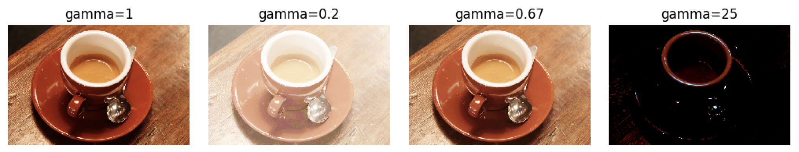

Gamma变换（幂次变换）：用于改变亮度。



```python
from skimage import data,io,exposure
from matplotlib import pyplot as plt

image=data.coffee()

for i,gamma in enumerate([1,0.2,0.67,25]):
    plt.subplot(1,4,i+1)
    plt.title(f'gamma={gamma}')
    plt.axis('off')
    io.imshow(exposure.adjust_gamma(image,gamma))
plt.show()
```

其中，`exposure.adjust_gamma`运行的方法为：
```python
# skimage/exposure/exposure.py

def _adjust_gamma_u8(image, gamma, gain):
	"""LUT based implementation of gamma adjustment."""
	lut = 255 * gain * (np.linspace(0, 1, 256) ** gamma)
	lut = np.minimum(np.rint(lut), 255).astype('uint8')
	return lut[image]
	
def adjust_gamma(image, gamma=1, gain=1):
	"""Perform gamma correction on the input image.
	Gamma correction is a power-law transform [1]_. This function
	transforms the input `image` pixel-wise according to the power law
	``image**gamma`` after scaling each pixel to the range 0 to 1. Then
	it is rescaled to its original range and muliplied by `gain`.
	Parameters
	----------
	image : ndarray
		Input image.
	gamma : float, optional
		Non negative real number. Default value is 1.
	gain : float, optional
		The constant multiplier. Default value is 1.
	Returns
	-------
	out : ndarray
		Gamma corrected output image.
	See Also
	--------
	adjust_log
	Notes
	-----
	For gamma greater than 1, the histogram will shift towards left and
	the output image will be darker than the input image.
	For gamma less than 1, the histogram will shift towards right and
	the output image will be brighter than the input image.
	References
	----------
	.. [1] https://en.wikipedia.org/wiki/Gamma_correction
	Examples
	--------
	>>> import skimage as ski
	>>> image = ski.util.img_as_float(ski.data.moon())
	>>> gamma_corrected = ski.exposure.adjust_gamma(image, 2)
	>>> # Output is darker for gamma > 1
	>>> image.mean() > gamma_corrected.mean()
	True
	"""
	if gamma < 0:
		raise ValueError("Gamma should be a non-negative real number.")
	dtype = image.dtype.type
	if dtype is np.uint8:
		out = _adjust_gamma_u8(image, gamma, gain)
	else:
		_assert_non_negative(image)
		limits = dtype_limits(image, clip_negative=True)
		scale = float(limits[1] - limits[0])
		out = (((image / scale) ** gamma) * scale * gain).astype(dtype)
	return out
```

**核心公式：**
```python
out = (((image / scale) ** gamma) * scale * gain).astype(dtype)
```

**公式逻辑分解：**

1. **归一化**：`image / scale`
   - 将图像像素值从原始范围 [min, max] 归一化到 [0, 1] 范围
   - `scale = max - min` 是原始数据的范围

2. **幂次变换**：`(image / scale) ** gamma`
   - 对归一化后的值进行 Gamma 变换（幂次变换）
   - 这是 Gamma 校正的核心操作

3. **反归一化与增益**：`((image / scale) ** gamma) * scale * gain`
   - `* scale`：将结果缩放回原始范围 [0, scale]
   - `* gain`：乘以增益系数，调整整体亮度

4. **类型转换**：`.astype(dtype)`
   - 保持输出图像与输入图像相同的数据类型

**Gamma 值的作用：**
- `gamma > 1`：图像变暗（压缩亮部，拉伸暗部）
- `gamma < 1`：图像变亮（压缩暗部，拉伸亮部）
- `gamma = 1`：保持不变，线性变换

**数学表达：**
对于归一化后的像素值 $x \in [0, 1]$，Gamma 变换为：
$$
f(x) = x^{\gamma}
$$
然后缩放回原始范围。skimage 的实现额外提供了增益参数$g$，用于调整整体亮度。

**优化实现：**
对于 8 位图像 (`np.uint8`)，使用查找表 (LUT) 优化：
```python
lut = 255 * gain * (np.linspace(0, 1, 256) ** gamma)
```
预先计算所有可能的变换结果，然后通过查表快速应用变换。