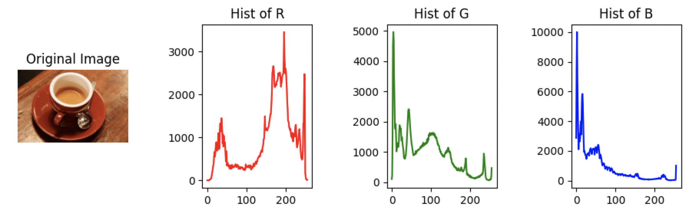

一般颜色直方图：某个色彩通道的直方图。



```python
from skimage import exposure,data
from matplotlib import pyplot as plt

image =data.coffee()

hist_r=exposure.histogram(image[:,:,0],nbins=256)
hist_g=exposure.histogram(image[:,:,1],nbins=256)
hist_b=exposure.histogram(image[:,:,2],nbins=256)

plt.subplot(1, 4, 1)
plt.imshow(image, cmap='gray')
plt.title('Original Image')
plt.axis('off')

plt.subplot(1, 4, 2)
plt.plot(hist_r[1], hist_r[0], color='red')
plt.title('Hist of R')

plt.subplot(1, 4, 3)
plt.plot(hist_g[1], hist_g[0], color='green')
plt.title('Hist of G')

plt.subplot(1, 4, 4)
plt.plot(hist_b[1], hist_b[0], color='blue')
plt.title('Hist of B')

plt.tight_layout()
plt.show()
```
