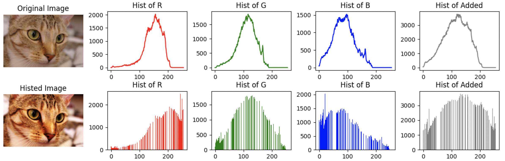

全局累加直方图：当图像中的特征并不能取遍所有可取值时，**统计直方图中会出现一些零值**。这些零值的出现会对相似性度量的计算带来影响，从而使得相似性度量并不能正确反映图像之间的颜色差别。


```python
from skimage import data, exposure
from matplotlib import pyplot as plt
import numpy as np

# image = exposure.equalize_hist(data.chelsea())
image = data.cat()

bins = np.arange(256)
hist_r,bins=np.histogram(image[:,:,0], bins=bins, density=False)
hist_g,_=np.histogram(image[:,:,1], bins=bins, density=False)
hist_b,_=np.histogram(image[:,:,2], bins=bins, density=False)
hist_add=(hist_r+hist_g+hist_b)

plt.subplot(2, 5, 1)
plt.imshow(image, cmap='gray')
plt.title('Original Image')
plt.axis('off')

plt.subplot(2, 5, 2)
plt.plot(bins[:-1], hist_r, color='red')
plt.title('Hist of R')

plt.subplot(2, 5, 3)
plt.plot(bins[:-1], hist_g, color='green')
plt.title('Hist of G')

plt.subplot(2, 5, 4)
plt.plot(bins[:-1], hist_b, color='blue')
plt.title('Hist of B')

plt.subplot(2, 5, 5)
plt.plot(bins[:-1], hist_add, color='gray')
plt.title('Hist of Added')

image = exposure.equalize_hist(image)
image = (255.0*np.array(image)).astype(np.uint8)

bins = np.arange(256)
hist_r,bins=np.histogram(image[:,:,0], bins=bins, density=False)
hist_g,_=np.histogram(image[:,:,1], bins=bins, density=False)
hist_b,_=np.histogram(image[:,:,2], bins=bins, density=False)
hist_add=(hist_r+hist_g+hist_b)

plt.subplot(2, 5, 6)
plt.imshow(image, cmap='gray')
plt.title('Histed Image')
plt.axis('off')

plt.subplot(2, 5, 7)
plt.bar(bins[:-1], hist_r, color='red')
plt.title('Hist of R')

plt.subplot(2, 5, 8)
plt.bar(bins[:-1], hist_g, color='green')
plt.title('Hist of G')

plt.subplot(2, 5, 9)
plt.bar(bins[:-1], hist_b, color='blue')
plt.title('Hist of B')

plt.subplot(2, 5, 10)
plt.bar(bins[:-1], hist_add, color='gray')
plt.title('Hist of Added')

plt.tight_layout()
plt.show()
```
