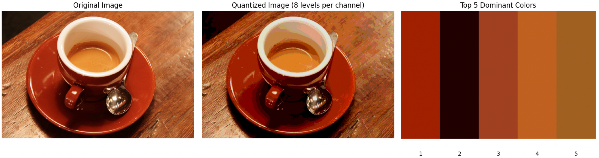
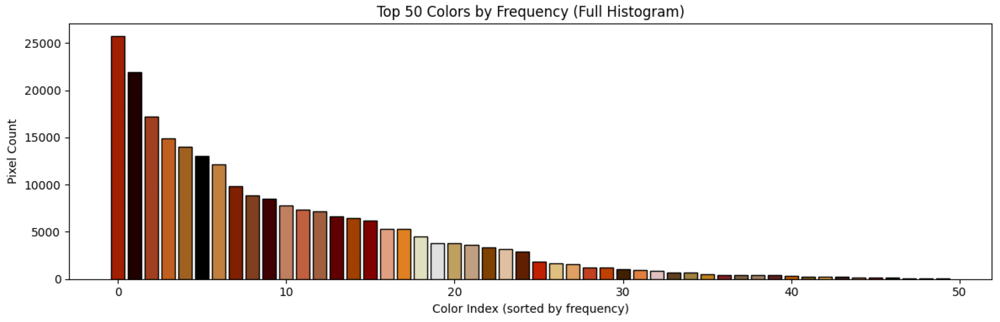

```python
from skimage import data, io, color
from matplotlib import pyplot as plt
import matplotlib
matplotlib.use('TkAgg')
import numpy as np
from collections import Counter


# 加载一张示例图片（这里用skimage自带的咖啡图，颜色比较集中）
# 你也可以替换为其他图片路径
image = data.coffee()
# image = io.imread('your_image.jpg')


# 1. 将图像颜色量化，减少颜色数量以便提取主色调
# 将RGB每个通道从256级压缩到8级（8x8x8=512种颜色）
quantized = (image // 32) * 32


# 2. 将图像重塑为像素列表，每个像素是一个RGB三元组
pixels = quantized.reshape(-1, 3)


# 3. 统计每种颜色出现的频率
color_counts = Counter(map(tuple, pixels))


# 4. 获取频率最高的5种颜色作为主色调
top_n = 5
top_colors = color_counts.most_common(top_n)


print("Top", top_n, "dominant colors (RGB):")
for i, (color_rgb, count) in enumerate(top_colors):
    print(f"{i+1}. RGB{color_rgb}: {count} pixels")

# 5. 可视化
plt.figure(figsize=(15, 5))


# 子图1：原始图像
plt.subplot(1, 3, 1)
plt.imshow(image)
plt.title('Original Image')
plt.axis('off')


# 子图2：量化后的图像（颜色更少，主色调更明显）
plt.subplot(1, 3, 2)
plt.imshow(quantized)
plt.title('Quantized Image (8 levels per channel)')
plt.axis('off')


# 子图3：主色调展示
plt.subplot(1, 3, 3)
# 创建一个颜色条来显示主色调
dominant_colors = [np.array(color_rgb) / 255.0 for color_rgb, _ in top_colors]
for i, color_val in enumerate(dominant_colors):
    plt.fill_between([i, i+1], 0, 1, color=color_val)
    plt.text(i+0.5, -0.1, f'{i+1}', ha='center', va='top')
plt.xlim(0, top_n)
plt.ylim(0, 1)
plt.title(f'Top {top_n} Dominant Colors')
plt.axis('off')


plt.tight_layout()
plt.show()


# 6. 额外：显示完整颜色直方图（按频率排序）
plt.figure(figsize=(12, 4))


# 获取所有颜色及其频率
all_colors = list(color_counts.keys())
all_counts = list(color_counts.values())


# 按频率排序
sorted_indices = np.argsort(all_counts)[::-1]
sorted_colors = [all_colors[i] for i in sorted_indices]
sorted_counts = [all_counts[i] for i in sorted_indices]


# 只显示前50种颜色（否则太多）
show_top = min(50, len(sorted_colors))
colors_to_show = np.array(sorted_colors[:show_top]) / 255.0
counts_to_show = sorted_counts[:show_top]


plt.bar(range(show_top), counts_to_show,
        color=colors_to_show, edgecolor='black')
plt.title(f'Top {show_top} Colors by Frequency (Full Histogram)')
plt.xlabel('Color Index (sorted by frequency)')
plt.ylabel('Pixel Count')
plt.tight_layout()
plt.show()
```