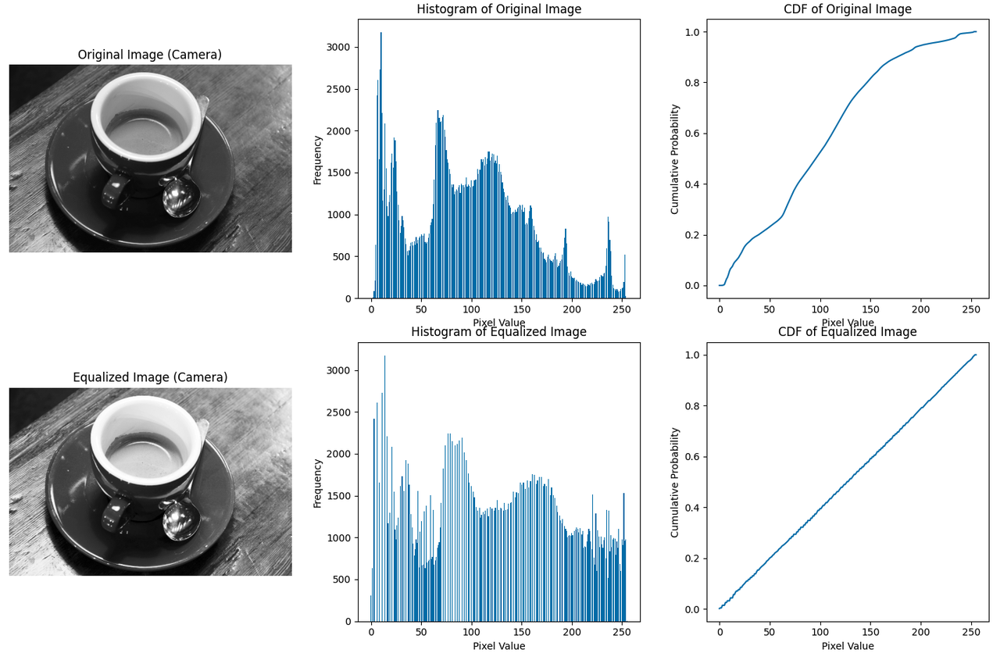

直方图均衡化案例



```python
import numpy as np
import matplotlib.pyplot as plt
from skimage import data, color

def calculate_histogram(image):
    """计算图像的直方图"""
    # 确定可能的灰度级别
    levels = np.arange(0, 257)
    # 计算并返回直方图
    histogram, _ = np.histogram(image, bins=levels, density=False)
    return histogram

def calculate_cdf(histogram):
    """计算累积分布函数（CDF）"""
    cdf = histogram.cumsum()
    # 归一化CDF
    cdf_normalized = cdf / float(cdf[-1])
    return cdf_normalized

def equalize_histogram(image):
    """均衡化直方图"""
    # 计算原始图像的直方图
    histogram = calculate_histogram(image)
    # 计算CDF
    cdf = calculate_cdf(histogram)
    # 映射原始图像的像素值
    image_equalized = np.interp(image, np.arange(0, 256), cdf * 255)
    return image_equalized.astype('uint8')

# 使用skimage的案例图片：camera
image_camera = np.clip(color.rgb2gray(data.coffee())*255.0,0,255).astype(np.uint8)

# 均衡化图像
image_equalized = equalize_histogram(image_camera)

# 可视化
fig, ax = plt.subplots(2, 3, figsize=(12, 12))

# 原始图像
ax[0, 0].imshow(image_camera, cmap='gray')
ax[0, 0].set_title('Original Image (Camera)')
ax[0, 0].axis('off')

# 原始直方图
ax[0, 1].bar(np.arange(0, 256), calculate_histogram(image_camera))
ax[0, 1].set_title('Histogram of Original Image')
ax[0, 1].set_xlabel('Pixel Value')
ax[0, 1].set_ylabel('Frequency')

# 均衡化后的CDF
ax[0, 2].plot(np.arange(0, 256), calculate_cdf(calculate_histogram(image_camera)))
ax[0, 2].set_title('CDF of Original Image')
ax[0, 2].set_xlabel('Pixel Value')
ax[0, 2].set_ylabel('Cumulative Probability')

# 均衡化后的图像
ax[1, 0].imshow(image_equalized, cmap='gray')
ax[1, 0].set_title('Equalized Image (Camera)')
ax[1, 0].axis('off')

# 均衡化后直方图
ax[1, 1].bar(np.arange(0, 256), calculate_histogram(image_equalized))
ax[1, 1].set_title('Histogram of Equalized Image')
ax[1, 1].set_xlabel('Pixel Value')
ax[1, 1].set_ylabel('Frequency')

# 均衡化后的CDF
ax[1, 2].plot(np.arange(0, 256), calculate_cdf(calculate_histogram(image_equalized)))
ax[1, 2].set_title('CDF of Equalized Image')
ax[1, 2].set_xlabel('Pixel Value')
ax[1, 2].set_ylabel('Cumulative Probability')

plt.tight_layout()
plt.show()
```

