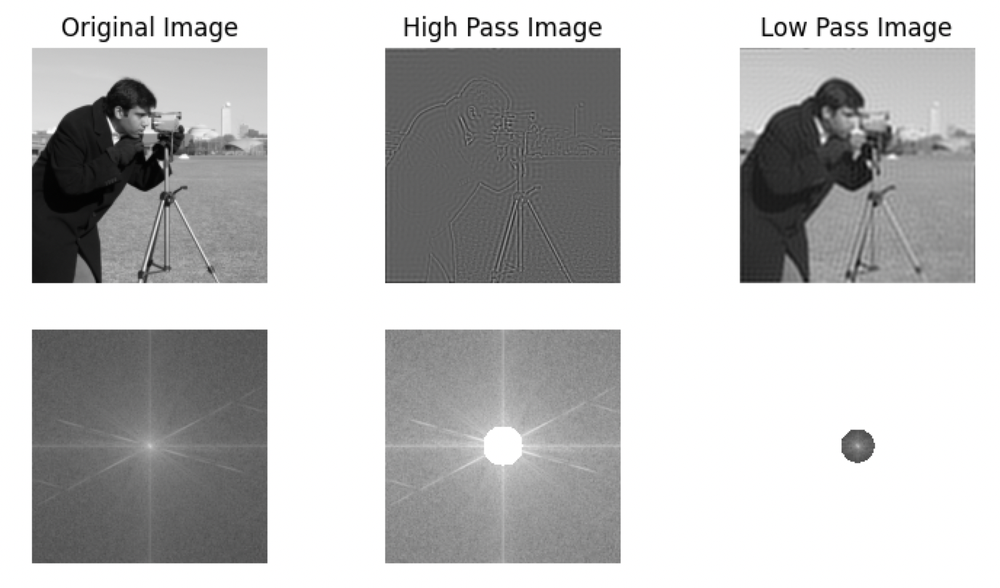

```python
from skimage import data
import numpy as np
import matplotlib.pyplot as plt

def freq_trans(image,func=None):
    # Convert the image to the frequency domain
    f = np.fft.fft2(image)
    fshift = np.fft.fftshift(f)
    if func == None: return fshift, image

    # Apply the filter function to the frequency domain
    fshift_filtered = func(fshift)

    # Convert back to the spatial domain
    f_inv = np.fft.ifftshift(fshift_filtered)
    image_filtered = np.fft.ifft2(f_inv)
    return fshift_filtered, image_filtered

def cal_dis(image_shape):
    """Create a high-pass mask."""
    center_width = image_shape[0] // 2
    center_height = image_shape[1] // 2
    x = np.arange(image_shape[0])
    y = np.arange(image_shape[1])
    X, Y = np.meshgrid(x, y)
    distances = np.sqrt((X - center_width)**2 + (Y - center_height)**2)
    return distances

def ideal_high_pass_filter(fshift):
    """High pass filter function."""
    return np.where(cal_dis(fshift.shape)>40, fshift, 0)

def ideal_low_pass_filter(fshift):
    """Low pass filter function."""
    return np.where(cal_dis(fshift.shape)<=40, fshift, 0)

img = data.camera()
f1,m1 = freq_trans(img)
f2,m2 = freq_trans(img, ideal_high_pass_filter)
f3,m3 = freq_trans(img, ideal_low_pass_filter)

plt.subplot(2,3,1)
plt.imshow(m1,cmap='gray')
plt.title("Original Image")
plt.axis('off')
plt.subplot(2,3,2)
plt.imshow(np.real(m2),cmap='gray')
plt.title("High Pass Image")
plt.axis('off')
plt.subplot(2,3,3)
plt.imshow(np.real(m3),cmap='gray')
plt.title("Low Pass Image")
plt.axis('off')
plt.subplot(2,3,4)
plt.imshow(np.log(np.abs(f1)),cmap='gray')
plt.axis('off')
plt.subplot(2,3,5)
plt.imshow(np.log(np.abs(f2)),cmap='gray')
plt.axis('off')
plt.subplot(2,3,6)
plt.imshow(np.log(np.abs(f3)),cmap='gray')
plt.axis('off')
plt.show()
```
