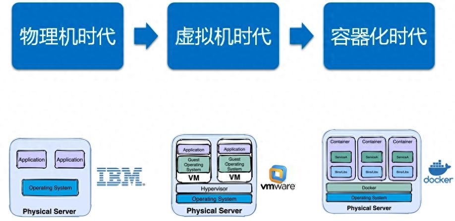

# docker基础

> https://www.yuque.com/taijuanlebaai/fh01mx/bpn59snshbmekp2m?singleDoc#

1. 部署方案
	1. 传统部署：应用之间没有隔离，如果一个应用出现问题，会影响到其他应用。
	2. 虚拟机部署：每个应用都运行在一个独立的虚拟机上，每个虚拟机都有自己的操作系统，占用系统资源。
	3. 容器化部署：每个应用都运行在一个独立的容器中，**容器之间共享操作系统内核**。
	

2. 启动与验证

	```bash
	#查看Docker版本
	docker -v
	
	# 启动Docker
	systemctl start docker
	
	#列出运行在本地Docker主机上的所有镜像
	docker images
	
	# 停止Docker
	systemctl stop docker
	
	# 重启
	systemctl restart docker
	
	# 设置开机自启
	systemctl enable docker
	
	# 执行docker ps命令，如果不报错，说明安装启动成功
	docker ps
	```

