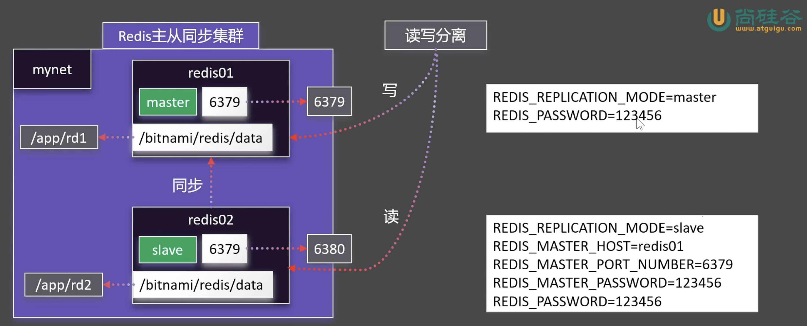

# Docker 网路

## 容器的ip

每一个容器都有自己的ip，我们可以使用`docker inspect app01 | grep -A 19 "Networks"` 来查看对应的信息。

```bash
^^/Downloads >>> docker inspect app01 | grep -A 19 "Networks"18:34:12 
            "Networks": {
                "bridge": {
                    "IPAMConfig": null,
                    "Links": null,
                    "Aliases": null,
                    "DriverOpts": null,
                    "GwPriority": 0,
                    "NetworkID": "35c2ac70786853f14b3248aea2cfb1278ce59c805cdb82bd2c84803e6afc80d4",
                    "EndpointID": "d4b47ffd7a48841c1351ce4fdbd46fa8dada61677587a629d775da4d1de7a5ab",
                    "Gateway": "172.17.0.1",
                    "IPAddress": "172.17.0.2",
                    "MacAddress": "6a:b7:d2:c8:d4:6b",
                    "IPPrefixLen": 16,
                    "IPv6Gateway": "",
                    "GlobalIPv6Address": "",
                    "GlobalIPv6PrefixLen": 0,
                    "DNSNames": null
                }
            }
        },
^^/Downloads >>> curl http://172.17.0.2:80                   18:34:15 
<h1>Hello World!</h1>
```

## 容器的域名

我们的每个容器的ip每次开启的时候可能会变化。所以我们也可以为容器指定一个域名。

要注意，我们需要新建一个网络，不能用默认的网络

创建docker网络的命令是：`docker network`

```bash
^^/Downloads >>> docker network --help                       18:34:18 
Usage:  docker network COMMAND

Manage networks

Commands:
  connect     Connect a container to a network
  create      Create a network
  disconnect  Disconnect a container from a network
  inspect     Display detailed information on one or more networks
  ls          List networks
  prune       Remove all unused networks
  rm          Remove one or more networks

Run 'docker network COMMAND --help' for more information on a command.

```

创建我们的网络
```bash
^^/Downloads >>> docker network create mynet                 19:34:26 
272e849499d662dbff61ab86a1bc4585e01040b1d6526f9d5f068af529743739
^^/Downloads >>> docker network ls                           20:59:12 
NETWORK ID     NAME      DRIVER    SCOPE
35c2ac707868   bridge    bridge    local
24c3de86af4a   host      host      local
272e849499d6   mynet     bridge    local
f097d2b7c757   none      null      local

```

然后创建容器的时候指定网络
```bash
^^/Downloads >>> docker rm -f app01                          20:59:29 
app01
^^/Downloads >>> docker run -p 80:81 -d -v ngconf:/etc/nginx -v /media/psf/Home/workspace/data/dockerdemo/assets:/usr/share/nginx/html --network mynet --name app01 nginx
0430445d23ea84e8beef53b6dc980fc8c6124e000c94e681f975aee0c0d7a8f9
^^/Downloads >>> docker exec -it app01 bash                  21:03:17 
root@0430445d23ea:/# curl http://app01:80
<h1>Hello World!</h1> 
```

## 构建redis同步集群（案例）



```bash
docker run \
-d -p 6379:6379 \
-v /home/parallels/workspace/data/dockerdemo/rd1:/bitnami/redis/data \
-e REDIS_REPLICATION_MODE=master \
-e REDIS_PASSWORD=123456 \
--network mynet \
--name redis01 \
bitnami/redis

```

```bash
docker run \
-d -p 6380:6379 \
-v /home/parallels/workspace/data/dockerdemo/rd2:/bitnami/redis/data \
-e REDIS_REPLICATION_MODE=slave \
-e REDIS_MASTER_HOST=redis01 \
-e REDIS_MASTER_PORT_NUMBER=6379 \
-e REDIS_MASTER_PASSWORD=123456 \
-e REDIS_PASSWORD=123456 \
--network mynet \
--name redis02 \
bitnami/redis
```

注意设置一下权限，因为docker默认是root的，然后我们创建的文件夹不是，所以要
```bash
^^/w/d/dockerdemo >>> pwd
/home/parallels/workspace/data/dockerdemo
^^/w/d/dockerdemo >>> chmod 777 ./rd1
^^/w/d/dockerdemo >>> chmod 777 ./rd2
```

```bash
# 在主节点设置键值
docker exec redis01 redis-cli -a 123456 SET test:master "This is master data"
docker exec redis01 redis-cli -a 123456 INCR test:counter
docker exec redis01 redis-cli -a 123456 HSET test:hash field1 "value1" field2 "value2"

# 在从节点读取（验证同步）
docker exec redis02 redis-cli -a 123456 GET test:master
docker exec redis02 redis-cli -a 123456 GET test:counter
docker exec redis02 redis-cli -a 123456 HGETALL test:hash
```

得到输出结果
```bash
Warning: Using a password with '-a' or '-u' option on the command line interface may not be safe.
OK
Warning: Using a password with '-a' or '-u' option on the command line interface may not be safe.
1
2
Warning: Using a password with '-a' or '-u' option on the command line interface may not be safe.
Warning: Using a password with '-a' or '-u' option on the command line interface may not be safe.
This is master data
Warning: Using a password with '-a' or '-u' option on the command line interface may not be safe.
1
Warning: Using a password with '-a' or '-u' option on the command line interface may not be safe.
field1
value1
field2
value2
```