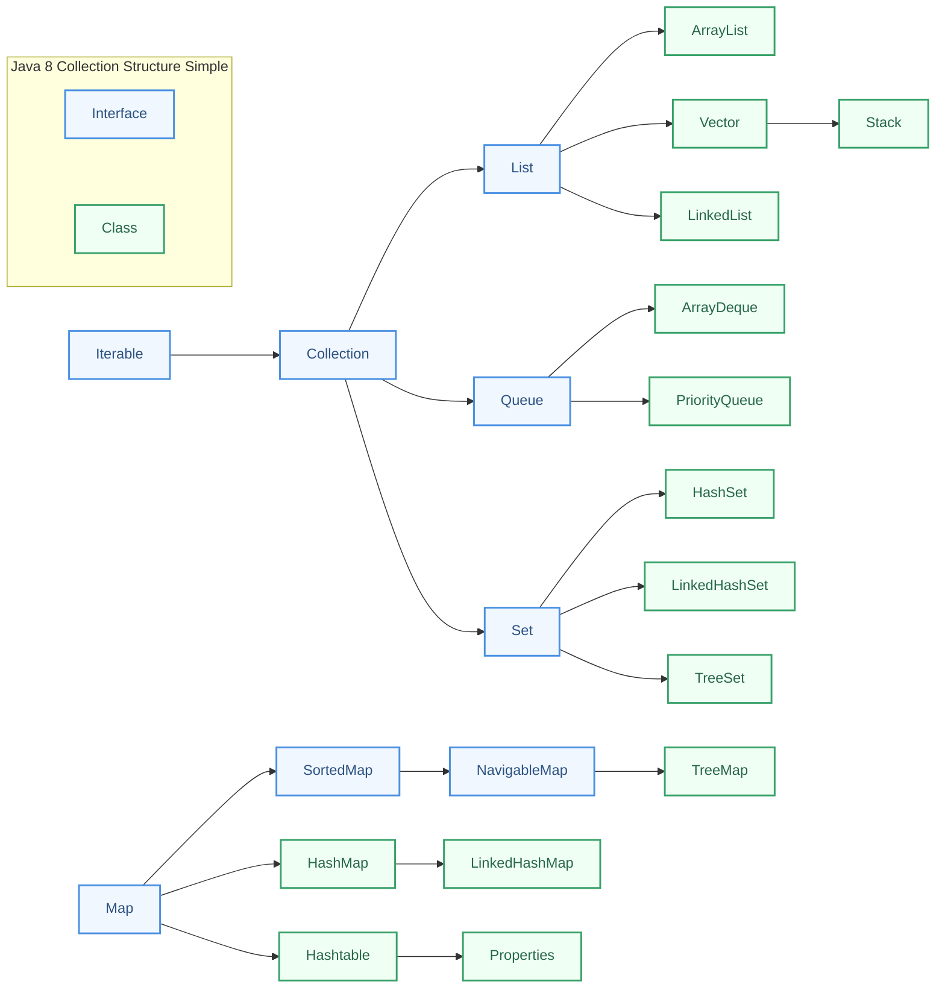

# Collection
> 本版本励志于弄一个精简版本的，之前的会有很多冗余的图和代码。以下是老资源：
> [集合](../stage2/集合.md)
> [精通集合](../stage2/精通集合.md)

---

## Collection

### 继承关系

> * https://javabetter.cn/collection/gailan.html




（面试题）简单介绍一下集合的体系：

集合框架可以分为两条大的支线
1. 第一条支线 Collection，主要由 **List**、**Set**、**Queue** 组成：
  - List 代表有序、可重复的集合，典型代表就是封装了动态数组的 [ArrayList](https://javabetter.cn/collection/arraylist.html) 和封装了链表的 [LinkedList](https://javabetter.cn/collection/linkedlist.html)；
  - Set 代表无序、不可重复的集合，典型代表就是 HashSet 和 TreeSet；
  - Queue 代表队列，典型代表就是双端队列 [ArrayDeque](https://javabetter.cn/collection/arraydeque.html)，以及优先级队列 [PriorityQueue](https://javabetter.cn/collection/PriorityQueue.html)。
2. 第二条支线 Map，代表键值对的集合，典型代表就是 [HashMap](https://javabetter.cn/collection/hashmap.html)，LinkedHashMap、TreeMap等。

### Collection全部api

| 方法签名 | 功能说明 |
| :-------------------------- | :---------------------------------- |
| `int size()` | 返回集合中元素个数 |
| `boolean isEmpty()` | 判断集合是否为空 |
| `boolean contains(Object o)` | 判断集合是否包含指定元素 |
| `Iterator<E> iterator()` | 返回集合的迭代器，用于遍历 |
| `Object[] toArray()` | 将集合转为 Object 数组 |
| `<T> T[] toArray(T[] a)` | 将集合转为指定类型数组 |
| `boolean add(E e)` | 向集合添加单个元素 |
| `boolean remove(Object o)` | 删除集合中首次出现的指定元素 |
| `boolean containsAll(Collection<?> c)` | 判断集合是否包含指定集合中的所有元素 |
| `boolean addAll(Collection<? extends E> c)` | 将指定集合中的所有元素添加到当前集合 |
| `boolean removeAll(Collection<?> c)` | 删除当前集合中与指定集合交集的所有元素 |
| `boolean removeIf(Predicate<? super E> filter)` | 按条件删除满足谓词的元素 |
| `boolean retainAll(Collection<?> c)` | 仅保留与指定集合交集的元素 |
| `void clear()` | 清空集合 |
| `boolean equals(Object o)` | 判断集合是否与指定对象相等 |
| `int hashCode()` | 返回集合的哈希值 |
| `Spliterator<E> spliterator()` | 返回可分割的迭代器，用于并行遍历 |
| `Stream<E> stream()` | 返回顺序流，用于函数式操作 |
| `Stream<E> parallelStream()` | 返回并行流，用于并行计算 |

### Collection遍历

> * https://javabetter.cn/collection/iterator-iterable.html

构建一个`Collection`

```java
List<Integer> list = Arrays.asList(0, 1, 2, 3, 4, 5, 6, 7, 8, 9);
```

可以使用`Iterator`对`Collection`进行遍历

```java
Iterator<Integer> iterator = list.iterator();
while (iterator.hasNext()) {
  System.out.println(iterator.next());
}
```

我们使用的增强`for`循环，底层也是用的迭代器

```java
for (Integer i : list) {
  System.out.println(i);
}
```

我们也可以采用Lambda表达式完成迭代

```java
// 匿名内部类方式
list.forEach(new Consumer<Integer>() {
  @Override
  public void accept(Integer integer) {
    System.out.println(integer);
  }
});
// Lambda表达式
list.forEach(i -> System.out.println(i));
// 方法引用
list.forEach(System.out::println);
```

最后看一下对于`ArrayList`中对`Iterator`接口的实现的`next()`的源码，可以看到：`iterator`对象一开始指向第一个元素，运行`next()`会①<u>放回指向的元素</u>并②<u>返回下一个元素</u>。运行`hasNext()`会判断是否还有下一个元素。

```java
public class ArrayList<E> extends AbstractList<E> implements List<E>, RandomAccess, Cloneable, java.io.Serializable {
  private class Itr implements Iterator<E> {
    int cursor;       // index of next element to return
    int lastRet = -1; // index of last element returned; -1 if no such
    int expectedModCount = modCount;

    Itr() {}

    public boolean hasNext() {
      return cursor != size;
    }

    @SuppressWarnings("unchecked")
    public E next() {
      checkForComodification();
      int i = cursor;
      if (i >= size)
        throw new NoSuchElementException();
      Object[] elementData = ArrayList.this.elementData;
      if (i >= elementData.length)
        throw new ConcurrentModificationException();
      cursor = i + 1;
      return (E) elementData[lastRet = i];
    }
    // ...
  }
  // ...
}
```

### 并发修改异常问题

> * https://javabetter.cn/collection/fail-fast.html

1. 迭代集合时删除元素
  1. 使用`集合对象.remove(元素)`：会出现`ConcurrentModificationException`异常（并发修改异常）。
  2. 使用`迭代器对象.remove()`：不会出现异常。

2. 如何解决并发修改问题：**fail-fast机制**（快速失败机制）。也就是说只要程序发现了程序对集合进行了并发修改。就会立即让其失败，以防出现错误。

3. **fail-fast机制是如何实现的**？以下是源码中的实现原理（使用`ArrayList`分析源码）

  1. 集合中设置了一个`modCount`属性，用来记录修改次数。

     ```java
     // AbstractList.java
     protected transient int modCount = 0;
     ```

  2. 使用<u>集合对象</u>执行增，删，改中任意一个操作时，`modCount`就会自动加1。

     ```java
     // 这个是ArrayList的remove
     public E remove(int index) {
       rangeCheck(index);
     
       modCount++; // 这里会修改modCount
       E oldValue = elementData(index);
     
       int numMoved = size - index - 1;
       if (numMoved > 0)
         System.arraycopy(elementData, index+1, elementData, index,
                          numMoved);
       elementData[--size] = null; // clear to let GC do its work
     
       return oldValue;
     }
     ```

  3. 获取迭代器对象的时候，会给**迭代器对象**初始化一个`expectedModCount`属性。并且将`expectedModCount`初始化为`modCount`

     ```java
     // 这个是ArrayList内部的Itr内部类
     int expectedModCount = modCount;
     ```

  4. 当使用<u>集合</u>对象删除元素时：`modCount`会加1。但是迭代器中的`expectedModCount`不会加1。而当迭代器对象的`next()`方法执行时，会检测`expectedModCount`和`modCount`是否相等，如果不相等，则抛出：`ConcurrentModificationException`异常。

  5. 当使用<u>迭代器</u>删除元素的时候：`modCount`会加1，并且`expectedModCount`也会加1。这样当迭代器对象的`next()`方法执行时，检测到的`expectedModCount`和`modCount`相等，则不会出现`ConcurrentModificationException`异常。

     ```java
     // 这个是ArrayList内部的Itr内部类
     public void remove() {
       if (lastRet < 0)
         throw new IllegalStateException();
       checkForComodification(); // here
     
       try {
         ArrayList.this.remove(lastRet); // 这里会修改modCount
         cursor = lastRet;
         lastRet = -1;
         expectedModCount = modCount; // 这里会调整expectedModCount
       } catch (IndexOutOfBoundsException ex) {
         throw new ConcurrentModificationException();
       }
     }
     ```

4. 虽然我们当前写的程序是**单线程**的程序，并没有使用多线程，但是通过迭代器去遍历的同时使用集合去删除元素，这个行为将被认定为并发修改。

5. 结论：迭代集合时，删除元素只能使用`迭代器对象.remove()`方法来删除，避免使用`集合对象.remove(元素)`。主要是为了避免ConcurrentModificationException异常的发生。**注意：迭代器的remove()方法删除的是next()方法的返回的那个数据。remove()方法调用之前一定是先调用了next()方法，如果不是这样的，就会报错。**

---

## List

### List API

| 方法签名（相对 Collection 新增） | 功能说明 |
| :--- | :--- |
| `boolean addAll(int index, Collection<? extends E> c)` | 从指定下标开始批量插入集合 |
| `void replaceAll(UnaryOperator<E> operator)` | 用 Lambda方法引用替换列表中每个元素 |
| `void sort(Comparator<? super E> c)` | 按给定比较器对列表排序 |
| `E get(int index)` | 读取指定下标元素 |
| `E set(int index, E element)` | 修改指定下标元素并返回旧值 |
| `void add(int index, E element)` | 在指定下标插入元素 |
| `E remove(int index)` | 删除指定下标元素并返回被删值 |
| `int indexOf(Object o)` | 返回元素首次出现下标，不存在返回 -1 |
| `int lastIndexOf(Object o)` | 返回元素最后一次出现下标，不存在返回 -1 |
| `ListIterator<E> listIterator()` | 获取双向列表迭代器 |
| `ListIterator<E> listIterator(int index)` | 从指定下标开始的双向迭代器 |
| `List<E> subList(int fromIndex, int toIndex)` | 获取子列表视图（左闭右开） |

### ArrayList扩容

> * https://javabetter.cn/collection/arraylist.html

当创建ArrayList对象时，如果使用的是**无参构造器**，则**初始**elementData容量为**0**，**第1次**添加，则扩容elementData为**10**，如需要**再次扩容**，则扩容elementData为**1.5倍**。

```java
// 下面演示 add 函数的调用过程(java8)
// 保存内容的 Object 数组，transient的意思是顺时的，为了不能序列化
transient Object[] elementData; // non-private to simplify nested class access

// 默认初始化数组是空
private static final Object[] DEFAULTCAPACITY_EMPTY_ELEMENTDATA = {};

// 默认容量大小为 10
private static final int DEFAULT_CAPACITY = 10;

// add 函数调用的 api，首先去[保证容量]，然后添加元素
public boolean add(E e) {  
  ensureCapacityInternal(size + 1);  // Increments modCount!!  
  elementData[size++] = e;  
  return true;  
}

// [保证容量]的方法，首先[计算需要的容量]，然后[确保这些容量足够]
private void ensureCapacityInternal(int minCapacity) {  
  ensureExplicitCapacity(calculateCapacity(elementData, minCapacity));  
}

// [计算需要的容量]：如果元素是空，就代表这是第一次 add，那么就添加 10 个元素，否则返回调用传入的内容
private static int calculateCapacity(Object[] elementData, int minCapacity) {  
  if (elementData == DEFAULTCAPACITY_EMPTY_ELEMENTDATA) {  
    return Math.max(DEFAULT_CAPACITY, minCapacity);  
  }    
  return minCapacity;  
}

// [确保这些容量足够]
// modCount用来保证不会有两个线程同时进来
// minCapacity > elementData.length 说明容量不够，才去真正的扩容
private void ensureExplicitCapacity(int minCapacity) {  
  modCount++;  

  // overflow-conscious code  
  if (minCapacity - elementData.length > 0)  
    grow(minCapacity);  
}

// 真正的扩容
// 新的容量 = 老容量*1.5，他的 0.5 倍用的移位的操作实现的
// 新容量 = max(1.5老, 10)
// 先生成新的内容，然后把老内容 copy 到前边
private void grow(int minCapacity) {  
  // overflow-conscious code  
  int oldCapacity = elementData.length;  
  int newCapacity = oldCapacity + (oldCapacity >> 1);  
  if (newCapacity - minCapacity < 0)  
    newCapacity = minCapacity;  
  if (newCapacity - MAX_ARRAY_SIZE > 0)  
    newCapacity = hugeCapacity(minCapacity);  
  // minCapacity is usually close to size, so this is a win:  
  elementData = Arrays.copyOf(elementData, newCapacity);  
}
```

如果使用的是**指定大小的构造器**，则初始elementData容量为指定大小，如果需要扩容，则直接扩容elementData为1.5倍

```java
//源码中的构造器
public ArrayList(int initialCapacity) {  
  if (initialCapacity > 0) {  
    this.elementData = new Object[initialCapacity];  
  } else if (initialCapacity == 0) {  
    this.elementData = EMPTY_ELEMENTDATA;  
  } else {  
    throw new IllegalArgumentException("Illegal Capacity: "+  
                                       initialCapacity);  
  }
}
```

### LinkedList

> * https://javabetter.cn/collection/linkedlist.html
> * https://javabetter.cn/collection/list-war-2.html

* `LinkedList`是基于**双链表**实现的
* `LinkdedList`和`ArrayList`都是线程不安全的

| 方法签名（相对 Collection 新增） | 功能说明 |
| -------------------------------- | -------- |
| `public void addFirst(E e)`      | 将元素插入链表头部 |
| `public void addLast(E e)`       | 将元素插入链表尾部 |
| `public E getFirst()`            | 返回链表头部元素，链表为空抛NoSuchElementException |
| `public E getLast()`             | 返回链表尾部元素，链表为空抛NoSuchElementException |
| `public E removeFirst()`         | 移除并返回链表头部元素，链表为空抛NoSuchElementException |
| `public E removeLast()`          | 移除并返回链表尾部元素，链表为空抛NoSuchElementException |

### Stack

> * https://javabetter.cn/collection/stack.html

* Vector的子类，实现了栈数据结构，除了具有 `Vector` 的方法，还扩展了其它方法，完成了栈结构的模拟。不过在JDK1.6（Java6）之后就**不建议使用**了。
* Stack 是一个“原始”类，它的核心方法上都加了 `synchronized` 关键字以确保线程安全，当我们不需要线程安全（比如说单线程环境下）性能就会比较差。当需要使用栈时候，请首选`ArrayDeque`。
* Stack中的方法
	* `E push(E item)`：压栈
	* `E pop()`：弹栈（将栈顶元素删除，并返回被删除的引用）
	* `int search(Object o)`：查找栈中元素（返回值的意思是：以1为开始，从栈顶往下数第几个）
	* `E peek()`：窥视栈顶元素（不会将栈顶元素删除，只是看看栈顶元素是什么。注意：如果栈为空时会报异常。）

---

## Queue

### ArrayDeque

> * https://javabetter.cn/collection/arraydeque.html

* ArrayDeque底层也是数组
* ArrayDeque实现了双端队列（实现`Deque` 接口）
* ArrayDeque也实现了栈的数据结构

### PriorityQueue

> * https://javabetter.cn/collection/PriorityQueue.html

PriorityQueue 是 Java 中的一个基于优先级堆的优先队列实现，它能够在 O(log n) 的时间复杂度内实现元素的插入和删除操作，并且能够自动维护队列中元素的优先级顺序。

---

## Set

### Set API


---

## Map

### HashMap

> * https://javabetter.cn/collection/hashmap.html


### LinkedHashMap

> * https://javabetter.cn/collection/linkedhashmap.html


### TreeMap

> * https://javabetter.cn/collection/treemap.html


### WeakHashMap

> * https://javabetter.cn/collection/WeakHashMap.html


