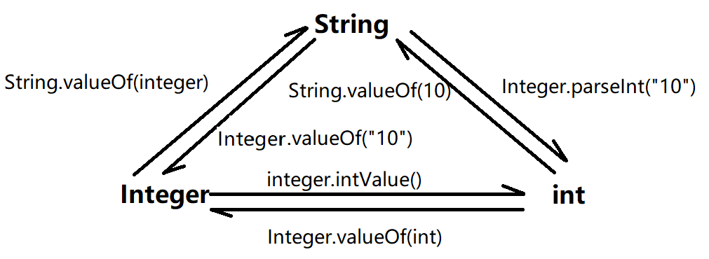

# 包装类

![[../../../assets/wrapper-drawing|1000]]

---
## 概述

### 简介

GPT：帮我总结一下 java 的包装类 ⬇️

Java 的包装类是一组特殊的类，它们为 Java 基本数据类型提供了对象形式的包装。这些包装类位于 `java.lang` 包中，每个包装类都对应一个基本数据类型。以下是 Java 中的基本数据类型及其对应的包装类：

1. `Boolean` - 包装 `boolean` 类型。
2. `Byte` - 包装 `byte` 类型。
3. `Short` - 包装 `short` 类型。
4. `Integer` - 包装 `int` 类型。
5. `Long` - 包装 `long` 类型。
6. `Float` - 包装 `float` 类型。
7. `Double` - 包装 `double` 类。
8. `Character` - 包装 `char` 类。

包装类的主要特点和用途包括：

- **提供对象形式**：包装类允许基本数据类型以对象形式存在，这在需要对象引用的场合非常有用，例如在集合类（如 `ArrayList`、`HashSet`）中存储数据。

- **方法**：包装类提供了许多有用的方法，例如，`Integer` 类的 `parseInt(String)` 方法可以将字符串转换为整数，`Double` 类的 `toString()` 方法可以将 `double` 值转换为字符串。

- **不可变性**：包装类的对象是不可变的，一旦创建，其值不能被修改。

- **自动装箱和拆箱**：Java 自动装箱机制允许基本数据类型和它们对应的包装类之间的无缝转换。例如，你可以在需要 `int` 类型参数的方法中直接传递一个 `Integer` 对象，Java 会自动进行拆箱操作。

- **值比较**：包装类重写了 `equals()` 和 `hashCode()` 方法，使得可以直接比较两个包装类对象的值是否相等。

- **缓存**：对于常见的数值，如 `Integer` 类，Java 提供了缓存机制，以减少对象创建的开销。例如，`Integer.valueOf(42)` 和 `Integer.valueOf(42)` 会返回相同的对象引用。👉 https://javabetter.cn/basic-extra-meal/int-cache.html

- **序列化**：包装类实现了 `Serializable` 接口，这意味着它们的实例可以被序列化（转换为字节流）和反序列化（从字节流恢复）。

包装类在 Java 集合框架中非常重要，因为集合只能存储对象，而不能直接存储基本数据类型。通过使用包装类，可以在集合中存储基本数据类型的值。

### 继承关系

```json
{
  'Object':[
    {
      'Number implements Serialzable':[
        'Byte implements Comparable',
        'Short implements Comparable',
        'Integer implements Comparable',
        'Long implements Comparable',
        'Float implements Comparable',
        'Double implements Comparable',
      ]
    },
    'Character implements Serialzable, Comparable',
    'Boolean implements Serialzable, Comparable',
  ]
}
```


### Integer 类的常用方法

1. **构造方法**

- `Integer(int value)`：创建一个表示指定 `int` 值的 `Integer` 对象。（**已经过时**，不要这样用了）
- `Integer(String s)`：创建一个表示指定 `String` 中的整数值的 `Integer` 对象。如果字符串不能解析为整数，会抛出 `NumberFormatException`。

2. **值转换**

- `int intValue()`：将 `Integer` 对象转换为基本数据类型 `int`。
- `static Integer valueOf(int i)`：将基本数据类型 `int` 转换为 `Integer` 对象。（**推荐使用**）
- `static Integer valueOf(String s)`：将字符串转换为 `Integer` 对象。如果字符串不能解析为整数，会抛出 `NumberFormatException`。
- `static int parseInt(String s)`：将字符串解析为 `int` 值。如果字符串不能解析为整数，会抛出 `NumberFormatException`。

3. **比较操作**

- `int compareTo(Integer anotherInteger)`：比较两个 `Integer` 对象的大小。如果当前对象的值小于参数对象的值，返回负整数；相等返回 0；大于返回正整数。
- `boolean equals(Object obj)`：判断当前 `Integer` 对象是否与指定对象相等。如果指定对象也是 `Integer` 类型且值相等，返回 `true`，否则返回 `false`。

4. **数值范围**

- `static int MIN_VALUE`：表示 `int` 类型的最小值，即 -2^31。
- `static int MAX_VALUE`：表示 `int` 类型的最大值，即 2^31 - 1。

4. **其他方法**

- `String toString()`：返回 `Integer` 对象的字符串表示形式。
- `static String toString(int i)`：将 `int` 值转换为字符串。
- `static int bitCount(int i)`：返回指定 `int` 值的二进制表示中 1 的个数。
- `static int rotateLeft(int i, int distance)`：将指定 `int` 值的二进制表示向左旋转指定的距离。
- `static int rotateRight(int i, int distance)`：将指定 `int` 值的二进制表示向右旋转指定的距离。

### Character 类的常用方法

1. **构造方法**

- `Character(char value)`：创建一个表示指定 `char` 值的 `Character` 对象。

2. **值转换**

- `char charValue()`：将 `Character` 对象转换为基本数据类型 `char`。
- `static Character valueOf(char c)`：将基本数据类型 `char` 转换为 `Character` 对象。

3. **字符判断**

- `static boolean isDigit(char ch)`：判断指定字符是否是数字字符（0-9）。
- `static boolean isLetter(char ch)`：判断指定字符是否是字母字符（a-z 或 A-Z）。
- `static boolean isLetterOrDigit(char ch)`：判断指定字符是否是字母或数字字符。
- `static boolean isUpperCase(char ch)`：判断指定字符是否是大写字母。
- `static boolean isLowerCase(char ch)`：判断指定字符是否是小写字母。
- `static boolean isWhitespace(char ch)`：判断指定字符是否是空白字符（如空格、制表符等）。

4. **字符转换**

- `static char toUpperCase(char ch)`：将指定字符转换为大写形式。如果字符已经是大写或不是字母，则返回原字符。
- `static char toLowerCase(char ch)`：将指定字符转换为小写形式。如果字符已经是小写或不是字母，则返回原字符。
- `static char toTitleCase(char ch)`：将指定字符转换为标题大小写形式。

5. **其他方法**

- `static int digit(char ch, int radix)`：将指定字符转换为指定进制下的数值。如果字符不是有效的数字字符，返回 -1。
- `static char forDigit(int digit, int radix)`：将指定的数值转换为指定进制下的字符表示。如果数值超出范围，返回 `\u0000`。
- `String toString()`：返回 `Character` 对象的字符串表示形式。

以下是一些使用 `Integer` 和 `Character` 类的示例代码：

```java
public class Main {
    public static void main(String[] args) {
        // Integer 示例
        Integer num1 = new Integer(123); // 使用构造方法
        Integer num2 = Integer.valueOf("456"); // 从字符串转换
        int sum = num1 + num2.intValue(); // 转换为基本类型进行运算
        System.out.println("Sum: " + sum);

        // Character 示例
        Character ch1 = new Character('A'); // 使用构造方法
        Character ch2 = Character.valueOf('b'); // 从基本类型转换
        System.out.println("Is letter: " + Character.isLetter(ch1));
        System.out.println("Is digit: " + Character.isDigit(ch2));
        System.out.println("To upper case: " + Character.toUpperCase(ch2));
    }
}
```

---
## 装箱和拆箱

```java
package ex_commom;  

public class BoxingExample {  
  public static void main(String[] args){  
    // jdk5 及以前，需要手动的装箱和拆箱  
    // 手动装箱  
    Integer i1 = new Integer(100);  // 现在已经被弃用了 jdk9 之后  
    Integer i2 = Integer.valueOf(200);  

    // 手动拆箱  
    int i3 = i1.intValue();  

    // 自动装箱  
    Integer i4 = 300;  

    // 自动拆箱
    int i5 = i4; 
    int i5 = i4 
  }  
}
```

自动拆箱要注意排空处理

```java
package com.powernode.javase.integertest;  

/**  
 * 关于自动装箱和自动拆箱  
 *      1. Java5的新特性。  
 *      2. 自动装箱和自动拆箱属于编译阶段的功能。  
 *      3. 自动装箱：auto boxing  
 *      4. 自动拆箱：auto unboxing  
 *      5. 自动装箱和自动拆箱机制是为了方便写代码而存在的机制。  
 *      6. 装箱：Integer i = new Integer(100);  
 *      7. 拆箱：int num = i.intValue();  
 */
public class IntegerTest05 {  
  public static void m1(Integer i){  
    // 发生自动拆箱  
    // 注意空指针异常。（注意排除空引用）  
    if (i != null) {  
      System.out.println(i + 1);  
    }  
  }  

  public static void main(String[] args) {  

    // 这个过程其实就发生了自动装箱。  
    m1(10000);  
    m1(null);  

    // 自动装箱  
    Integer x = 1000; // 程序在编译的时候底层实际上的代码是：Integer x = new Integer(1000);  

    /*Integer a = 10000;  
        Integer b = 10000;        
        System.out.println(a == b); // false（堆当中两个Integer对象，内存地址不同。）*/  

    // 自动拆箱  
    int num = x; // 底层实际上会调用：int num = x.intValue();  

    // 注意空指针：java.lang.NullPointerException  
    /*x = null;  
        int num2 = x; // 
        int num2 = x.intValue();*/  
  }  
}
```

---
## 包装类与 String



```java
// 包装类 转 String
Integer I = 100;  
//方法 1
System.out.println(I+"");  
// 方法 2
System.out.println(I.toString());  
// 方法 3
System.out.println(String.valueOf(I));   // Integer -> int -> String

// String 转包装类  
String i = "200";  
// 方法 1
Integer ia = Integer.parseInt(i);  
// 方法 2
Integer ib = new Integer(i);
```

GPT（常用方法）
在 Java 中，`Integer` 和 `Character` 是两个重要的包装类，分别用于包装基本数据类型 `int` 和 `char`。它们提供了许多常用方法，方便对整数和字符进行操作。

---

## 面试题：IntegerCache

下边这个例题很有趣，推荐！

```java
public void method1() {
    Integer i = new Integer(1);
    Integer j = new Integer(1);
    System.out.println(i == j);

    Integer m = 1;
    Integer n = 1;
    System.out.println(m == n);

    Integer x = 128;
    Integer y = 128;
    System.out.println(x == y);
}
```

```java
public void method1() {
    Integer i = new Integer(1);
    Integer j = new Integer(1);
    System.out.println(i == j);//false 不同的对象

    Integer m = 1; // 等价于 Integer.valueOf(1)
    Integer n = 1;
    System.out.println(m == n);//true

    Integer x = 128; // 不在-128 到 127 的范围内，所以 new Integer
    Integer y = 128;
    System.out.println(x == y);//false
}
```

这里就要看一下 Integer 的源码了

```java
// Integer.java

@IntrinsicCandidate  
public static Integer valueOf(int i) {  
    if (i >= IntegerCache.low && i <= IntegerCache.high)  
        return IntegerCache.cache[i + (-IntegerCache.low)];  
    return new Integer(i);  
}

// 再去看看 IntegerCache
private static final class IntegerCache {  
    static final int low = -128;  
    static final int high;  
  
    @Stable  
    static final Integer[] cache;  
    static Integer[] archivedCache;  
  
    static {  
        // high value may be configured by property  
        int h = 127;  
        String integerCacheHighPropValue =  
            VM.getSavedProperty("java.lang.Integer.IntegerCache.high");  
        if (integerCacheHighPropValue != null) {  
            try {  
                h = Math.max(parseInt(integerCacheHighPropValue), 127);  
                // Maximum array size is Integer.MAX_VALUE  
                h = Math.min(h, Integer.MAX_VALUE - (-low) -1);  
            } catch( NumberFormatException nfe) {  
                // If the property cannot be parsed into an int, ignore it.  
            }  
        }  
        high = h;  
  
        // Load IntegerCache.archivedCache from archive, if possible  
        CDS.initializeFromArchive(IntegerCache.class);  
        int size = (high - low) + 1;  
  
        // Use the archived cache if it exists and is large enough  
        if (archivedCache == null || size > archivedCache.length) {  
            Integer[] c = new Integer[size];  
            int j = low;  
            for(int i = 0; i < c.length; i++) {  
                c[i] = new Integer(j++);  
            }  
            archivedCache = c;  
        }  
        cache = archivedCache;  
        // range [-128, 127] must be interned (JLS7 5.1.7)  
        assert IntegerCache.high >= 127;  
    }  
  
    private IntegerCache() {}  
}
```

所以 valueOf 的机制是，如果在（-127,128）就直接放回，如果不在这个区域，就 new 一个 Integer

下面是另一个练习题【面试题，重要】

```java
//示例一
Integer i1=new Integer(127);
Integer i2=new Integer(127);
System.out.println(i1==i2); // false, 两个对象

//示例二
Integer i3=new Integer(128);
Integer i4=new Integer(128);
System.out.println(i3==i4); // false，两个对象

//示例三
Integer i5=127;
Integer i6=127;
System.out.println(i5==i6); // true，在(-128到 127）中，从 cache 返回

//示例四
Integer i7=128;
Integer i8=128;
System.out.println(i7==i8); // false，不在(-128到 127）中，还是 new 了两个对象

//示例五
Integer i9=127;
Integer i10=new Integer(127);
System.out.println(i9==i10); // false，因为 i9 用的缓存，i10 new 了新对象

//示例六
Integer i11=127;
int i12=127;
System.out.println(i11==i12); // true（只要有基本数据类型，就判断值相等）

//示例七
Integer i13=128;
int i14=128;
System.out.println(i13==i14); //  true （只要有基本数据类型，就判断值相等）
```

类似的缓存机制也存在于其他包装类中：

- `Byte`：全部缓存（-128 到 127，因为 `byte` 的范围就是 -128 到 127）。
- `Short`：缓存 -128 到 127。
- `Long`：缓存 -128 到 127。
- `Character`：缓存 0 到 127。
- `Boolean`：缓存 `TRUE` 和 `FALSE`。

使用数据类型缓存池可以有效提高程序的性能和节省内存开销，但需要注意的是，在特定的业务场景下，缓存池可能会带来一些问题，例如缓存池中的对象被不同的线程同时修改，导致数据错误等问题。因此，在实际开发中，需要根据具体的业务需求来决定是否使用数据类型缓存池。