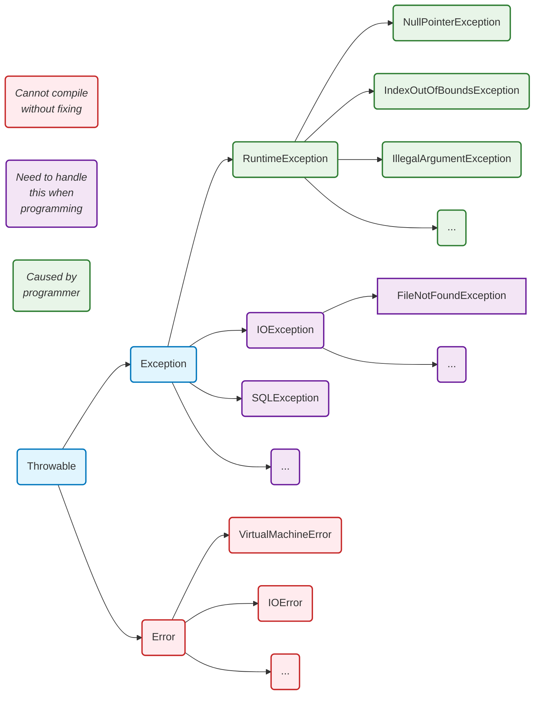

# 异常
---
## 异常的种类



> 简要说明
>
> 1. 错误 `Error` 是不能救了，出现了就会终止程序。
> 2. 异常 `Exception` 是还能抢救 = 运行时异常（`RuntionException`） + 编译时异常（`RuntionException`以外的所有）。所以异常可以抛出。

* 继承关系梳理
	1.  框架：**Serializable** 👉 **Throwable** 👉 **Exception** 和 **Error**
	2. 运行时异常：Exception 👉 **RuntionException** 👉 NullPointerException，ArithmeticException, ArrayIndexOutOfBoundsException, ClassCastException
	3. 编译时异常：Exception 👉 （等等，很多种编译异常）IOException 👉 FileNotFoundException
	4. 错误：Error 👉 StackOverflowError, OutOfMemoryError, ....
* Exception一些别称：
	* 所有的RuntimeException的子类：运行时异常/未检查异常(UncheckedException)/非受控异常
	* Exception的子类（除RuntimeException之外）：编译时异常/检查异常(CheckedException)/受控异常
	*  [常见的异常（AI总结）](exception-ai.md)
* 编译时异常和运行时异常区别：
	* 编译时异常特点：**在编译阶段必须提前处理，如果不处理编译器报错**。
	* 运行时异常特点：在编译阶段可以选择处理，也可以不处理，没有硬性要求。
	* 编译时异常一般是由外部环境或外在条件引起的，如网络故障、磁盘空间不足、文件找不到等
	* 运行时异常一般是由程序员的错误引起的，并且不需要强制进行异常处理
	* 注意：编译时异常并不是在编译阶段发生的异常，所有的**异常发生都是在运行阶段的**，因为每个异常发生都是会new异常对象的，new异常对象只能在运行阶段完成。那为什么叫做编译时异常呢？这是因为这种异常必须在编译阶段提前预处理，如果不处理编译器报错，因此而得名编译时异常。

---
## 异常的创建与抛出

### 自定义异常

> 1) 定义类：自定义异常类名（程序员自己写）继承`Exception`或`RuntimeException`
>    1) 如果继承`Exception`，属于**编译异常**
>    2) 如果继承`RuntimeException`，属于**运行异常**，一般都继承`RuntimeException`
> 2) 提供一个无参数构造方法，再提供一个带`String msg`参数的构造方法，在构造方法中调用父类的构造方法。

```java
package ex_exception;  

public class CustomTest {  
  public static void main(String[] args){  
    int age = 80;  
    // 要求年龄在 18 到 120        
    if(!(age >= 18 && age <= 120)){  
      throw new AgeException("年龄需要在 18 到 120");  
    }
    int age2 = 180;  
    // 要求年龄在 18 到 120        
    if(!(age2 >= 18 && age2 <= 120)){  
      throw new AgeException("年龄需要在 18 到 120");  
    }
  }
}  

class AgeException extends RuntimeException{ 
  public AgeException(){ }

  public AgeException(String message){  
    super(message);  
  }
}
```

### throw

> 我们可以手动的创建异常对象然后通过`throw`抛出。

```java
package com.powernode.javase;  
  
/**  
 * 异常在程序中到底是如何发生的？  
 */  
public class ExceptionTest02 {  
    public static void main(String[] args) {  
        // 异常的发生要经历两个阶段  
        // 第一个阶段：创建异常对象  
        //NullPointerException e = new NullPointerException();  
        // 第二个阶段：让异常发生（手动抛出异常）  
        //throw e;  
  
        // 合并一步  
        throw new NullPointerException();  
    }  
}
```

---

## try catch

### 基础语法

> 摘要：
>
> 1. `try`和`catch`有返回值，`finally`没有返回值：前边的返回值保存到临时变量，`finally`修改了他也无效。
> 2. `try`和`catch`有返回值，`finally`也有返回值：后边的返回值会覆盖前边的，前边的如果有`++`这种运算，也会影响到返回值。
> 3. java17开始可以用自动`finally`的方法。

这是处理异常的第一种方法：“捕捉异常”

```java
try{
	// 可能有错的代码
}catch(Exception e){
	// 如果 try 错了，就进来，通常将释放资源的代码写在这里
}finally{
	// 一定会执行
}
```

```java
// throws 处理机制图
throws 会抛到上边调用他的地方，也可以通过 try catch 捕获异常
```

要求连续的多个 catch，子类异常写在前边，父类异常写在后边

```java
import java.io.*;

public class ExceptionHandling {
  public static void main(String[] args) {
    File file = new File("test.txt");
    try {
      FileInputStream fis = new FileInputStream(file);
      int content;
      while ((content = fis.read()) != -1) {
        System.out.print((char) content);
      }
    } catch (FileNotFoundException e) {
      System.out.println("File not found: " + e.getMessage());
    } catch (IOException e) {
      System.out.println("I/O error: " + e.getMessage());
    } finally {
      if (file.exists()) {
        System.out.println("File exists.");
      } else {
        System.out.println("File does not exist.");
      }
    }
  }
```

可以只去 `try`,` finally`，没有 `catch`

### 多个位置的返回值

练习 1：`catch`和`finally`的`return`会真的返回哪一个？

```java
public class Exception01 {
  public static int method() {
    try {
      String[] names = new String[3];
      if (names[1].equals("tom")) {
        System.out.println(names[1]);
      } else {
        names[3] = "hspedu";
      }
      return 1;
    } catch (ArrayIndexOutOfBoundsException e) {
      return 2;
    } catch (NullPointerException e) {
      return 3;
    } finally {
      return 4;
    }
  }

  public static void main(String[] args) {
    System.out.println(method());
  }
} 
// 输出什么？   4
```

练习 2：`catch`的`return`会被执行，但是真正返回的是`finally`的

```java
package ex_exception;

public class Exception02 {
  public static int method() {
    int i = 1;
    try {
      i++;
      String[] names = new String[3];
      if (names[1].equals("tom")) { // 没办法去访问names，进入catch
        System.out.println(names[1]);
      } else {
        names[3] = "hspedu";
      }
      return 1;
    } catch (ArrayIndexOutOfBoundsException e) {
      System.out.println(2);
      return 2;
    } catch (NullPointerException e) {  // 会来到这里
      System.out.println(3);
      return ++i;
    } finally {
      return ++i;
    }
  }
  public static void main(String[] args) {
    System.out.println(method());
  }
}
// 练习2 输出 3 4
```

练习 3: 如果`try`里边返回了，`finally`里边对`try`返回的变量进行了修改怎么办？

```java
package com.powernode.javase;  

/**  
 * finally语句块
 */  
public class ExceptionTest09 {  
  public static void main(String[] args) {  
    int result = m3();  
    System.out.println(result);   // 100

    int result2 = m4();  
    System.out.println(result2);  // 100
  }  

  public static int m3(){  
    int i = 100;  
    try {  
      return i;  
    } finally {  
      System.out.println("finally..."+i);   // 100
      i++;  
      System.out.println("finally..."+i);   // 101
    }  
  }  

  public static int m4(){  
    int i = 100;  
    try {  
      return i;  
    } finally {  
      System.out.println("finally..."+i);   // 100
      ++i;
      System.out.println("finally..."+i);   // 101
    }  
  }  
}
```
**Java 会在执行 finally 块之前，先将 return 语句中的返回值（此时是 100）保存到一个临时变量中，然后再执行 finally 块，最后返回之前保存的临时变量值。​**

### 自动 finally

java17引入的，可以自动 `finally` 。对于实现了`autoCloseable`的类，可以自动关闭。

```java
package com.powernode.javase.io;  

import java.io.FileInputStream;  
import java.io.FileOutputStream;  

public class TryWithReources {  
  public static void main(String[] args) {   
    try (  
      FileInputStream fis = new FileInputStream("d:/a.txt");  
      FileOutputStream fos = new FileOutputStream("d:/b.txt");  
    ){  
      int b;  
      while ((b = fis.read()) != -1) {  
        fos.write(b);  
      }  
    } catch (Exception e) {  
      e.printStackTrace();  
    }  
  }  
}
```


---

## throws

### 基础语法

这是处理异常的第二种方法：“抛给调用者处理”

```java
// 定义一个可能抛出 IOException 的方法
public class FileHandler {
  public void readFile(String fileName) throws IOException {
    // 假设这里是读取文件的代码
    if (fileName == null) {
      throw new IOException("文件名不能为 null");
    }
    // 正常情况下读取文件的代码
    System.out.println("文件读取成功：" + fileName);
  }
}

public class ExceptionDemo {
  public static void main(String[] args) {
    FileHandler handler = new FileHandler();
    try {
      // 尝试读取文件
      handler.readFile(null); // 故意传递 null 触发异常
    } catch (IOException e) {
      System.out.println("捕获到 IOException：" + e.getMessage());
    }
  }
}
```

我们可以抛出具体的异常：`throws IOException`
也可以抛出通用的：`throws Exception`
也可以抛出一个异常列表：`throws IOException, NullPointerException, ArithmeticException`

一些细节：
1. **编译时异常**：必须处理，例如使用 `try-catch` 或者 `throws` 声明。
2. **运行时异常**：如果没有处理，默认使用 `throws` 方式处理。
3. **子类重写父类方法**：抛出的异常类型必须与父类一致，或为父类抛出异常类型的子类型。
4. **`throws` 过程中**：有 `try-catch`，相当于处理了异常，可以不必再使用 `throws`。


```java
public void test() /*throws ArithmeticException*/ {
  int n1 = 9 / 0; // 发生运行异常，如果没有 catch 默认就是 throws
}

class Father {
  public void method() throws RuntimeException {}
}

class Son extends Father {
  public void method() throws NullPointerException {} // 这样可以
  // public void method() throws Exception {} // 这样不可以❌
}
```

### throw 和 throws 对比

`throw` 是我在方法里边自己的弄得，类似 python 的 raise 
`throws` 是在 class 上边弄得

下边是一个案例，如果用户名长度不符合就触发异常
* 定义两个编译时异常：
	* `IllegalNameException` ：无效名字异常
	* `IllegalAgeException`：无效年龄异常
* 完成这样的需求：
	* 编写一个用户注册的方法，该方法接收两个参数，一个是用户名，一个是年龄。如果用户名长度在[6 - 12]位，并且年龄大于18岁时，输出用户注册成功。
	* 如果用户名长度不是[6 - 12]位时，让程序出现异常，让`IllegalNameException`异常发生！
	* 如果年龄小于18岁时，让程序出现异常，让`IllegalAgeException`异常发生！

```java
package com.powernode.javase;  

import com.powernode.javase.exception.IllegalAgeException;  
import com.powernode.javase.exception.IllegalNameException;  
import com.powernode.javase.exception.IllegalRealnameException;  

import java.util.Scanner;  

// 第一种方法(假如在ExceptionTest03.java)
public class ExceptionTest03 {  
  //public static void main(String[] args) throws IllegalNameException, IllegalAgeException {  
  public static void main(String[] args) throws Exception{  
    //public static void main(String[] args) throws IllegalRealnameException, IllegalAgeException {  
    Scanner scanner = new Scanner(System.in);  
    System.out.println("欢迎使用本系统，先进行用户的注册：");  
    System.out.print("请输入用户名：");  
    String name = scanner.next();  
    System.out.print("请输入年龄：");  
    int age = scanner.nextInt();  

    // 注册  
    UserService userService = new UserService();  
    userService.register(name, age); // 这里的代码可能出现异常，如果一旦出现异常，后续代码则不再执行。  

    System.out.println("main over!");  
  }  
}  

// 第二种方法去（假如在ExceptionTest04.java）
public class ExceptionTest04 {  
  public static void main(String[] args) {  
    Scanner scanner = new Scanner(System.in);  
    System.out.println("欢迎使用本系统，先进行用户的注册：");  
    System.out.print("请输入用户名：");  
    String name = scanner.next();  
    System.out.print("请输入年龄：");  
    int age = scanner.nextInt();  

    UserService userService = new UserService();  
    /*try {  
            // 可能出现异常的代码  
            userService.register(name, age);            
            // 如果以上代码出现异常，这里不会执行。  
            System.out.println("如果出现异常，这里的代码会不会执行！");  
        }catch(IllegalNameException e){            
	        System.out.println("对不起，用户名不合法");  
        }catch(IllegalAgeException e){            
	        System.out.println("对不起，年龄不合法！");  
        }*/  
    /*try {            
	        // 可能出现异常的代码  
            userService.register(name, age);            
            // 如果以上代码出现异常，这里不会执行。  
            System.out.println("如果出现异常，这里的代码会不会执行！");  
        }catch(Exception e){            
	        System.out.println("异常发生了");  
        }*/  
    /*try {            
	        // 可能出现异常的代码  
            userService.register(name, age);            
            // 如果以上代码出现异常，这里不会执行。  
            System.out.println("如果出现异常，这里的代码会不会执行！");  
        }catch(IllegalNameException e){            
	        System.out.println("名字有问题！");  
            //System.out.println(e);        
        }catch(Exception e){            
	        System.out.println("异常发生了");  
        }*/  
    // 编译报错  
    /*try {  
            // 可能出现异常的代码  
            userService.register(name, age);            
            // 如果以上代码出现异常，这里不会执行。  
            System.out.println("如果出现异常，这里的代码会不会执行！");  
        }catch(Exception e){            
	        System.out.println("异常发生了");  
        }catch(IllegalAgeException e){  
        }*/  
    // java7的新特性  
    try {  
      // 可能出现异常的代码  
      userService.register(name, age);  
      // 如果以上代码出现异常，这里不会执行。  
      System.out.println("如果出现异常，这里的代码会不会执行！");  
    }catch(IllegalNameException | IllegalAgeException e){  
      System.out.println("对不起，参数不合法！");  
    }  

    System.out.println("main over!");  
  }  
}

/**  
 * 用户的业务类  
 */  
class UserService {  
  public void register(String name, int age) throws IllegalNameException, IllegalAgeException {  
    System.out.println("正在注册，请稍后....");  
    UserDao userDao = new UserDao();  
    userDao.save(name, age); //这里有可能出现异常，出现了异常之后，后续程序则不再执行了。  
    System.out.println("注册成功，欢迎[" + name + "]");  
  }  
}  

/**  
 * 操作数据库的一个类  
 */  
class UserDao {  
  /**  
     * 用户要注册，肯定最后用户名和年龄这个用户相关的信息是需要保存的。  
     * @param name 用户名  
     * @param age 年龄  
     */  
  public void save(String name, int age) throws IllegalNameException, IllegalAgeException{  
    System.out.println("用户["+name+"]的信息正在保存....");  
    if(name.length() < 6 || name.length() > 12){  
      throw new IllegalNameException();  
      // 这里不能写任何代码，因为这里的代码永远都不会执行。  
      //System.out.println("hello world");  
    }  
    if(age < 18){  
      throw new IllegalAgeException();  
    }  
    System.out.println("用户["+name+"]的信息保存成功！");  
  }
}
```

---

## 异常的常用方法

* 获取异常的简单描述信息：
	* `exception.getMessage();`
	* 获取的message是通过构造方法创建异常对象时传递过去的message。
* 打印异常堆栈信息：
	* `exception.printStackTrace();`
* 要会看异常的堆栈信息：
	* 异常信息的打印是符合栈数据结构的。
	* 看异常信息主要看最开始的描述信息。看栈顶信息。

---
## 方法重写的异常

方法重写之后，不能比父类方法抛出更多的异常，可以更少。

怎么记：方法越写越好，异常越来越少

