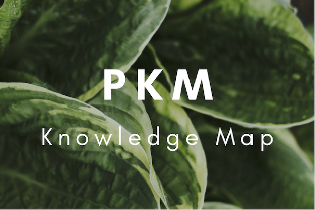

# PKM - Personal Knowledge Map  

## PKM - Page
https://charlesshan-hub.github.io/PKM
## 项目介绍  
PKM(Personal Knowledge Map)，个人知识地图致力于在构建知识树的基础上加入其他要素，使之成为具有可发展性，强关联性的新型知识树。  
个人知识地图关注于：构建某学科的全面的知识树；将不同学科知识树进行关联与整合；将基于Xmind的知识图提炼出知识数据关系。  
## 项目逻辑
1. 利用Xmind搭建内部富有关联的知识地图 -> learn.xmind
2. 根据learn.xmind内部关系映射出另一套.xmind系统。在知识构建时在外部进行草稿构建。构建完成后同步到learn.xmind中。
3. 利用PKMViewer中的工具，将思维导图中的数据提炼出来，进行处理，生成HTML展示。
4. (可以将数据提炼为关系，插入到Neoj4知识图谱中。)
5. 可以通过Nginx搭建属于自己的知识展示网站
