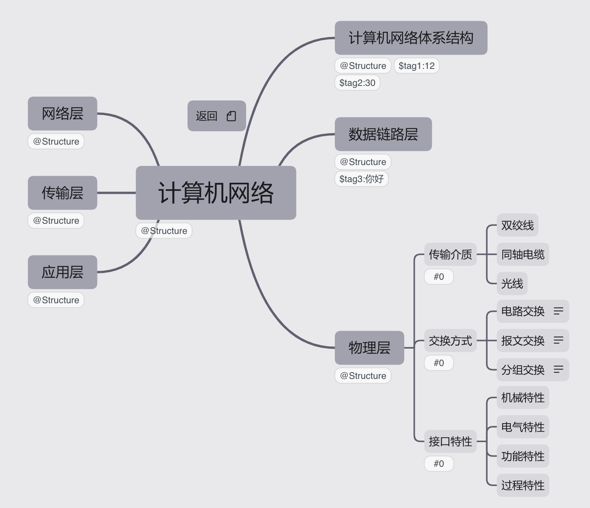
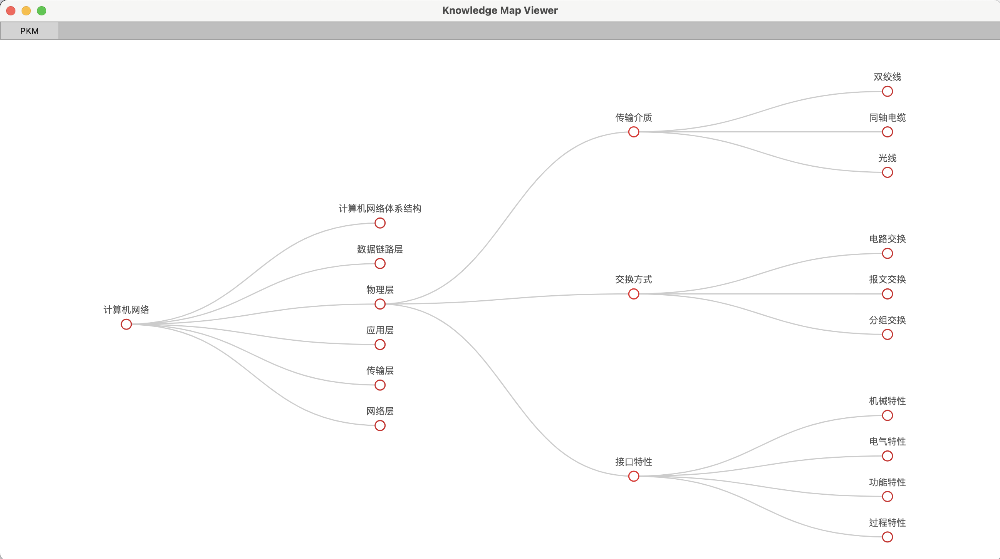
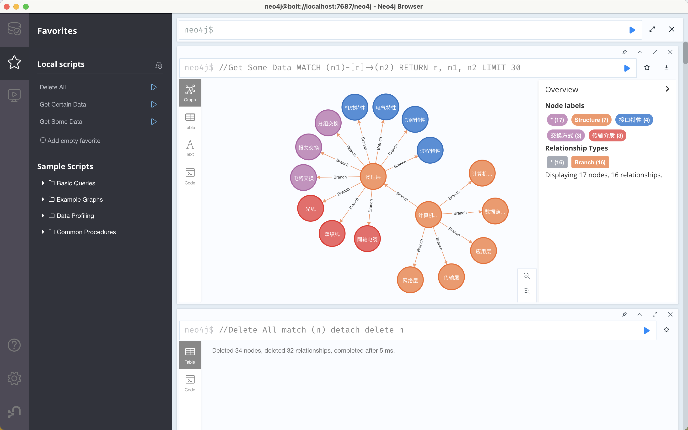

# PKM - Personal Knowledge Map  

独立思考能力是科学研究和创造发明的一项必备才能。在历史上任何一个较重要的科学上的创造和发明，都是和创造发明者的独立地深入地看问题的方法分不开的。——华罗庚

## 项目介绍  

PKM(Personal Knowledge Map)，个人知识地图致力于在构建知识树的基础上加入其他要素，使之成为具有可发展性，强关联性的新型知识树。  

个人知识地图关注于：构建某学科的全面的知识树；将不同学科知识树进行关联与整合；将基于Xmind的知识图提炼出知识数据关系。  目前阶段专注于构建单独学科的内在知识导图。

个人知识地图领域探索：

1. “理科是人的腿”，是人们实践的工具
   1. PKM主要集中于计算机及相关领域
   2. PKM同时兼顾深度与广度，但不会沦为笔记的奴隶。生活中学到什么，需要什么就去记录什么，剩下的仅仅是浅尝辄止。
2. “文科是人的另一条腿”。在物理领域，“科学靠两条腿走路,一是理论,一是实验。有时一条腿走在前面,有时另一条腿走在前面。只有使用两条腿,才能前进。”（密立根）。理论与实验以前以后，彼此平等。马克思认为“实践是认识的来源、目的、检验标准、前进动力，认识又对实践产生反作用”，彼此相互影响。
   1. PKM文科系统聚焦于管理、法律、心理等问题
   2. PKM文科系统为辅助部分，仅做笔记梳理用，目前成不了体系
3. “哲学是人的大脑”。
   1. PKM哲学部分聚焦于马克思主义与马克思主义中国化内容及其相关领域。
   2. 会兼顾哲学史，但不是重点。
4. “艺术是衣服”。
   1. PKM艺术部分为画龙点睛部分，作用是锦上添花，而不是雪中送炭。

## 内容地图

**[计算机科学](./KnowledgeMap/计算机科学/README.md)** **—— 基础理论**

|                                                              |                                                              |                          |
| ------------------------------------------------------------ | ------------------------------------------------------------ | ------------------------ |
| (电路分析基础)                                               | (模拟电路)                                                   | (数字电路)               |
| (数字系统设计)                                               | (计算理论)                                                   |                          |
| 🌟[计算机组成原理](./KnowledgeMap/计算机科学/计算机组成原理/README.md) | 🐦[计算机体系结构](./KnowledgeMap/计算机科学/计算机体系结构/README.md) | (深入理解计算机体系结构) |
| (嵌入式系统)                                                 | (程序设计理论)                                               |                          |
| 🌟[操作系统](./KnowledgeMap/计算机科学/操作系统/README.md)    | (数据库)                                                     |                          |
| 🌟[计算机网络](./KnowledgeMap/计算机科学/计算机网络/README.md) | (现代交换原理)                                               | (下一代网络技术)         |
| (网络安全)                                                   | (中间件)                                                     |                          |
| 🌟[数据结构](./KnowledgeMap/计算机科学/数据结构/README.md)    | (算法设计与分析)                                             | (软件工程)               |
| (计算机图形学)                                               | (GPU编程)                                                    | (并行计算)               |
| (分布式与云计算)                                             | ✏️[区块链](./KnowledgeMap/计算机科学/区块链/README.md)        |                          |

**[计算机科学](./KnowledgeMap/计算机科学/README.md)** **—— 应用**

|                |                    |                |
| :------------: | :----------------: | :------------: |
|   (人工智能)   |     (机器学习)     |  (计算机视觉)  |
| (自然语言处理) |     (知识图谱)     |   (风控模型)   |
|   (推荐系统)   |                    |                |
|     (仿真)     |      (超计算)      |    (大数据)    |
|   (虚拟现实)   |     (增强现实)     |   (介导现实)   |
|    (物联网)    |     (黑客技术)     |                |
|  (多媒体基础)  | （图像与视频处理） | （交互式媒体） |
|   (人机交互)   |                    |                |

**[计算机科学](./KnowledgeMap/计算机科学/README.md)** **—— 编程语言**

|              |           |            |
| :----------: | :-------: | :--------: |
|    (VHDL)    | (Verilog) |   (汇编)   |
|     (C)      |   (SQL)   |   (Java)   |
|    (C++)     | (Python)  |  (Julia)   |
| (Javascript) | (Matlab)  | (Solidity) |
|   (Swift)    |           |            |

**[计算机科学](./KnowledgeMap/计算机科学/README.md)** **—— 关联学科（非数学）**

|              |                  |              |
| :----------: | :--------------: | :----------: |
| (信号与系统) |    (通信原理)    |  (量子计算)  |
|   (信息论)   | （数字信号处理） | （高级变换） |
|   (密码学)   |                  |              |
|              |                  |              |

**[计算机科学](./KnowledgeMap/计算机科学/README.md)** **—— 软件与技术**

|          |           |           |
| :------: | :-------: | :-------: |
|  (Git)   |  (Xcode)  | (Protege) |
| (OpenGL) |  (Unity)  |   (Vue)   |
| (React)  | (Angular) | (MongoDB) |
| (Sqlite) | (Arduino) |  (Linux)  |

**[数学](./KnowledgeMap/数学/README.md)**

|                                                     |                                                     |                                                              |
| :-------------------------------------------------: | :-------------------------------------------------: | :----------------------------------------------------------: |
| ⭐️[高等数学](./KnowledgeMap/数学/高等数学/README.md) | ✏️[线性代数](./KnowledgeMap/数学/线性代数/README.md) | ✏️[概率论与数理统计](./KnowledgeMap/数学/概率论与数理统计/README.md) |
|                    （抽象代数）                     |                                                     |                                                              |

**[文史哲](./KnowledgeMap/文史哲/README.md)**

|                                                              |                                                              |                                                              |
| :----------------------------------------------------------: | :----------------------------------------------------------: | :----------------------------------------------------------: |
|                        （西方哲学史）                        |                        （中国哲学史）                        | ⭐️[马克思主义原理](./KnowledgeMap/文史哲/马克思主义原理/README.md) |
| ⭐️[毛泽东思想](./KnowledgeMap/文史哲/毛泽东思想和中国特色社会主义理论体系概论/README.md) | ⭐️[中国特色社会主义理论体系概论](./KnowledgeMap/文史哲/毛泽东思想和中国特色社会主义理论体系概论/README.md) |  ⭐️[近代史纲要](./KnowledgeMap/文史哲/近代史纲要/README.md)   |
| ⭐️[思想道德修养](./KnowledgeMap/文史哲/思想道德修养/README.md) |                            (英语)                            |                                                              |
|  ✏️ [社会心理学](./KnowledgeMap/文史哲/社会心理学/README.md)  |                                                              |                                                              |

**经济与管理**

|              |                |                  |
| :----------: | :------------: | :--------------: |
| (宏观经济学) | （微观经济学） |                  |
| （企业管理） |  （产品开发）  | （企业战略管理） |

**艺术设计**

|      |      |      |
| ---- | ---- | ---- |
|      |      |      |

* 💎：熟能生巧
* 🌟：已经多次迭代渐入佳境
* ⭐️：已经完成一次知识点覆盖
* ✏️：正在进行学习
* 🐦：已加入学习计划
* (  )：草稿构建

#  零碎专题

| **正则表达式**                                          |                                           |                                                              |
| ------------------------------------------------------- | ----------------------------------------- | ------------------------------------------------------------ |
| [正则表达式博客](https://zhuanlan.zhihu.com/p/58110403) | [正则表达式可视化](https://regexper.com/) | [正则表达式可视化2](https://blog.robertelder.org/regular-expression-visualizer/) |
| **设计模式**                                            |                                           |                                                              |
|                                                         |                                           |                                                              |
| **数据库**                                              |                                           |                                                              |
| SQL Server                                              | MongoDB                                   | Sqlite                                                       |
|                                                         |                                           |                                                              |
|                                                         |                                           |                                                              |

## 项目逻辑

1. 利用Xmind搭建内部富有关联的知识地图 -> learn.xmind

   

2. 利用PKMViewer中的工具，将思维导图中的数据提炼出来，进行处理，生成HTML展示。

   

3. 可以通过Nginx搭建属于自己的知识展示网站

   

4. 可以将数据提炼为关系，插入到Neoj4知识图谱中。

   
   
5. 知识结构为通过思维导图连接的知识点（项目/领域标题），与通过Markdown文档表现的具体内容笔记。通过[**Docusaurus**](https://docusaurus.io/zh-CN/)进行静态网络的搭建，快速生成对应博客。

## 想挖的坑

* 计算机网络 $\to$编码工具CRC，海明码等可视化
  * 项目要求：基于JS，生成动态的可视化看板，可以进行数据交互。需要做到简单易用，一个浏览器就能运行。
* 计算机组成原理$\to$原码反码补码转换可视化工具
* 数据结构$\to$可拓展数据结构组件（C++）
* 数据结构$\to$AVL(二叉平衡树)流畅美观动画展示
  * 项目要求：AVL左旋右旋动画-提起父节点，高度超过爷节点，子节点吸到爷节点上。每个节点展现出磁力互斥感。
* 去除所有导图内容中可能存在版权问题的成分，去除可能存在版权问题的资料，将项目分成个人部分与开源部分，公开的资料不含敏感文件。
* 所有导图适配知识图谱导入工具，注重构建知识关联。
