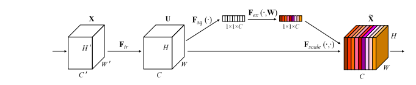
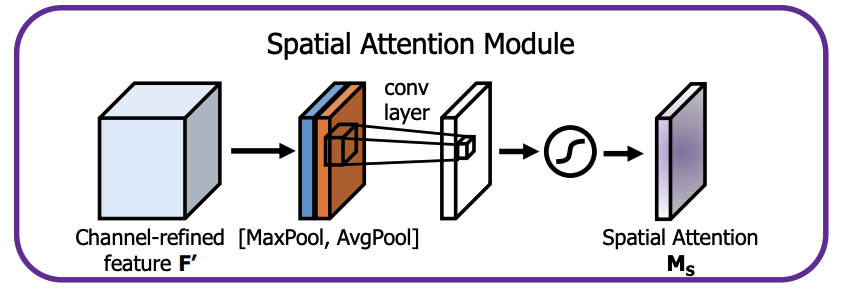
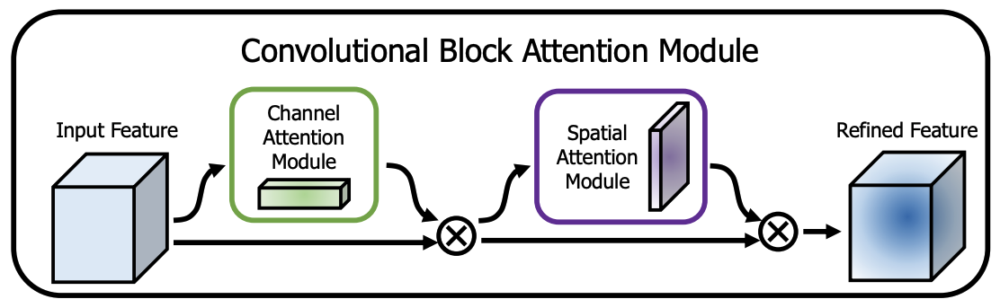

# 自注意力

* 简介：李宏毅简化版本的自注意力模型。
* `query`: 用来查询别人的键
* `key`: 用来被别人查的键
* `value`: 用来代表自己的值的键，后边与查询结果相乘，得到重要性
* 主要流程：每一个图像块都变成了一个$I_i$， 有自己的`key`、`query`和`value`，得到重要性$a_i$，与自己的值相乘得到输出$o_i$
# 多头自注意力

* 单独的自注意力叫做一个“头”，多套自注意力并列就是多头自注意力模型（MSD）
# 通道注意力

* Paper：["Squeeze-and-Excitation Networks"](https://arxiv.org/abs/1709.01507)
* 主要思想：用一个数字一个特征图的 channel 的权重。
* 主要流程：输入一个$(B,C_1,H,W)$的特征图，首先经过“全局池化层”把每一层压缩成一个数，得到$(B,C_1,1,1)$ 的向量。再对它进行压缩得到$(B,C_2,H,W)$的向量，之后再压缩后的结果进行扩张恢复成$(B,C_1,1,1)$ 的向量，这就是每一层的权重。最后把权重和输入特征图的每一层相乘得到形状为$(B,C_1,H,W)$的输出结果。

# 空间注意力

* 主要思想：对通道使用池化，压缩成一张特征图，然后进行注意力机制得到权重图。
# CBAM

* 分两步的，先进行通道注意力，再进行空间注意力