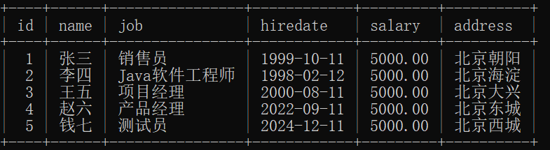

# DAO

> 下边会用一个员工信息管理系统演示DAO
> 本文使用工具类：[utils](../details/utils.md)

---

## 什么是DAO

* DAO是：Data Access Object，翻译为：数据访问对象。一种JavaEE的设计模式，专门用来做数据增删改查的类。
* 在实际的开发中，通常我们会将数据库的操作封装为一个单独的DAO去完成，这样做的目的是：提高代码的复用性，另外也可以降低程序的耦合度，提高扩展力。
* 例如：操作用户数据的叫做`UserDao`，操作员工数据的叫做`EmployeeDao`，操作产品数据的叫做`ProductDao`，操作订单数据的叫做`OrderDao`等。

---

## 准备工作

```sql
drop databases if exists jdbc;
drop table if exists t_employee;

create table t_employee(
  id bigint primary key auto_increment,
  name varchar(255),
  job varchar(255),
  hiredate char(10),
  salary decimal(10,2),
  address varchar(255)
);

insert into t_employee(name,job,hiredate,salary,address) values('Zhang San','Salesman','1999-10-11',5000.0,'Chaoyang, Beijing');
insert into t_employee(name,job,hiredate,salary,address) values('Li Si','Coder','1998-02-12',5000.0,'Haidian, Beijing');
insert into t_employee(name,job,hiredate,salary,address) values('Wang Wu','Project Manager','2000-08-11',5000.0,'Daxing, Beijing');
insert into t_employee(name,job,hiredate,salary,address) values('Zhao Liu','Product Manager','2022-09-11',5000.0,'Dongcheng, Beijing');
insert into t_employee(name,job,hiredate,salary,address) values('Qian Qi','Tester','2024-12-11',5000.0,'Xicheng, Beijing');

commit;

select * from t_employee;
```



maven坐标
```xml
<dependencies>  
  <dependency>  
    <groupId>junit</groupId>  
    <artifactId>junit</artifactId>  
    <version>3.8.1</version>  
    <scope>test</scope>  
  </dependency>  
  <dependency>  
    <groupId>mysql</groupId>  
    <artifactId>mysql-connector-java</artifactId>  
    <version>8.0.33</version>  
  </dependency>  
  <dependency>  
    <groupId>org.projectlombok</groupId>  
    <artifactId>lombok</artifactId>  
    <optional>true</optional>  
  </dependency>  
</dependencies>
```

---

## 实现效果

查看员工列表


查看员工详情


新增员工


修改员工


删除员工


退出系统


---

## Entity

Employee类是一个Java Bean，专门用来封装员工的信息

```java
package top.charles.entity;  
  
import lombok.AllArgsConstructor;  
import lombok.Data;  
import lombok.NoArgsConstructor;  
  
/**  
 * ClassName: Employee 
 * Description:
 * Datetime: 2024/4/14 23:32
 * Author: 老杜@动力节点  
 * Version: 1.0  
 */
@Data  
@NoArgsConstructor  
@AllArgsConstructor  
public class Employee {  
    private Long id;  
    private String name;  
    private String job;  
    private Double salary;  
    private String hiredate;  
    private String address;  
}
```

## Dao

这里封装一些基本的jdbc，其实dao就是mapper

```java
package top.charles.dao;  
  
import top.charles.utils.DbUtils;  
  
import java.lang.reflect.Field;  
import java.sql.*;  
import java.util.ArrayList;  
import java.util.List;  
  
/**  
 * ClassName: BaseDao
 * Description: 最基础的Dao，所有的Dao应该去继承该BaseDao  
 * Datetime: 2024/4/15 11:08
 * Author: 老杜@动力节点  
 * Version: 1.0  
 */public class BaseDao {  
  
    /**  
     * 这是一个通用的执行insert delete update语句的方法。  
     * @param sql  
     * @param params  
     * @return  
     */  
    protected  int executeUpdate(String sql, Object... params) {  
        Connection conn = null;  
        PreparedStatement ps = null;  
        int count = 0;  
        try {  
            // 获取连接  
            conn = DbUtils.getConnection();  
            // 获取预编译的数据库操作对象  
            ps = conn.prepareStatement(sql);  
            // 给 ? 占位符传值  
            if(params != null && params.length > 0){  
                // 有占位符 ?                
                for (int i = 0; i < params.length; i++) {  
                    ps.setObject(i + 1, params[i]);  
                }  
            }  
            // 执行SQL语句  
            count = ps.executeUpdate();  
        } catch (SQLException e) {  
            throw new RuntimeException(e);  
        } finally {  
            DbUtils.close(conn, ps, null);  
        }  
        return count;  
    }  
  
    /**  
     * 这是一个通用的查询语句  
     * @param clazz  
     * @param sql  
     * @param params  
     * @return  
     * @param <T>  
     */  
    protected  <T> List<T> executeQuery(Class<T> clazz, String sql, Object... params){  
        List<T> list = new ArrayList<>();  
        Connection conn = null;  
        PreparedStatement ps = null;  
        ResultSet rs = null;  
        try {  
            // 获取连接  
            conn = DbUtils.getConnection();  
            // 获取预编译的数据库操作对象  
            ps = conn.prepareStatement(sql);  
            // 给?传值  
            if(params != null && params.length > 0){  
                for (int i = 0; i < params.length; i++) {  
                    ps.setObject(i + 1, params[i]);  
                }  
            }  
            // 执行SQL语句  
            rs = ps.executeQuery();  
  
            // 获取查询结果集元数据  
            ResultSetMetaData rsmd = rs.getMetaData();  
  
            // 获取列数  
            int columnCount = rsmd.getColumnCount();  
  
            // 处理查询结果集  
            while(rs.next()){  
                // 封装bean对象  
                T obj = clazz.newInstance();  
                // 给bean对象属性赋值  
                /*  
                比如现在有一张表：t_user，然后表中有两个字段，一个是 user_id，一个是user_name  
                现在javabean是User类，该类中的属性名是：userId,username  
                执行这样的SQL语句：select user_id as userId, user_name as username from t_user;  
                 */                
                 for (int i = 1; i <= columnCount; i++) {  
                    // 获取查询结果集中的列的名字  
                    // 这个列的名字是通过as关键字进行了起别名，这个列名就是bean的属性名。  
                    String fieldName = rsmd.getColumnLabel(i);  
                    // 获取属性Field对象  
                    Field declaredField = clazz.getDeclaredField(fieldName);  
                    // 打破封装  
                    declaredField.setAccessible(true);  
                    // 给属性赋值  
                    declaredField.set(obj, rs.getObject(i));  
                }  
  
                // 将对象添加到List集合  
                list.add(obj);  
            }  
        } catch (Exception e) {  
            throw new RuntimeException(e);  
        } finally {  
            DbUtils.close(conn, ps, rs);  
        }  
        // 返回List集合  
        return list;  
    }  
  
    /**  
     *    
     * @param clazz  
     * @param sql  
     * @param params  
     * @return  
     * @param <T>  
     */  
    protected  <T> T queryOne(Class<T> clazz, String sql, Object... params){  
        List<T> list = executeQuery(clazz, sql, params);  
        if(list == null || list.size() == 0){  
            return null;  
        }  
        return list.get(0);  
    }  
}
```

定义EmployeeDao：定义五个方法，分别完成五个功能，新增，修改，删除，查看一个，查看所有。

```java
package top.charles.dao;  
  
import top.charles.entity.Employee;  
import java.sql.*;  
import java.util.List;  
  
/**  
 * ClassName: EmployeeDao
 * Description: Employee数据访问层，继承BaseDao  
 * Datetime: 2024/4/14 23:34
 * Author: 老杜@动力节点  
 * Version: 1.0  
 */
 public class EmployeeDao extends BaseDao {  
  
    /**
     * 新增员工  
     * @param employee  
     * @return  
     */  
    public int insert(Employee employee) {  
        String sql = "insert into t_employee(name,job,salary,hiredate,address) values(?,?,?,?,?)";  
        return executeUpdate(sql,  
                employee.getName(),  
                employee.getJob(),  
                employee.getSalary(),  
                employee.getHiredate(),  
                employee.getAddress()  
        );  
    }  
  
    /**  
     * 修改员工  
     * @param employee  
     * @return  
     */  
    public int update(Employee employee){  
        String sql = "update t_employee set name=?, job=?, salary=?, hiredate=?, address=? where id=?";  
        return executeUpdate(sql,  
                employee.getName(),  
                employee.getJob(),  
                employee.getSalary(),  
                employee.getHiredate(),  
                employee.getAddress(),  
                employee.getId()  
        );  
    }  
  
    /**  
     * 根据id删除员工信息  
     * @param id 员工id  
     * @return 1表示成功  
     */  
    public int deleteById(Long id){  
        String sql = "delete from t_employee where id = ?";  
        return executeUpdate(sql, id);  
    }  
  
    /**  
     * 根据id查询所有员工  
     * @param id  
     * @return  
     */  
    public Employee selectById(Long id){  
        String sql = "select * from t_employee where id = ?";  
        return queryOne(Employee.class, sql, id);  
    }  
  
    /**  
     * 查询所有员工信息  
     * @return 员工列表  
     */  
    public List<Employee> selectAll(){  
        String sql = "select * from t_employee";  
        return executeQuery(Employee.class, sql);  
    }  
}
```

## App

```java
package top.charles;  
  
import top.charles.dao.EmployeeDao;  
import top.charles.entity.Employee;  
  
import java.math.BigDecimal;  
import java.util.Scanner;  
  
public class App {  
    public static void main(String[] args){  
        System.out.println("Welcome to the Employee Management System. Through this system, you can perform the following employee information operations:\n"+  
                "Add Employee, Modify Employee, Delete Employee, View Specific Employee Details, View Employee List");  
        String welcome_text = "Please enter the corresponding function number to use the corresponding function:\n"+  
            "[1] View Employee List\n"+  
            "[2] View Specific Employee Details\n"+  
            "[3] Add Employee\n"+  
            "[4] Modify Employee\n"+  
            "[5] Delete Employee\n"+  
            "[0] Exit System\n";  
        Scanner scanner = new Scanner(System.in);  
        while(true){  
            System.out.println(welcome_text);  
            switch (scanner.nextInt()){  
                case 0:  
                    break;  
                case 1:  
                    System.out.println("View Employee List");  
                    for (Employee employee : new EmployeeDao().selectAll()) {  
                        System.out.println(employee);  
                    }  
                    break;  
                case 2:  
                    System.out.println("View Specific Employee Details");  
                    System.out.println("Please enter the employee ID:");  
                    System.out.println(new EmployeeDao().selectById(scanner.nextLong()));  
                    break;  
                case 3:  
                    System.out.println("Add Employee");  
                    System.out.println("Please enter the employee information:");  
                    System.out.println("Name:");  
                    String name = scanner.next();  
                    System.out.println("Job:");  
                    String job = scanner.next();  
                    System.out.println("Salary:");  
                    BigDecimal salary = scanner.nextBigDecimal();  
                    System.out.println("Hire Date(ex. 2012-01-15):");  
                    String hiredate = scanner.next();  
                    System.out.println("Address:");  
                    String address = scanner.next();  
                    System.out.println(new EmployeeDao().insert(new Employee(null, name, job, salary, hiredate, address)));  
                    break;  
                case 4:  
                    System.out.println("Modify Employee");  
                    System.out.println("Please enter the employee id:");  
                    Long id = scanner.nextLong();  
                    System.out.println("Origin information");  
                    System.out.println(new EmployeeDao().selectById(id));  
                    System.out.println("Please enter the employee information:");  
                    System.out.println("Name:");  
                    name = scanner.next();  
                    System.out.println("Job:");  
                    job = scanner.next();  
                    System.out.println("Salary:");  
                    salary = scanner.nextBigDecimal();  
                    System.out.println("Hire Date(ex. 2012-01-15):");  
                    hiredate = scanner.next();  
                    System.out.println("Address:");  
                    address = scanner.next();  
                    System.out.println(new EmployeeDao().update(new Employee(id, name, job, salary, hiredate, address)));  
                    break;  
                case 5:  
                    System.out.println("Delete Employee");  
                    System.out.println("Please enter the employee id:");  
                    System.out.println(new EmployeeDao().deleteById(scanner.nextLong()));  
                    break;  
                default:  
                    System.out.println("Invalid operation, please try again.");  
                    break;  
            }  
        }  
    }  
}
```