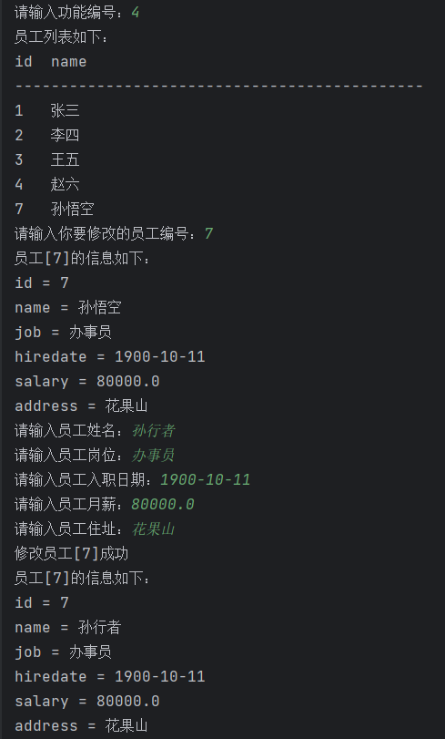
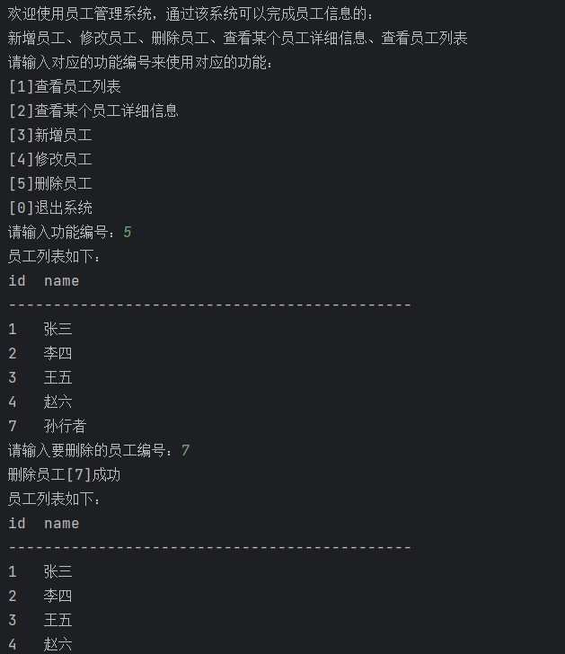

# 数据库表的准备
```sql
drop table if exists t_employee;

create table t_employee(
  id bigint primary key auto_increment,
  name varchar(255),
  job varchar(255),
  hiredate char(10),
  salary decimal(10,2),
  address varchar(255)
);

insert into t_employee(name,job,hiredate,salary,address) values('张三','销售员','1999-10-11',5000.0,'北京朝阳');
insert into t_employee(name,job,hiredate,salary,address) values('李四','编码人员','1998-02-12',5000.0,'北京海淀');
insert into t_employee(name,job,hiredate,salary,address) values('王五','项目经理','2000-08-11',5000.0,'北京大兴');
insert into t_employee(name,job,hiredate,salary,address) values('赵六','产品经理','2022-09-11',5000.0,'北京东城');
insert into t_employee(name,job,hiredate,salary,address) values('钱七','测试员','2024-12-11',5000.0,'北京西城');

commit;

select * from t_employee;
```


# 实现效果
## 查看员工列表


## 查看员工详情


## 新增员工


## 修改员工


## 删除员工


## 退出系统

