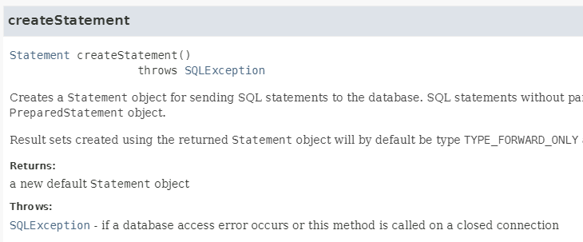
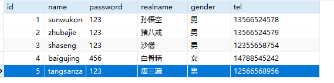

# JDBC 增删改
---
## JDBC编程六步

JDBC编程的步骤是很固定的，通常包含以下六步：
- 第一步：注册驱动
	- 作用一：将 JDBC 驱动程序从硬盘上的文件系统中加载到内存中。
	- 作用二：使得 DriverManager 可以通过一个统一的接口来管理该驱动程序的所有连接操作。
- 第二步：获取数据库连接
	- 获取 java.sql.Connection 对象，该对象的创建标志着mysql进程和jvm进程之间的通道打开了。
- 第三步：获取数据库操作对象
	- 获取 java.sql.Statement 对象，该对象负责将SQL语句发送给数据库，数据库负责执行该SQL语句。
- 第四步：执行SQL语句
	- 执行具体的SQL语句，例如：insert delete update select等。
- 第五步：处理查询结果集
	- 如果之前的操作是DQL查询语句，才会有处理查询结果集这一步。
	- 执行DQL语句通常会返回查询结果集对象：java.sql.ResultSet。
	- 对于ResultSet查询结果集来说，通常的操作是针对查询结果集进行结果集的遍历。
- 第六步：释放资源
	- 释放资源可以避免资源的浪费。在 JDBC 编程中，每次使用完 Connection、Statement、ResultSet 等资源后，都需要显式地调用对应的 close() 方法来释放资源，避免资源的浪费。
	- 释放资源可以避免出现内存泄露问题。在 Java 中，当一个对象不再被引用时，会被 JVM 的垃圾回收机制进行回收。但是在 JDBC 编程中，如果不显式地释放资源，那么这些资源就不会被 JVM 的垃圾回收机制自动回收，从而导致内存泄露问题。

---
## 数据的准备

* 使用PowerDesigner设计用户表t_user。
	* powerdesigner介绍：[PowerDesigner-intro](../details/PowerDesigner-intro.md)
	* powerdesigner安装：[PowerDesigner-install](../details/PowerDesigner-install.md)
	* powerdesigner使用：[PowerDesigner-use](../details/PowerDesigner-use.md)
* 但我还是选择用PDMass进行标设计。
* 使用Navicat for MySQL创建数据库，创建表，插入数据。
	* navicat使用：[navicat-use](../details/navicat-use.md)

---
## JDBC流程

> 下边以新增为例，展示Mysql进行JDBC的流程。

### 构建表

```sql
CREATE TABLE t_user (  
	id INT PRIMARY KEY AUTO_INCREMENT,  
	name VARCHAR(50) NOT NULL,  
	password VARCHAR(100) NOT NULL,  
	realname VARCHAR(50),  
	gender VARCHAR(10),  
	tel VARCHAR(20)  
);
```

### Maven依赖

```xml
<dependency>
    <groupId>mysql</groupId>
    <artifactId>mysql-connector-java</artifactId>
    <version>8.0.33</version>
</dependency>
```

### JDBC编程第一步：注册驱动

1. 注册驱动有两个作用：
	1. 将 JDBC 驱动程序从硬盘上的文件系统中加载到内存。
	2. 让 DriverManager 可以通过一个统一的接口来管理该驱动程序的所有连接操作。
2. 注册驱动的方法1：显示的调用驱动实现类（自己new驱动对象，然后调用DriverManager的registerDriver()方法来完成驱动注册）
	```java
	Driver driver = new com.mysql.cj.jdbc.Driver();
	DriverManager.registerDriver(driver);
	```
	其中：
	* `Driver`是接口：`import java.sql.Driver;`
	* `com.mysql.cj.jdbc.Driver`是mysql的实现类，这个是多态的体现；
	* `oracle.jdbc.OracleDriver`是oracle的实现；
3. 注册驱动的方法2：（更常用）：
	```java
	Class.forName("com.mysql.cj.jdbc.Driver");
	```
	为什么这种方式常用？第一：代码少了很多；第二：这种方式可以很方便的将`com.mysql.cj.jdbc.Driver`类名配置到属性文件当中。
	实现原理是什么？找一下`com.mysql.cj.jdbc.Driver`的源码
	```java
	package com.mysql.cj.jdbc;
	
	public class Driver extends NonRegisteringDriver implements java.sql.Driver {  
		// Register ourselves with the DriverManager.  
		static {  
			try {  
				java.sql.DriverManager.registerDriver(new Driver());  
			} catch (SQLException E) {  
				throw new RuntimeException("Can't register driver!");  
			}    
		}
		// .....
	}
	```
	通过源码不难发现，在`com.mysql.cj.jdbc.Driver`类中有一个静态代码块，在这个静态代码块中调用了`java.sql.DriverManager.registerDriver(new Driver());`完成了驱动的注册。而`Class.forName("com.mysql.cj.jdbc.Driver");`代码的作用就是让`com.mysql.cj.jdbc.Driver`类完成加载，执行它的静态代码块。

### JDBC编程第二步：获取连接

1. 获取 java.sql.Connection 对象，该对象的创建标志着mysql进程和jvm进程之间的通道打开了。
2. 获取连接方法一：`getConnection(String url, String user, String password)`
	```java
	// 2. 获取连接
	String url = "jdbc:mysql://localhost:3306/jdbc";
	String user = "root";
	String password = "123456";
	Connection conn = DriverManager.getConnection(url, user, password);
	```
	通过以上程序的输出结果得知：`com.mysql.cj.jdbc.ConnectionImpl`是`java.sql.Connection`接口的实现类，降低了耦合度。
	连接数据库需要提供三个信息：**url**，**用户名**，**密码**。
3. 获取连接方法二：`getConnection(String url)`
	```java
	String url = "jdbc:mysql://localhost:3306/jdbc?user=root&password=123456";
	Connection conn = DriverManager.getConnection(url);
	```
4. 获取连接方法三：`getConnection(String url, Properties info)`。这种方式有两个参数，一个是url，一个是Properties对象。
	- url：可以单纯提供一个url地址
	- info：可以将url的参数存放到该对象中
	```java
	String url = "jdbc:mysql://localhost:3306/jdbc";
	
	Properties info = new Properties();
	info.setProperty("user", "root");
	info.setProperty("password", "123456");
	info.setProperty("useUnicode", "true");
	info.setProperty("serverTimezone", "Asia/Shanghai");
	info.setProperty("useSSL", "true");
	info.setProperty("characterEncoding", "utf-8");
	
	Connection conn = DriverManager.getConnection(url, info);
	```

#### JDBC连接MySQL时的URL格式
JDBC URL 是在使用 JDBC 连接数据库时的一个 URL 字符串，它用来标识要连接的数据库的位置、认证信息和其他配置参数等。JDBC URL 的格式可以因数据库类型而异，但通常包括以下几个部分：

- **协议**：表示要使用的数据库管理系统（DBMS）的类型，如 `jdbc:mysql` 表示要使用 MySQL 数据库，`jdbc:postgresql` 表示要使用 PostgreSQL 数据库。
- **主机地址和端口号**：表示要连接的数据库所在的服务器的 IP 地址或域名，以及数据库所在服务器监听的端口号。
- **数据库名称**：表示要连接的数据库的名称。
- 其他可选参数：这些参数包括连接的超时时间、使用的字符集、连接池相关配置等。

例如，连接 MySQL 数据库的 JDBC URL 的格式一般如下：

```java
jdbc:mysql://<host>:<port>/<database_name>?<connection_parameters>
```

其中：

- `<host>` 是 MySQL 数据库服务器的主机名或 IP 地址；
- `<port>` 是 MySQL 服务器的端口号（默认为 3306）；
- `<database_name>` 是要连接的数据库名称；
- `<connection_parameters>` 包括连接的额外参数，例如用户名、密码、字符集等。

JDBC URL 是连接数据库的关键，通过 JDBC URL，应用程序可以通过特定的 JDBC 驱动程序与数据库服务器进行通信，从而实现与数据库的交互。在开发 Web 应用和桌面应用时，使用 JDBC URL 可以轻松地连接和操作各种类型的数据库，例如 MySQL、PostgreSQL、Oracle 等。

以下是一个常见的JDBC MySQL URL：
```
jdbc:mysql://localhost:3306/jdbc
```
* `jdbc:mysql://`是协议
* `localhost`表示连接本地主机的MySQL数据库，也可以写作`127.0.0.1`
* `3306`是MySQL数据库的端口号
* `jdbc`是数据库实例名

#### MySQL URL中的其它常用配置
在 JDBC MySQL URL 中，常用的配置参数有：

- `serverTimezone`：MySQL 服务器时区，默认为 UTC，可以通过该参数来指定客户端和服务器的时区；
	在 JDBC URL 中设置 `serverTimezone` 的作用是指定数据库服务器的时区。这个时区信息会影响 JDBC 驱动在处理日期时间相关数据类型时如何将其映射到服务器上的日期时间值。
	如果不设置 `serverTimezone`，则 JDBC 驱动程序**默认将使用本地时区**，也就是**客户端机器**上的系统时区，来处理日期时间数据。在这种情况下，如果服务器的时区和客户端机器的时区不同，那么处理日期时间数据时可能会出现问题，从而导致数据错误或不一致。
	例如，假设服务器位于美国加州，而客户端位于中国上海，如果不设置 `serverTimezone` 参数，在客户端执行类似下面的查询：
	```sql
	SELECT * FROM orders WHERE order_date = '2022-11-11';
	```
	由于客户端和服务器使用了不同的时区，默认使用的是客户端本地的时区，那么实际查询的时间就是客户端本地时间对应的时间，而不是服务器的时间。这可能会导致查询结果不正确，因为服务器上的时间可能是比客户端慢或者快了多个小时。
	通过在 JDBC URL 中设置 `serverTimezone` 参数，可以明确告诉 JDBC 驱动程序使用哪个时区来处理日期时间值，从而避免这种问题。在上述例子中，如果把时区设置为 `America/Los_Angeles`（即加州的时区）：
	```
	jdbc:mysql://localhost:3306/mydatabase?user=myusername&password=mypassword&serverTimezone=America/Los_Angeles
	```
	那么上面的查询就会在数据库服务器上以加州的时间来执行。

- `useSSL`：是否使用 SSL 进行连接，默认为 true；
	`useSSL` 参数用于配置是否使用 SSL（Secure Sockets Layer）安全传输协议来加密 JDBC 和 MySQL 数据库服务器之间的通信。其设置为 `true` 表示使用 SSL 连接，设置为 `false` 表示不使用 SSL 连接。其区别如下：
	当设置为 `true` 时，JDBC 驱动程序将使用 SSL 加密协议来保障客户端和服务器之间的通信安全。这种方式下，所有数据都会使用 SSL 加密后再传输，可以有效防止数据在传输过程中被窃听、篡改等安全问题出现。当然，也要求服务器端必须支持 SSL，否则会连接失败。
	当设置为 `false` 时，JDBC 驱动程序会以明文方式传输数据，这种方式下，虽然数据传输的速度会更快，但也会存在被恶意攻击者截获和窃听数据的风险。因此，在不安全的网络环境下，或是要求数据传输安全性较高的情况下，建议使用 SSL 加密连接。
	需要注意的是，使用 SSL 连接会对系统资源和性能消耗有一定的影响，特别是当连接数较多时，对 CPU 和内存压力都比较大。因此，在性能和安全之间需要权衡，根据实际应用场景合理设置 `useSSL` 参数。

- useUnicode：是否使用Unicode编码进行数据传输，默认是true启用
	`useUnicode`是 JDBC 驱动程序连接数据库时的一个参数，用于告诉驱动程序在传输数据时是否使用 Unicode 编码。Unicode 是计算机科学中的一种字符编码方案，可以用于表示全球各种语言中的字符，包括 ASCII 码、中文、日文、韩文等。因此，使用 Unicode 编码可以确保数据在传输过程中能够正确、完整地呈现各种语言的字符。
	具体地说，如果设置 `useUnicode=true`，JDBC 驱动程序会在传输数据时使用 Unicode 编码。这意味着，无论数据源中使用的是什么编码方案，都会先将数据转换为 Unicode 编码进行传输，确保数据能够跨平台、跨数据库正确传输。当从数据库中获取数据时，驱动程序会根据 `characterEncoding` 参数指定的字符集编码将数据转换为指定编码格式，以便应用程序正确处理数据。
	需要注意的是，如果设置 `useUnicode=false`，则表示使用当前平台默认的字符集进行数据传输。这可能会导致在跨平台或跨数据库时出现字符编码不一致的问题，因此通常建议在进行数据传输时启用 Unicode 编码。
	综上所述，设置 `useUnicode` 参数可以确保数据在传输过程中正确呈现各种字符集编码。对于应用程序处理多语言环境数据的场景，启用 `useUnicode` 参数尤为重要。

- `characterEncoding`：连接使用的字符编码，默认为 UTF-8；
	`characterEncoding` 参数用于设置 MySQL 服务器和 JDBC 驱动程序之间进行字符集转换时使用的字符集编码。其设置为 `UTF-8` 表示使用 UTF-8 编码进行字符集转换，设置为 `GBK` 表示使用 GBK 编码进行字符集转换。其区别如下：
	UTF-8 编码是一种可变长度的编码方式，可以表示世界上的所有字符，包括 ASCII、Unicode 和不间断空格等字符，是一种通用的编码方式。UTF-8 编码在国际化应用中被广泛使用，并且其使用的字节数较少，有利于提高数据传输的效率和节约存储空间。
	GBK 编码是一种固定长度的编码方式，只能表示汉字和部分符号，不能表示世界上的所有字符。GBK 编码通常只用于中文环境中，因为在英文和数字等字符中会出现乱码情况。
	因此，在 MySQL 中使用 `UTF-8` 编码作为字符集编码的优势在于能够支持世界上的所有字符，而且在国际化应用中使用广泛，对于不同语言和地区的用户都能够提供良好的支持。而使用 `GBK` 编码则主要在于适用于中文环境中的数据存储和传输。
	需要注意的是，在选择编码方式时需要考虑到应用本身的实际需要和数据的特性，根据具体情况进行选择，避免出现字符集编码错误的问题。同时，还要确保 MySQL 服务器、JDBC 驱动程序和应用程序之间的字符集编码一致，避免出现字符集转换错误的问题。

* **注意：useUnicode和characterEncoding有什么区别？**
	- **useUnicode设置的是数据在传输过程中是否使用Unicode编码方式。**
	- **characterEncoding设置的是数据被传输到服务器之后，服务器采用哪一种字符集进行编码。**
	例如，连接 MySQL 数据库的 JDBC URL 可以如下所示：
	```
	jdbc:mysql://localhost:3306/jdbc?useUnicode=true&serverTimezone=Asia/Shanghai&useSSL=true&characterEncoding=utf-8
	```
	这里演示的是使用本地 MySQL 数据库，使用Unicode编码进行数据传输，服务器时区为 Asia/Shanghai，启用 SSL 连接，服务器接收到数据后使用 UTF-8 编码。

### JDBC编程第三步：获取数据库操作对象
数据库操作对象是这个接口：java.sql.Statement。这个对象负责将SQL语句发送给数据库服务器，服务器接收到SQL后进行编译，然后执行SQL。

API帮助文档如下：


获取数据库操作对象代码如下：
```java
// 3. 获取数据库操作对象
Statement stmt = conn.createStatement();
System.out.println("数据库操作对象stmt = " + stmt);
```

执行结果如下：
```shell
数据库操作对象stmt = com.mysql.cj.jdbc.StatementImpl@302552ec
```

同样可以看到：java.sql.Statement接口在MySQL驱动中的实现类是：com.mysql.cj.jdbc.StatementImpl。不过我们同样是不需要关心这个具体的实现类。因为后续的代码仍然是面向Statement接口写代码的。

另外，要知道的是通过一个Connection对象是**可以创建多个Statement对象**的：
```java
// 3. 获取数据库操作对象
Statement stmt = conn.createStatement();
System.out.println("数据库操作对象stmt = " + stmt);

Statement stmt2 = conn.createStatement();
System.out.println("数据库操作对象stmt2 = " + stmt2);
```

执行结果：
```shell
数据库操作对象stmt = com.mysql.cj.jdbc.StatementImpl@4d1c00d0
数据库操作对象stmt2 = com.mysql.cj.jdbc.StatementImpl@4b2bac3f
```

### JDBC编程第四步：执行SQL
当获取到Statement对象后，调用这个接口中的相关方法即可执行SQL语句。

API帮助文档如下：


**该方法的参数是一个SQL语句，只要将insert语句传递过来即可。当执行executeUpdate(sql)方法时，JDBC会将sql语句发送给数据库服务器，数据库服务器对SQL语句进行编译，然后执行SQL。**
**该方法的返回值是int类型，返回值的含义是：影响了数据库表当中几条记录。例如：返回1表示1条数据插入成功，返回2表示2条数据插入成功，以此类推。如果一条也没有插入，则返回0。**
**该方法适合执行的SQL语句是DML，包括：insert delete update。**

代码实现如下：
```sql
String sql = "insert into t_user(name,password,realname,gender,tel) values('tangsanzang','123','唐三藏','男','12566568956')"; // sql语句最后的分号';'可以不写。
int count = stmt.executeUpdate(sql);
System.out.println("插入了" + count + "条记录"); 
```

执行结果如下：
```shell
插入了1条记录
```
数据库表变化了：


### JDBC编程第六步：释放资源
第五步去哪里了？第五步是处理查询结果集，以上操作不是select语句，所以第五步直接跳过，直接先看一下第六步释放资源。【后面学习查询语句的时候，再详细看第五步】
#### 为什么要释放资源
在 JDBC 编程中，建立数据库连接、创建 Statement 对象等操作都需要申请系统资源，例如打开网络端口、申请内存等。为了避免占用过多的系统资源和避免出现内存泄漏等问题，我们需要在使用完资源后及时释放它们。
#### 释放资源的原则
* 原则1：在finally语句块中释放：建议在finally语句块中释放，因为程序执行过程中如果出现了异常，finally语句块中的代码是一定会执行的。也就是说：我们需要保证程序在执行过程中，不管是否出现了异常，最后的关闭是一定要执行的。当然了，也可以使用Java7的新特性：Try-with-resources。Try-with-resources 是 Java 7 引入的新特性。它简化了资源管理的代码实现，可以自动释放资源，减少了代码出错的可能性，同时也可以提供更好的代码可读性和可维护性。

* 原则2：释放有顺序： 从小到大依次释放，创建的时候，先创建Connection，再创建Statement。那么关闭的时候，先关闭Statement，再关闭Connection。

* 原则3：分别进行try...catch...：关闭的时候调用 **close()** 方法，该方法有异常需要处理，建议分别对齐try...catch...进行异常捕获。如果只编写一个try...catch...进行一块捕获，在关闭过程中，如果某个关闭失败，会影响下一个资源的关闭。

#### 完整代码实现
```java
import java.sql.Driver;
import java.sql.DriverManager;
import java.sql.SQLException;
import java.sql.Connection;
import java.sql.Statement;

public class JDBCTest01 {
    public static void main(String[] args){
        Connection conn = null;
        Statement stmt = null;
        try {
            // 1. 注册驱动
            //Driver driver = new com.mysql.cj.jdbc.Driver(); // 创建MySQL驱动对象
            //DriverManager.registerDriver(driver); // 完成驱动注册
            Class.forName("com.mysql.cj.jdbc.Driver");

            // 2. 获取连接
            String url = "jdbc:mysql://localhost:3306/jdbc?useUnicode=true&serverTimezone=Asia/Shanghai&useSSL=true&characterEncoding=utf-8";
            String user = "root";
            String password = "123456";
            conn = DriverManager.getConnection(url, user, password);

            // 3. 获取数据库操作对象
            stmt = conn.createStatement();

            // 4. 执行SQL语句
            String sql = "insert into t_user(name,password,realname,gender,tel) values('tangsanzang','123','唐三藏','男','12566568956')"; // sql语句最后的分号';'可以不写。
            int count = stmt.executeUpdate(sql);
            System.out.println("插入了" + count + "条记录");
            
        } catch(SQLException e){
            e.printStackTrace();
        } finally {
            // 6. 释放资源
            if(stmt != null){
                try{
                    stmt.close();
                }catch(SQLException e){
                    e.printStackTrace();
                }
            }
            if(conn != null){
                try{
                    conn.close();
                }catch(SQLException e){
                    e.printStackTrace();
                }
            }
        }
    }
}
```

---
## JDBC 4.0后不用手动注册驱动（了解）
从JDBC 4.0（**也就是Java6**）版本开始，驱动的注册不需要再手动完成，由系统自动完成。
```java
import java.sql.DriverManager;
import java.sql.SQLException;
import java.sql.Connection;
import java.sql.Statement;

public class JDBCTest03 {
    public static void main(String[] args){
        Connection conn = null;
        Statement stmt = null;
        try {
            // 2. 获取连接
            String url = "jdbc:mysql://localhost:3306/jdbc?useUnicode=true&serverTimezone=Asia/Shanghai&useSSL=true&characterEncoding=utf-8";
            String user = "root";
            String password = "123456";
            conn = DriverManager.getConnection(url, user, password);

            // 3. 获取数据库操作对象
            stmt = conn.createStatement();

            // 4. 执行SQL语句
            String sql = "insert into t_user(name,password,realname,gender,tel) values('tangsanzang','123','唐三藏','男','12566568956')"; // sql语句最后的分号';'可以不写。
            int count = stmt.executeUpdate(sql);
            System.out.println("插入了" + count + "条记录");
            
        } catch(SQLException e){
            e.printStackTrace();
        } finally {
            // 6. 释放资源
            if(stmt != null){
                try{
                    stmt.close();
                }catch(SQLException e){
                    e.printStackTrace();
                }
            }
            if(conn != null){
                try{
                    conn.close();
                }catch(SQLException e){
                    e.printStackTrace();
                }
            }
        }
    }
}
```

**注意：虽然大部分情况下不需要进行手动注册驱动了，但在实际的开发中有些数据库驱动程序不支持自动发现功能，仍然需要手动注册。所以建议大家还是别省略了。**

---
## 动态配置连接数据库的信息
为了程序的通用性，为了切换数据库的时候不需要修改Java程序，为了符合OCP开闭原则，建议将连接数据库的信息配置到属性文件中，例如：
```properties
driver=com.mysql.cj.jdbc.Driver
url=jdbc:mysql://localhost:3306/jdbc?useUnicode=true&serverTimezone=Asia/Shanghai&useSSL=true&characterEncoding=utf-8
user=root
password=123456
```

然后使用IO流读取属性文件，动态获取连接数据库的信息：
```java
import java.sql.DriverManager;
import java.sql.SQLException;
import java.sql.Connection;
import java.sql.Statement;
import java.util.ResourceBundle;

public class JDBCTest04 {
    public static void main(String[] args){
        
    	// 通过以下代码获取属性文件中的配置信息
		ResourceBundle bundle = ResourceBundle.getBundle("jdbc");
		String driver = bundle.getString("driver");
		String url = bundle.getString("url");
		String user = bundle.getString("user");
		String password = bundle.getString("password");

        Connection conn = null;
        Statement stmt = null;
        try {
            // 1. 注册驱动
            Class.forName(driver);

            // 2. 获取连接
            conn = DriverManager.getConnection(url, user, password);

            // 3. 获取数据库操作对象
            stmt = conn.createStatement();

            // 4. 执行SQL语句
            String sql = "insert into t_user(name,password,realname,gender,tel) values('tangsanzang','123','唐三藏','男','12566568956')"; // sql语句最后的分号';'可以不写。
            int count = stmt.executeUpdate(sql);
            System.out.println("插入了" + count + "条记录");
            
        } catch(SQLException | ClassNotFoundException e){
            e.printStackTrace();
        } finally {
            // 6. 释放资源
            if(stmt != null){
                try{
                    stmt.close();
                }catch(SQLException e){
                    e.printStackTrace();
                }
            }
            if(conn != null){
                try{
                    conn.close();
                }catch(SQLException e){
                    e.printStackTrace();
                }
            }
        }
    }
}
```

以后要连接其他数据库，只要修改属性文件中的配置即可。

