# JDBC的查询操作
---

## ResultSet 介绍

ResultSet 的遍历是基于 JDBC 的流式处理机制的，即一行一行地获取结果，避免将所有结果全部取出后再进行处理导致内存溢出问题。

在使用 ResultSet 遍历查询结果时，一般会采用以下步骤：

1. 执行 SQL 查询，获取 `ResultSet` 对象。
2. 使用 ResultSet 的 `next()` 方法移动游标指向结果集的下一行，判断是否有更多的数据行。
3. 如果有更多的数据行，则使用 `ResultSet` 对象提供的 `getXXX()` 方法获取当前行的各个字段（XXX 表示不同的数据类型）。例如，`getLong("id")` 方法用于获`取当前行的 id 列对应的 Long 类型的值。
4. 处理当前行的数据，例如将其存入 Java 对象中。
5. 重复执行步骤 2~4，直到结果集中的所有行都被遍历完毕。
6. 调用 `ResultSet` 的 `close()` 方法释放资源。

需要注意的是，在使用完 `ResultSet` 对象之后，需要及时关闭它，以释放数据库资源并避免潜在的内存泄漏问题。否则，如果在多个线程中打开了多个 `ResultSet` 对象，并且没有正确关闭它们的话，可能会导致数据库连接过多，从而影响系统的稳定性和性能。

---

## 通过列索引获取数据（以String类型获取）
需求：获取t_user表中所有数据，在控制台打印输出每一行的数据。
```sql
select id,name,password,realname,gender,tel from t_user;

-- 制造这些数据的sql语句如下
INSERT INTO t_user (name, password, realname, gender, tel) VALUES
('sunwukong', '123', 'Sun Wukong', 'Male', '13566524578'),
('zhubajie', '123', 'Zhu Bajie', 'Male', '13566524579'),
('shaseng', '123', 'Sha Seng', 'Male', '1235568754'),
('baijuping', '456', 'White Bone Spirit', 'Female', '14788545242'),
('tangzanga', '123', 'Tang Sanzang', 'Male', '12566568956');
```
要查询的数据如下图：
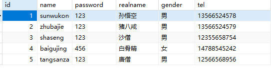
代码如下（重点关注第4步 第5步 第6步)：

```java
import java.sql.DriverManager;
import java.sql.SQLException;
import java.sql.Connection;
import java.sql.Statement;
import java.util.ResourceBundle;
import java.sql.ResultSet;

public class JDBCTest09 {
    public static void main(String[] args){
        
    // 通过以下代码获取属性文件中的配置信息
		ResourceBundle bundle = ResourceBundle.getBundle("jdbc");
		String driver = bundle.getString("driver");
		String url = bundle.getString("url");
		String user = bundle.getString("user");
		String password = bundle.getString("password");

        Connection conn = null;
        Statement stmt = null;
        ResultSet rs = null;
        try {
            // 1. 注册驱动
            Class.forName(driver);

            // 2. 获取连接
            conn = DriverManager.getConnection(url, user, password);

            // 3. 获取数据库操作对象
            stmt = conn.createStatement();

            // 4. 执行SQL语句
            String sql = "select id,name,password,realname,gender,tel from t_user";
            rs = stmt.executeQuery(sql);

            // 5. 处理查询结果集（这里的处理方式就是：遍历所有数据并输出）
            while(rs.next()){
                String id = rs.getString(1);
                String name = rs.getString(2);
                String pwd = rs.getString(3);
                String realname = rs.getString(4);
                String gender = rs.getString(5);
                String tel = rs.getString(6);
                System.out.println(id + "\t" + name + "\t" + pwd + "\t" + realname + "\t" + gender + "\t" + tel);
            }
            
        } catch(SQLException | ClassNotFoundException e){
            e.printStackTrace();
        } finally {
            // 6. 释放资源
            if(rs != null){
                try{
                    rs.close();
                }catch(SQLException e){
                    e.printStackTrace();
                }
            }
            if(stmt != null){
                try{
                    stmt.close();
                }catch(SQLException e){
                    e.printStackTrace();
                }
            }
            if(conn != null){
                try{
                    conn.close();
                }catch(SQLException e){
                    e.printStackTrace();
                }
            }
        }
    }
}
```

执行结果如下：


代码解读：
```java
// 4. 执行SQL语句
String sql = "select id,name,password,realname,gender,tel from t_user";
rs = stmt.executeQuery(sql);
```
执行insert delete update语句的时候，调用Statement接口的executeUpdate()方法。
执行select语句的时候，**调用Statement接口的executeQuery()方法**。执行select语句后返回结果集对象：ResultSet。

代码解读：
```java
// 5. 处理查询结果集（这里的处理方式就是：遍历所有数据并输出）
while(rs.next()){
    String id = rs.getString(1);
    String name = rs.getString(2);
    String pwd = rs.getString(3);
    String realname = rs.getString(4);
    String gender = rs.getString(5);
    String tel = rs.getString(6);
    System.out.println(id + "\t" + name + "\t" + pwd + "\t" + realname + "\t" + gender + "\t" + tel);
}
```

- **rs.next() 将游标移动到下一行，如果移动后指向的这一行有数据则返回true，没有数据则返回false。**
- **while循环体当中的代码是处理当前游标指向的这一行的数据。（注意：是处理的一行数据）**
- **rs.getString(int columnIndex) 其中 int columnIndex 是查询结果的列下标，列下标从1开始，以1递增。**

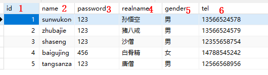

- **rs.getString(...) 方法在执行时，不管底层数据库中的数据类型是什么，统一以字符串String类型来获取。**

代码解读：
```java
// 6. 释放资源
if(rs != null){
    try{
        rs.close();
    }catch(SQLException e){
        e.printStackTrace();
    }
}
if(stmt != null){
    try{
        stmt.close();
    }catch(SQLException e){
        e.printStackTrace();
    }
}
if(conn != null){
    try{
        conn.close();
    }catch(SQLException e){
        e.printStackTrace();
    }
}
```
ResultSet最终也是需要关闭的。**先关闭ResultSet，再关闭Statement，最后关闭Connection**。

## 通过列名获取数据（以String类型获取）
获取当前行的数据，不仅可以通过列下标获取，还可以通过查询结果的列名来获取，通常这种方式是被推荐的，因为可读性好。
例如这样的SQL：
```sql
select id, name as username, realname from t_user;
```
执行结果是：
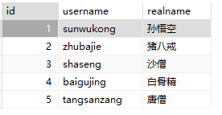
我们可以按照查询结果的列名来获取数据：
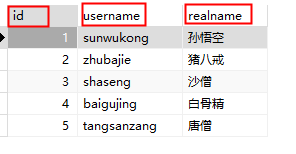
**注意：是根据查询结果的列名，而不是表中的列名。以上查询的时候将字段name起别名username了，所以要根据username来获取，而不能再根据name来获取了。**
```java
import java.sql.DriverManager;
import java.sql.SQLException;
import java.sql.Connection;
import java.sql.Statement;
import java.util.ResourceBundle;
import java.sql.ResultSet;

public class JDBCTest10 {
    public static void main(String[] args){
        
    	// 通过以下代码获取属性文件中的配置信息
		ResourceBundle bundle = ResourceBundle.getBundle("jdbc");
		String driver = bundle.getString("driver");
		String url = bundle.getString("url");
		String user = bundle.getString("user");
		String password = bundle.getString("password");

        Connection conn = null;
        Statement stmt = null;
        ResultSet rs = null;
        try {
            // 1. 注册驱动
            Class.forName(driver);

            // 2. 获取连接
            conn = DriverManager.getConnection(url, user, password);

            // 3. 获取数据库操作对象
            stmt = conn.createStatement();

            // 4. 执行SQL语句
            String sql = "select id,name as username,realname from t_user";
            rs = stmt.executeQuery(sql);

            // 5. 处理查询结果集（这里的处理方式就是：遍历所有数据并输出）
            while(rs.next()){
                String id = rs.getString("id");
                String name = rs.getString("username");
                String realname = rs.getString("realname");
                System.out.println(id + "\t" + name + "\t" + realname);
            }
            
        } catch(SQLException | ClassNotFoundException e){
            e.printStackTrace();
        } finally {
            // 6. 释放资源
            if(rs != null){
                try{
                    rs.close();
                }catch(SQLException e){
                    e.printStackTrace();
                }
            }
            if(stmt != null){
                try{
                    stmt.close();
                }catch(SQLException e){
                    e.printStackTrace();
                }
            }
            if(conn != null){
                try{
                    conn.close();
                }catch(SQLException e){
                    e.printStackTrace();
                }
            }
        }
    }
}
```

执行结果如下：


如果将上面代码中`rs.getString("username")`修改为`rs.getString("name")`，执行就会出现以下错误：

提示name列是不存在的。所以一定是根据查询结果中的列名来获取，而不是表中原始的列名。

## 以指定的类型获取数据
前面的程序可以看到，不管数据库表中是什么数据类型，都以String类型返回。当然，也能以指定类型返回。
使用PowerDesigner再设计一张商品表：t_product，使用Navicat for MySQL工具准备数据如下：
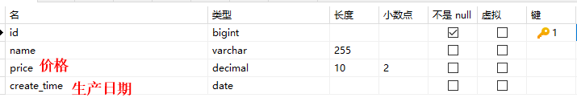


id以long类型获取，name以String类型获取，price以double类型获取，create_time以java.sql.Date类型获取，代码如下：
```java
import java.sql.DriverManager;
import java.sql.SQLException;
import java.sql.Connection;
import java.sql.Statement;
import java.util.ResourceBundle;
import java.sql.ResultSet;

public class JDBCTest11 {
    public static void main(String[] args){
        
    	// 通过以下代码获取属性文件中的配置信息
		ResourceBundle bundle = ResourceBundle.getBundle("jdbc");
		String driver = bundle.getString("driver");
		String url = bundle.getString("url");
		String user = bundle.getString("user");
		String password = bundle.getString("password");

        Connection conn = null;
        Statement stmt = null;
        ResultSet rs = null;
        try {
            // 1. 注册驱动
            Class.forName(driver);

            // 2. 获取连接
            conn = DriverManager.getConnection(url, user, password);

            // 3. 获取数据库操作对象
            stmt = conn.createStatement();

            // 4. 执行SQL语句
            String sql = "select id,name,price,create_time as createTime from t_product";
            rs = stmt.executeQuery(sql);

            // 5. 处理查询结果集（这里的处理方式就是：遍历所有数据并输出）
            while(rs.next()){
                long id = rs.getLong("id");
                String name = rs.getString("name");
                double price = rs.getDouble("price");
                java.sql.Date createTime = rs.getDate("createTime");
                // 以指定类型获取后是可以直接用的，例如获取到价格后，统一让价格乘以2
                System.out.println(id + "\t" + name + "\t" + price * 2 + "\t" + createTime);
            }
            
        } catch(SQLException | ClassNotFoundException e){
            e.printStackTrace();
        } finally {
            // 6. 释放资源
            if(rs != null){
                try{
                    rs.close();
                }catch(SQLException e){
                    e.printStackTrace();
                }
            }
            if(stmt != null){
                try{
                    stmt.close();
                }catch(SQLException e){
                    e.printStackTrace();
                }
            }
            if(conn != null){
                try{
                    conn.close();
                }catch(SQLException e){
                    e.printStackTrace();
                }
            }
        }
    }
}
```

执行结果如下：


## 获取结果集的元数据信息（了解）
ResultSetMetaData 是一个接口，用于描述 ResultSet 中的元数据信息，即查询结果集的结构信息，例如查询结果集中包含了哪些列，每个列的数据类型、长度、标识符等。

ResultSetMetaData 可以通过 ResultSet 接口的 getMetaData() 方法获取，一般在对 ResultSet 进行元数据信息处理时使用。例如，可以使用 ResultSetMetaData 对象获取查询结果中列的信息，如列名、列的类型、列的长度等。通过 ResultSetMetaData 接口的方法，可以实现对查询结果的基本描述信息操作，例如获取查询结果集中有多少列、列的类型、列的标识符等。以下是一段通过 ResultSetMetaData 获取查询结果中列的信息的示例代码：

```java
import java.sql.DriverManager;
import java.sql.SQLException;
import java.sql.Connection;
import java.sql.Statement;
import java.util.ResourceBundle;
import java.sql.ResultSet;
import java.sql.ResultSetMetaData;

public class JDBCTest12 {
    public static void main(String[] args){
        
    	// 通过以下代码获取属性文件中的配置信息
		ResourceBundle bundle = ResourceBundle.getBundle("jdbc");
		String driver = bundle.getString("driver");
		String url = bundle.getString("url");
		String user = bundle.getString("user");
		String password = bundle.getString("password");

        Connection conn = null;
        Statement stmt = null;
        ResultSet rs = null;
        try {
            // 1. 注册驱动
            Class.forName(driver);

            // 2. 获取连接
            conn = DriverManager.getConnection(url, user, password);

            // 3. 获取数据库操作对象
            stmt = conn.createStatement();

            // 4. 执行SQL语句
            String sql = "select id,name,price,create_time as createTime from t_product";
            rs = stmt.executeQuery(sql);

            // 获取元数据信息
            ResultSetMetaData rsmd = rs.getMetaData();
            int columnCount = rsmd.getColumnCount();
            for (int i = 1; i <= columnCount; i++) {
                System.out.println("列名：" + rsmd.getColumnName(i) + "，数据类型：" + rsmd.getColumnTypeName(i) +
                                   "，列的长度：" + rsmd.getColumnDisplaySize(i));
            }
            
        } catch(SQLException | ClassNotFoundException e){
            e.printStackTrace();
        } finally {
            // 6. 释放资源
            if(rs != null){
                try{
                    rs.close();
                }catch(SQLException e){
                    e.printStackTrace();
                }
            }
            if(stmt != null){
                try{
                    stmt.close();
                }catch(SQLException e){
                    e.printStackTrace();
                }
            }
            if(conn != null){
                try{
                    conn.close();
                }catch(SQLException e){
                    e.printStackTrace();
                }
            }
        }
    }
}
```

执行结果如下：


在上面的代码中，我们首先创建了一个 Statement 对象，然后执行了一条 SQL 查询语句，生成了一个 ResultSet 对象。接下来，我们通过 ResultSet 对象的 getMetaData() 方法获取了 ResultSetMetaData 对象，进而获取了查询结果中列的信息并进行输出。需要注意的是，在进行列信息的获取时，列的编号从 1 开始计算。该示例代码将获取查询结果集中所有列名、数据类型以及长度等信息。

# 获取新增行的主键值
有很多表的主键字段值都是自增的，在某些特殊的业务环境下，当我们插入了新数据后，希望能够获取到这条新数据的主键值，应该如何获取呢？
在 JDBC 中，如果要获取插入数据后的主键值，可以使用 Statement 接口的 executeUpdate() 方法的重载版本，该方法接受一个额外的参数，用于指定是否需要获取自动生成的主键值。然后，通过以下两个步骤获取插入数据后的主键值：

1.  在执行 executeUpdate() 方法时指定一个标志位，表示需要返回插入的主键值。
2.  调用 Statement 对象的 getGeneratedKeys() 方法，返回一个包含插入的主键值的 ResultSet 对象。 

```java
import java.sql.DriverManager;
import java.sql.SQLException;
import java.sql.Connection;
import java.sql.Statement;
import java.util.ResourceBundle;
import java.sql.ResultSet;

public class JDBCTest13 {
    public static void main(String[] args){
        
    	// 通过以下代码获取属性文件中的配置信息
		ResourceBundle bundle = ResourceBundle.getBundle("jdbc");
		String driver = bundle.getString("driver");
		String url = bundle.getString("url");
		String user = bundle.getString("user");
		String password = bundle.getString("password");

        Connection conn = null;
        Statement stmt = null;
        ResultSet rs = null;
        try {
            // 1. 注册驱动
            Class.forName(driver);

            // 2. 获取连接
            conn = DriverManager.getConnection(url, user, password);

            // 3. 获取数据库操作对象
            stmt = conn.createStatement();

            // 4. 执行SQL语句
            String sql = "insert into t_user(name,password,realname,gender,tel) values('zhangsan','111','张三','男','19856525352')";
            // 第一步
            int count = stmt.executeUpdate(sql, Statement.RETURN_GENERATED_KEYS);
            // 第二步
            rs = stmt.getGeneratedKeys();
            if(rs.next()){
                int id = rs.getInt(1);
                System.out.println("新增数据行的主键值：" + id);
            }
            
        } catch(SQLException | ClassNotFoundException e){
            e.printStackTrace();
        } finally {
            // 6. 释放资源
            if(rs != null){
                try{
                    rs.close();
                }catch(SQLException e){
                    e.printStackTrace();
                }
            }
            if(stmt != null){
                try{
                    stmt.close();
                }catch(SQLException e){
                    e.printStackTrace();
                }
            }
            if(conn != null){
                try{
                    conn.close();
                }catch(SQLException e){
                    e.printStackTrace();
                }
            }
        }
    }
}
```

执行结果如下：

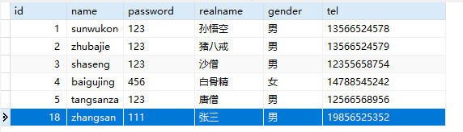
以上代码中，我们将 Statement.RETURN_GENERATED_KEYS 传递给 executeUpdate() 方法，以指定需要获取插入的主键值。然后，通过调用 Statement 对象的 getGeneratedKeys() 方法获取包含插入的主键值的 ResultSet 对象，通过 ResultSet 对象获取主键值。需要注意的是，在使用 Statement 对象的 getGeneratedKeys() 方法获取自动生成的主键值时，主键值的获取方式具有一定的差异，需要根据不同的数据库种类和版本来进行调整。

# 使用IDEA工具编写JDBC程序
## 创建空的工程并设置JDK
创建一个空的工程：mypro
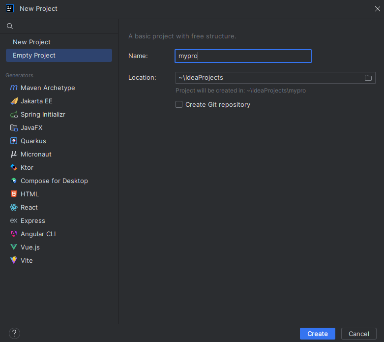

工程结构：
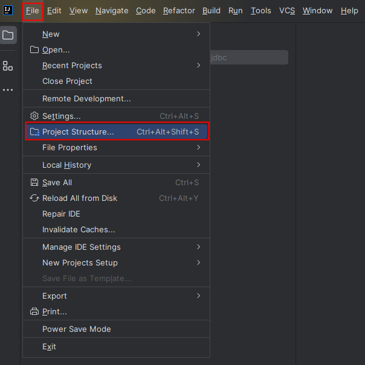

设置JDK以及编译器版本：
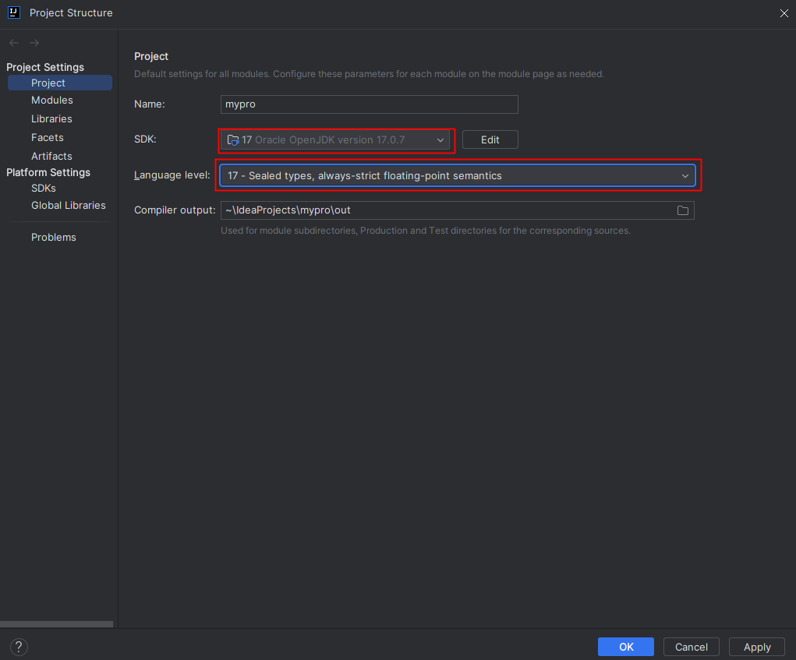

## 创建一个模块
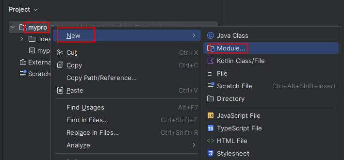
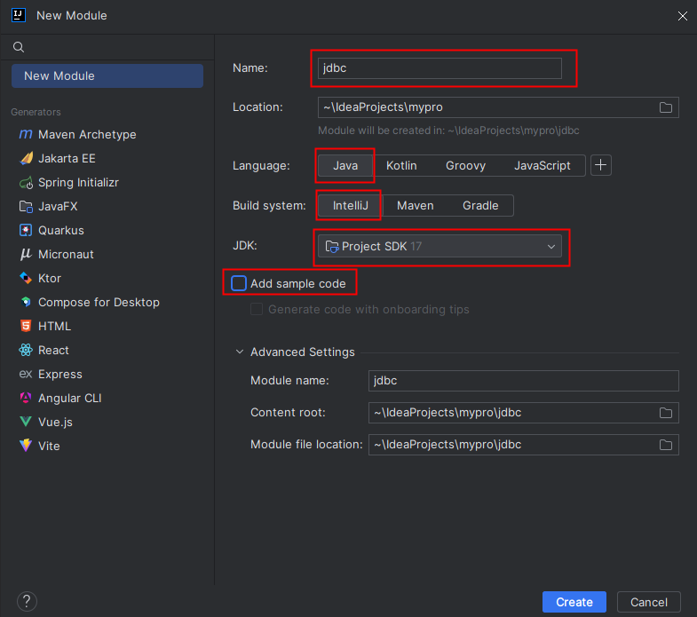

## 将驱动加入到CLASSPATH
在模块jdbc下创建一个目录：lib


将mysql的驱动jar包拷贝到lib目录当中：
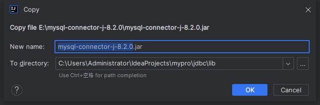
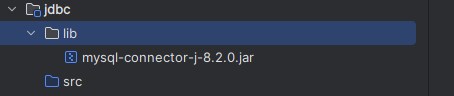

将jar包加入到classpath：


## 编写JDBC程序
新建软件包：com.powernode.jdbc


新建JDBCTest01类：
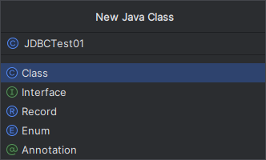

在JDBCTest01类中编写main方法，main方法中编写JDBC代码：
```java
package com.powernode.jdbc;

import java.sql.DriverManager;
import java.sql.SQLException;
import java.sql.Connection;
import java.sql.Statement;
import java.util.ResourceBundle;
import java.sql.ResultSet;

public class JDBCTest01 {
    public static void main(String[] args){

        // 通过以下代码获取属性文件中的配置信息
        ResourceBundle bundle = ResourceBundle.getBundle("com.powernode.jdbc.jdbc");
        String driver = bundle.getString("driver");
        String url = bundle.getString("url");
        String user = bundle.getString("user");
        String password = bundle.getString("password");

        Connection conn = null;
        Statement stmt = null;
        ResultSet rs = null;
        try {
            // 1. 注册驱动
            Class.forName(driver);

            // 2. 获取连接
            conn = DriverManager.getConnection(url, user, password);

            // 3. 获取数据库操作对象
            stmt = conn.createStatement();

            // 4. 执行SQL语句
            String sql = "select id,name,password from t_user";
            rs = stmt.executeQuery(sql);
            while (rs.next()) {
                int id = rs.getInt("id");
                String name = rs.getString("name");
                String pwd = rs.getString("password");
                System.out.println(id + "," + name + "," + pwd);
            }

        } catch(SQLException | ClassNotFoundException e){
            e.printStackTrace();
        } finally {
            // 6. 释放资源
            if(rs != null){
                try{
                    rs.close();
                }catch(SQLException e){
                    e.printStackTrace();
                }
            }
            if(stmt != null){
                try{
                    stmt.close();
                }catch(SQLException e){
                    e.printStackTrace();
                }
            }
            if(conn != null){
                try{
                    conn.close();
                }catch(SQLException e){
                    e.printStackTrace();
                }
            }
        }
    }
}
```

提供配置文件，在com.powernode.jdbc包下新建jdbc.properties文件：
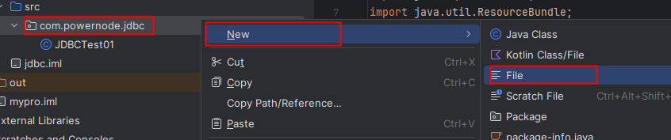

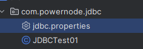

jdbc.properties文件中如下配置：
```properties
driver=com.mysql.cj.jdbc.Driver
url=jdbc:mysql://localhost:3306/jdbc?useUnicode=true&serverTimezone=Asia/Shanghai&useSSL=true&characterEncoding=utf-8
user=root
password=123456
```

执行结果如下：


