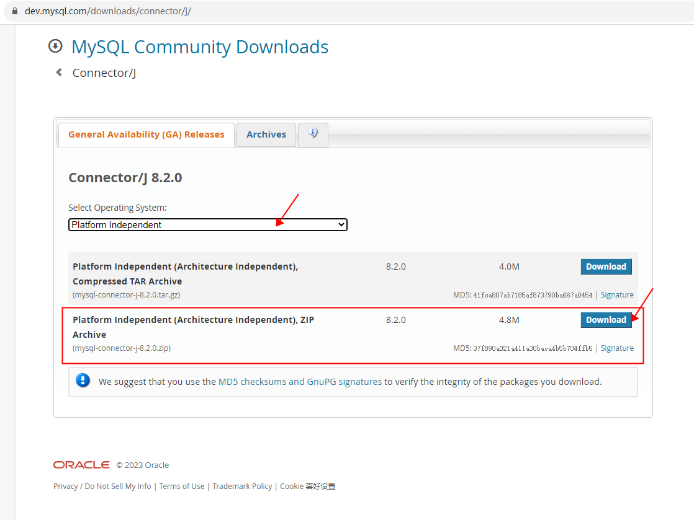

# 简介与环境配置

1. **JDBC**（Java DataBase Connectivity）是Java操作数据库的标准API规范
2. **核心架构**：JDBC定义接口规范，数据库厂商提供具体实现（驱动）
3. **JDBC API**（Sun公司制定）
    - 位于`java.sql`和`javax.sql`包
    - 主要组件
        - `DriverManager`：管理JDBC驱动
        - `Connection`：数据库连接
        - `Statement`：执行SQL语句
        - `ResultSet`：处理查询结果
4. JDBC三者角色
    1. **JDBC接口**（JDK内置）
        - 包路径：`java.sql.*`
        - 文档：JDK帮助文档中
    2. **JDBC驱动**（数据库厂商提供）
        - 实现JDBC接口的具体类
        - 连接特定数据库服务器
        - 打包为jar文件
        - 下载地址（以MySQL为例）：<https://dev.mysql.com/downloads/connector/j/>
        - 
    3. **开发代码**（程序员编写）：使用JDBC接口操作数据库
5. **设计优势**：接口规范实现调用者与实现者解耦
6. 模拟JDBC的接口、实现与调用：[jdbc-mock](../details/jdbc-mock.md)
