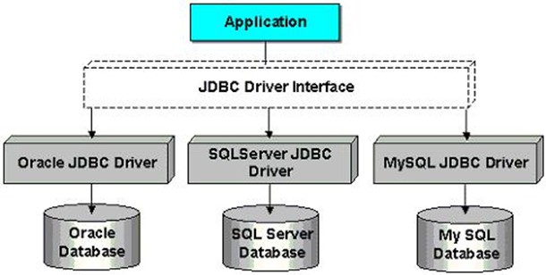

# 简介与环境配置

---
## 概述

1. JDBC（Java DataBase Connectivity）就是Java数据库连接，即一套使用Java语言来**操作数据库的编程接口（API）**，也可以认为是一组规范。
2. 早期SUN公司的天才们想编写一套可以连接天下所有数据库的API，但是当他们刚刚开始时就发现这是不可完成的任务，因为各个厂商的数据库服务器差异太大了。后来SUN开始与数据库厂商们讨论，最终得出的结论是，由SUN提供一套访问数据库的规范（就是一组接口），并提供连接数据库的协议标准，然后各个数据库厂商会遵循SUN的规范提供一套访问自己公司的数据库服务器的API出现。SUN提供的规范命名为JDBC，而各个厂商提供的，遵循了JDBC规范的，可以访问自己数据库的API被称之为**驱动**！
	
3. JDBC是接口，而JDBC驱动才是接口的实现，没有驱动无法完成数据库连接！每个数据库厂商都有自己的驱动，用来连接自己公司的数据库。
4. 为什么要定义接口：Java接口在使用场景中，一定是存在两个角色的，一个是接口的调用者，一个是接口的实现者，接口的出现让**调用者和实现者解耦合**了。
5. JDBC API
	1. 提供者：Sun公司
	2. 内容：供程序员调用的接口与类，集成在`java.sql`和`javax.sql`包中，如
		1. `DriverManager`类，管理各种不同的JDBC驱动
		2. `Connection`接口，用于连接数据库
		3. `Statement`接口，用于执行SQL语句
		4. `ResultSet`接口，用于处理查询结果集
6. JDBC 驱动
	1. 提供者：各个数据库厂商
	2. 内容：遵循JDBC规范的数据库驱动，用于连接数据库服务器
7. SUN公司是规范制定者，制定了规范JDBC（连接数据库规范），数据库厂商微软、甲骨文等分别提供实现JDBC接口的驱动jar包，程序员学习JDBC规范来应用这些jar包里的类。

---
## 模拟JDBC接口

1. **接口的制定者**：<u>SUN公司</u>负责制定的
	```java
	// SUN公司负责制定JDBC接口
	public interface JDBC {
	    // 负责连接数据库的方法
	    void getConnection();
	}
	```

2. **接口的实现者**：<u>各大数据库厂商</u>分别对JDBC接口进行实现，实现类被称为**驱动**
	* MySQL数据库厂商对JDBC接口的实现：MySQL驱动
		```java
		public class MySQLDriver implements JDBC{
		    public void getConnection(){
		        System.out.println("与MySQL数据库连接建立成功，您正在操作MySQL数据库");
		    }
		}
		```
	* Oracle数据库厂商对JDBC接口的实现：Oracle驱动
		```java
		public class OracleDriver implements JDBC{
		    public void getConnection(){
		        System.out.println("与Oracle数据库连接建立成功，您正在操作Oracle数据库");
		    }
		}
		```

3. **接口的调用者**：要操作数据库的Java<u>程序员</u>（我们）
	* 如果操作Mysql数据库
		```java
		public class Client{
		    public static void main(String[] args){
		        
		        JDBC jdbc = new MySQLDriver();
		        
		        // 只需要面向接口编程即可，不需要关心具体的实现，不需要关心具体是哪个厂商的数据库
		        jdbc.getConnection();
		    }
		}
		```
	* 如果要操作Oracle数据库的话，需要`new OracleDriver()`
		```java
		public class Client{
		    public static void main(String[] args){
		        
		        JDBC jdbc = new OracleDriver();
		        
		        // 只需要面向接口编程即可，不需要关心具体的实现，不需要关心具体是哪个厂商的数据库
		        jdbc.getConnection();
		    }
		}
		```
	* 可能你会说，最终还是修改了java代码，不符合OCP原则呀，如果你想达到OCP，那可以将创建对象的任务交给反射机制，将类名配置到文件中，例如配置文件如下：
		```properties
		driver=MySQLDriver
		```
		Java代码如下：
		```java
		import java.util.ResourceBundle;
		
		public class Client{
		    public static void main(String[] args) throws Exception{
		        
		        String driverClassName = ResourceBundle.getBundle("jdbc").getString("driver");
		        Class c = Class.forName(driverClassName);
		        JDBC jdbc = (JDBC)c.newInstance();
		        
		        // 只需要面向接口编程即可，不需要关心具体的实现
		        // 不需要关心具体是哪个厂商的数据库
		        jdbc.getConnection();
		    }
		}
		```
		最终通过修改`jdbc.properties`配置文件即可做到数据库的切换。这样就完全做到了调用者和实现者的解耦合。调用者不需要关心实现者，实现者也不需要关心调用者。双方都是面向接口编程。这就是JDBC的本质：它就是一套接口。

---

## 配置CLASSPATH

经过上面内容的讲解，大家应该知道JDBC开发有三个角色的参与：

- 我们（对数据库中数据进行增删改查的Java程序员）
- JDBC接口的制定者
- JDBC接口的实现者（驱动）

以上三者凑齐了我们才能进行JDBC的开发。它们三个都在哪里呢？“我们”就不用多说了，写操作数据库的代码就行了。JDBC接口在哪（接口的class文件在哪）？JDBC接口实现类在哪（驱动在哪）？

* JDBC接口在哪：JDBC接口在JDK中。对应的包是：`java.sql.*;`，JDBC API帮助文档就在JDK的帮助文档当中。
* 驱动在哪：驱动是JDBC接口的实现类，这些实现类是各大数据库厂家自己实现的，所以这些实现类的就需要去数据库厂商相关的网站上下载了。通常这些实现类被全部放到一个xxx.jar包中。下面演示一下mysql的驱动如何下载【下载mysql的驱动jar包】：打开页面：[https://dev.mysql.com/downloads/connector/j/](https://dev.mysql.com/downloads/connector/j/)
	
