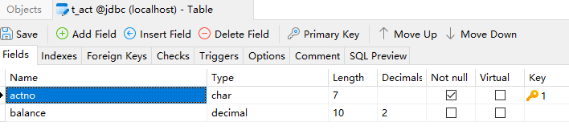
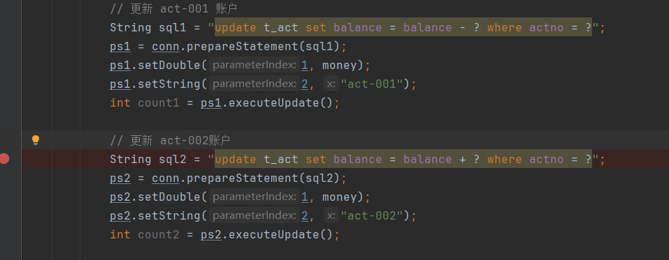
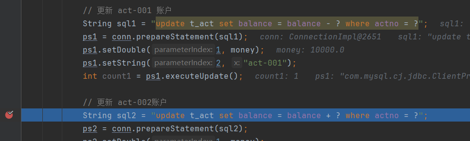
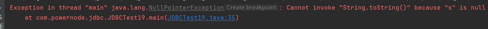
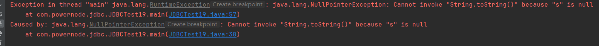
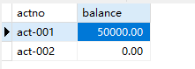

# JDBC 事务
---

## 什么是事务

事务是一个完整的业务，在这个业务中需要多条DML语句共同联合才能完成，而事务可以保证多条DML语句同时成功或者同时失败，从而保证数据的安全。例如A账户向B账户转账一万，A账户减去一万(update)和B账户加上一万(update)，必须同时成功或者同时失败，才能保证数据是正确的。（另请参见MySQL相关内容详细讲解了数据库事务机制。）

---

## 使用转账案例演示事务

### 表和数据的准备
t_act表：



### 没有添加事务的转账
```java
package com.powernode.jdbc;

import com.powernode.jdbc.utils.DbUtils;

import java.sql.Connection;
import java.sql.PreparedStatement;
import java.sql.SQLException;

/**
 * ClassName: JDBCTest19
 * Description: 实现账户转账
 * Datetime: 2024/4/12 15:20
 * Author: 老杜@动力节点
 * Version: 1.0
 */
public class JDBCTest19 {
    public static void main(String[] args) {
        // 转账金额
        double money = 10000.0;

        Connection conn = null;
        PreparedStatement ps1 = null;
        PreparedStatement ps2 = null;
        try {
            conn = DbUtils.getConnection();

            // 更新 act-001 账户
            String sql1 = "update t_act set balance = balance - ? where actno = ?";
            ps1 = conn.prepareStatement(sql1);
            ps1.setDouble(1, money);
            ps1.setString(2, "act-001");
            int count1 = ps1.executeUpdate();

            // 更新 act-002账户
            String sql2 = "update t_act set balance = balance + ? where actno = ?";
            ps2 = conn.prepareStatement(sql2);
            ps2.setDouble(1, money);
            ps2.setString(2, "act-002");
            int count2 = ps2.executeUpdate();

        } catch (SQLException e) {
            throw new RuntimeException(e);
        } finally {
            DbUtils.close(null, ps1, null);
            DbUtils.close(conn, ps1, null);
        }

    }
}

```
执行结果：


### JDBC事务默认是自动提交的
JDBC事务默认情况下是自动提交的，所谓的自动提交是指：只要执行一条DML语句则自动提交一次。测试一下，在以下代码位置添加断点：

让代码执行到断点处：

让程序停在此处，看看数据库表中的数据是否发生变化：

可以看到，整个转账的业务还没有执行完毕，act-001 账户的余额已经被修改为 30000了，为什么修改为 30000了，因为JDBC事务默认情况下是自动提交，只要执行一条DML语句则自动提交一次。这种自动提交是极其危险的。如果在此时程序发生了异常，act-002账户的余额未成功更新，则钱会丢失一万。我们可以测试一下：测试前先将数据恢复到起初的时候

在以下代码位置，让其发生异常：

执行结果如下：


经过测试得知，丢失了一万元。

### 添加事务控制
如何解决以上问题，分三步：
第一步：将JDBC事务的自动提交机制修改为手动提交（即开启事务）
```java
conn.setAutoCommit(false);
```
第二步：当整个业务完整结束后，手动提交事务（即提交事务，事务结束）
```java
conn.commit();
```
第三步：在处理业务过程中，如果发生异常，则进入catch语句块进行异常处理，手动回滚事务（即回滚事务，事务结束）
```java
conn.rollback();
```

代码如下：
```java
public class JDBCTest19 {
    public static void main(String[] args) {
        // 转账金额
        double money = 10000.0;

        Connection conn = null;
        PreparedStatement ps1 = null;
        PreparedStatement ps2 = null;
        try {
            conn = DbUtils.getConnection();
            
            // 开启事务（关闭自动提交机制）
            conn.setAutoCommit(false);

            // 更新 act-001 账户
            String sql1 = "update t_act set balance = balance - ? where actno = ?";
            ps1 = conn.prepareStatement(sql1);
            ps1.setDouble(1, money);
            ps1.setString(2, "act-001");
            int count1 = ps1.executeUpdate();

            String s = null;
            s.toString();

            // 更新 act-002账户
            String sql2 = "update t_act set balance = balance + ? where actno = ?";
            ps2 = conn.prepareStatement(sql2);
            ps2.setDouble(1, money);
            ps2.setString(2, "act-002");
            int count2 = ps2.executeUpdate();
            
            // 提交事务
            conn.commit();

        } catch (Exception e) {
            // 遇到异常回滚事务
            try {
                conn.rollback();
            } catch (SQLException ex) {
                throw new RuntimeException(ex);
            }
            throw new RuntimeException(e);
        } finally {
            DbUtils.close(null, ps1, null);
            DbUtils.close(conn, ps1, null);
        }

    }
}
```

将数据恢复如初：

执行程序，仍然会出现异常：

但是数据库表中的数据是安全的：

当程序不出现异常时：

数据库表中的数据也是正确的：

这样就采用了JDBC事务解决了数据安全的问题。

---

## 设置JDBC事务隔离级别

关于事务隔离级别相关内容另请参见：老杜发布的2024版MySQL教程。
设置事务的隔离级别也是比较重要的，在JDBC程序中应该如何设置事务的隔离级别呢？代码如下：
```java
public class JDBCTest20 {
    public static void main(String[] args) {
        Connection conn = null;
        try {
            conn = DbUtils.getConnection();
            conn.setTransactionIsolation(Connection.TRANSACTION_SERIALIZABLE);
        } catch (SQLException e) {
            throw new RuntimeException(e);
        } finally {
            DbUtils.close(conn, null, null);
        }
    }
}
```
请注意：设置隔离级别要在开启事务之前