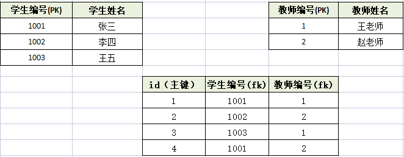
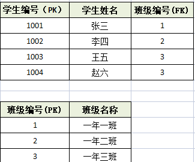
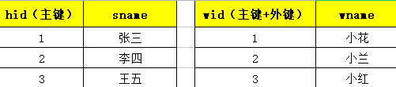

# 三范式

> 什么是数据库设计三范式
> 数据库表设计的原则。教你怎么设计数据库表有效，并且节省空间。

---
## 三范式

1. 第一范式：**任何一张表都应该有主键，每个字段是原子性的不能再分**
	1. 以下表的设计不符合第一范式：无主键，并且联系方式可拆分。
		
	2. 应该这样设计：
		
2. 第二范式：建立在第一范式基础上的，另外要求所有**非主键字段**完全**依赖主键**，不能产生部分依赖
	1. 以下表存储了学生和老师的信息
		
		虽然符合第一范式，但是违背了第二范式，学生姓名、老师姓名都产生了部分依赖。导致数据冗余。
	2. 以下这种设计方式就是符合第二范式的：
		
3. 第三范式：建立在第二范式基础上的，**非主键字段不能传递依赖于主键字段**
	1. 以下设计方式就是违背第三范式的（因为产生了传递依赖，导致班级名称冗余。）
		
	2. 以下这种方式就是符合第三范式的
		
---
## 一对多怎么设计

口诀：**一对多两张表，多的表加外键。**

---
## 多对多怎么设计

口诀：**多对多三张表，关系表添加外键**。

---
## 一对一怎么设计
两种方案：

1. 第一种：主键共享
	
2. 第二种：外键唯一
	

---
## 最终的设计

最终以满足客户需求为原则，有的时候会拿空间换速度。

