# 索引

> 索引是一种能够提高检索（查询）效率的提前排好序的数据结构。例如：书的目录就是一种索引机制。索引是解决SQL慢查询的一种方式。

---
## 索引的创建和删除

1. **主键会自动添加索引**：不需要程序员干涉，主键字段上的索引被称为`主键索引`
2. **unique约束的字段自动添加索引**：不需要程序员干涉，这种字段上添加的索引称为`唯一索引`
3. 给指定的字段添加索引
    1. 建表时添加索引：
        ```sql
        CREATE TABLE emp (
            ...
            name varchar(255),
            ...
            INDEX idx_name (name)
        );
        ```
    2. 如果表已经创建好了，后期给字段添加索引
        ```sql
        ALTER TABLE emp ADD INDEX idx_name (name);
        ```
    3. 也可以这样添加索引：
        ```sql
        create index idx_name on emp(name);
        ```
4. 删除指定字段上的索引
    ```sql
    ALTER TABLE emp DROP INDEX idx_name;
    ```
5. 查看某张表上添加了哪些索引
    ```sql
    show index from 表名;
    ```

---
## 索引的分类

不同的`存储引擎`有不同的索引类型和实现：

- 按照数据结构分类：
    - B+树 索引（**mysql的InnoDB**存储引擎采用的就是这种索引）采用**B+树**的数据结构
    - Hash 索引（仅 `memory` 存储引擎支持）：采用  哈希表  的数据结构
- 按照物理存储分类：
    - 聚集索引：索引和表中数据在一起，数据存储的时候就是按照索引顺序存储的。一张表只能有一个聚集索引。
    - 非聚集索引：索引和表中数据是分开的，索引是独立于表空间的，一张表可以有多个非聚集索引。
- 按照字段特性分类：
    - 主键索引（primary key）
    - 唯一索引（unique）
    - 普通索引（index）
    - 全文索引（fulltext：仅 `InnoDB`和`MyISAM` 存储引擎支持）
- 按照字段个数分类：
    - 单列索引、联合索引（也叫复合索引、组合索引）

---
## MySQL索引采用了B+树数据结构

常见的树相关的数据结构包括：

- 二叉树
- 红黑树
- B树
- B+树

区别：树的高度不同。树的高度越低，性能越高。这是因为每一个节点都是一次I/O

### 二叉树
有这样一张表
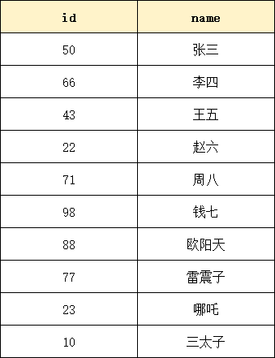
如果不给id字段添加索引，默认进行全表扫描，假设查询id=10的数据，那至少要进行10次磁盘IO。效率低。可以给id字段添加索引，假设该索引使用了二叉树这种数据结构，这个二叉树是这样的
(推荐一个数据结构可视化网：[Data Structure Visualizations](https://www.cs.usfca.edu/~galles/visualization/Algorithms.html))


如果这个时候要找id=10的数据，需要的IO次数是？4次。效率显著提升了。
但是MySQL并没有直接使用这种普通的二叉树，这种普通二叉树在`数据极端`的情况下，效率较低。比如下面的数据：

如果给id字段添加索引，并且该索引底层使用了普通二叉树，这棵树会是这样的：
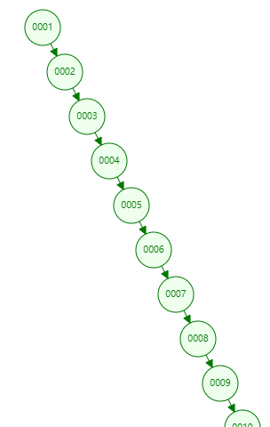
你虽然使用了二叉树，但这更像一个链表。查找效率等同于链表查询O(n)【**查找算法的时间复杂度是线性的**】。查找效率极低。
因此对于MySQL来说，它并没有选择这种数据结构作为索引。

### 红黑树（自平衡二叉树）
通过自旋平衡规则进行旋转，子节点会自动分叉为2个分支，从而减少树的高度，当数据有序插入时比二叉树数据检索性能更好。
例如有以下数据
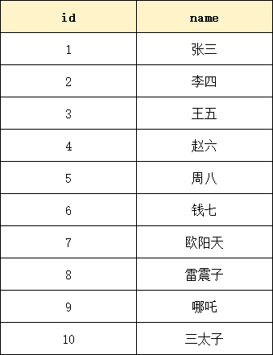
给id字段添加索引，并且该索引使用了`红黑树`数据结构，那么会是这样：
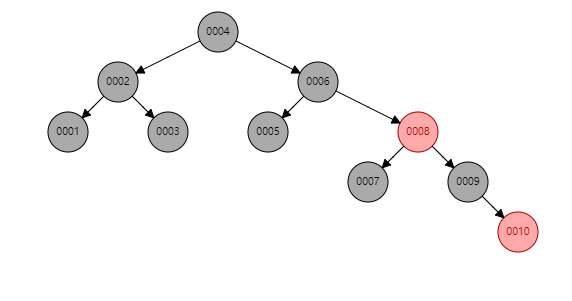
如果查找id=10的数据，磁盘IO次数为：5次。效率比普通二叉树要高一些。

但是如果数据量庞大，例如500万条数据，也会导致树的高度很高，磁盘IO次数仍然很多，查询效率也会比较低。

因此MySQL并没有使用红黑树这种数据结构作为索引。

### B Trees（B树）

B Trees首先是一个`自平衡`的。
B Trees每个节点下的子节点数量 > 2。
B Trees每个节点中也不是存储单个数据，可以存储多个数据。
B Trees又称为`平衡多路查找树`。

B Trees分支的数量不是2，是大于2，具体是多少个分支，由`阶`决定。例如：

- 3阶的B Trees，一个节点下最多有3个子节点，每个节点中最多有2个数据。
- 4阶的B Trees，一个节点下最多有4个子节点，每个节点中最多有3个数据。
- 5阶（5, 4）
- 6阶（6, 5）
- ....
- 16阶（16, 15）【MySQL采用了16阶】

采用B Trees，你会发现相同的数据量，**B Tree 树的高度更低**。磁盘IO次数更少。
3阶的B Trees：

**假设id字段添加了索引，并且采用了B Trees数据结构，查找id=10的数据，只需要3次磁盘IO。**
4阶的B Trees：
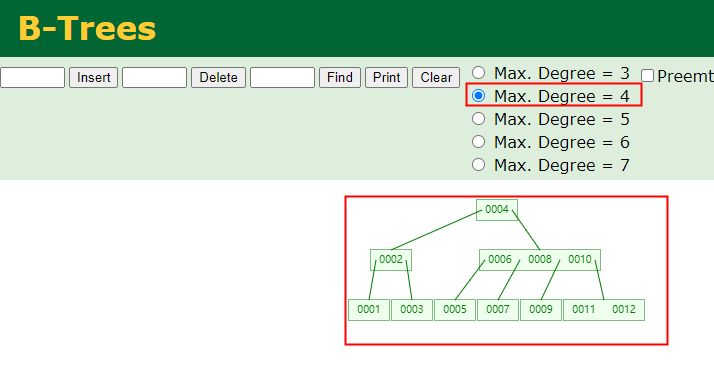

更加详细的存储是这样的，请看下图：

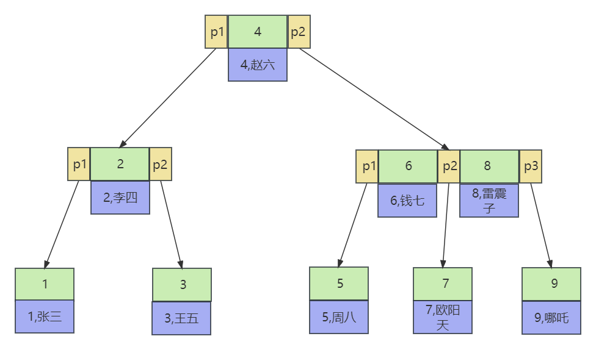
在B Trees中，每个节点不仅存储了`索引值`，还存储该索引值对应的`数据行`。
并且每个节点中的p1 p2 p3是指向下一个节点的指针。

B Trees数据结构存在的缺点是：不适合做区间查找，对于区间查找效率较低。假设要查id在[3~7]之间的，需要查找的是3,4,5,6,7。那么查这每个索引值都需要从头节点开始。
因此MySQL使用了B+ Trees解决了这个问题。

### B+ Trees（B+ 树）

B+ Trees 相较于 B Trees改进了哪些？

- B+树将数据都存储在叶子节点中。并且叶子节点之间使用链表连接，这样很适合范围查询。
- B+树的非叶子节点上只有索引值，没有数据，所以非叶子节点可以存储更多的索引值，这样让B+树更矮更胖，提高检索效率。

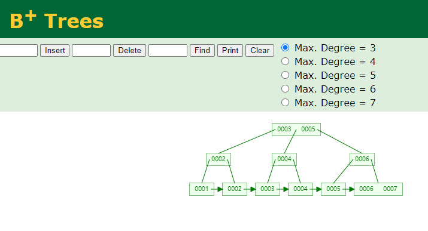

假设有这样一张表：

B+ Trees方式存储的话如下图所示：
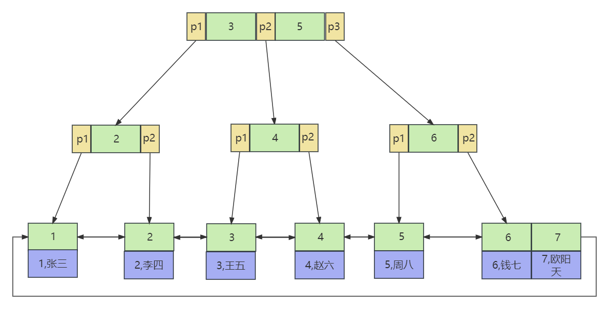

**经典面试题：mysql为什么选择B+树作为索引的数据结构，而不是B树？**

1. 非叶子节点上可以存储更多的键值，阶数可以更大，更矮更胖，磁盘IO次数少，数据查询效率高。
2. 所有数据都是有序存储在叶子节点上，让范围查找，分组查找效率更高。
3. 数据页之间、数据记录之间采用链表链接，让升序降序更加方便操作。

**经典面试题：如果一张表没有主键索引，那还会创建B+树吗？**

当一张表没有主键索引时，默认会使用一个**隐藏的内置的聚集索引（clustered index）**。这个聚集索引是基于表的物理存储顺序构建的，通常是使用B+树来实现的。

---
## 其他索引及相关调优

### Hash索引
支持Hash索引的存储引擎有：

- InnoDB（不支持手动创建Hash索引，系统会自动维护一个`自适应的Hash索引`）
    - 对于InnoDB来说，即使手动指定了某字段采用Hash索引，最终`show index from 表名`的时候，还是`BTREE`。
- Memory（支持Hash索引）

Hash索引底层的数据结构就是哈希表。一个数组，数组中每个元素是链表。和java中HashMap一样。哈希表中每个元素都是key value结构。key存储`索引值`，value存储`行指针`。

原理如下：
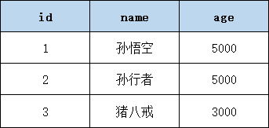
如果name字段上添加了Hash索引idx_name

Hash索引长这个样子：


检索原理：假设 name='孙行者'。通过哈希算法将'孙行者'转换为数组下标，通过下标找链表，在链表上遍历找到孙行者的行指针。

注意：不同的字符串，经过哈希算法得到的数组下标可能相同，这叫做哈希碰撞/哈希冲突。(不过，好的哈希算法应该具有很低的碰撞概率。常用的哈希算法如MD5、SHA-1、SHA-256等都被设计为尽可能减少碰撞的发生。)

Hash索引优缺点：

- 优点：只能用在等值比较中，效率很高。例如：name='孙悟空'
- 缺点：不支持排序，不支持范围查找。

### 聚集索引和非聚集索引

按照数据的物理存储方式不同，可以将索引分为聚集索引（聚簇索引）和非聚集索引（非聚簇索引）。

存储引擎是**InnoDB**的，**主键上的索引属于聚集索引**。
存储引擎是MyISAM的，任意字段上的索引都是非聚集索引。

InnoDB的物理存储方式：当创建一张表t_user，并使用InnoDB存储引擎时，会在硬盘上生成这样一个文件：

- t_user.ibd （InnoDB data表索引 + 数据）
- t_user.frm （存储表结构信息）

MyISAM的物理存储方式：当创建一张表t_user，并使用MyISAM存储引擎时，会在硬盘上生成这样一个文件：

- t_user.MYD （表数据）
- t_user.MYI （表索引）
- t_user.frm （表结构）

**注意：从MySQL8.0开始，不再生成frm文件了，引入了数据字典，用数据字典来统一存储表结构信息，例如**

- information_schema.TABLES （表包含了数据库中所有表的信息，例如表名、数据库名、引擎类型等）
- information_schema.COLUMNS（表包含了数据库中所有表的列信息，例如列名、数据类型、默认值等）

聚集索引的原理图：（B+树，叶子节点上存储了索引值 + 数据）


非聚集索引的原理图：（B+树，叶子节点上存储了索引值 + 行指针）
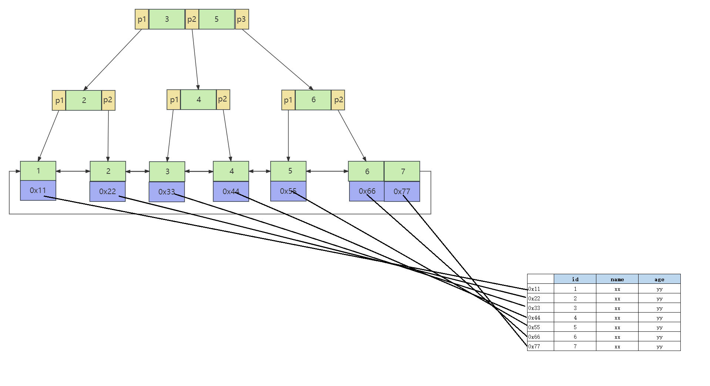

聚集索引的优点和缺点：

1. 优点：聚集索引将数据存储在索引树的叶子节点上。可以减少一次查询，因为查询索引树的同时可以获取数据。
2. 缺点：对数据进行修改或删除时需要更新索引树，会增加系统的开销。

### 二级索引

**二级索引也属于非聚集索引**。也有人把二级索引称为辅助索引。
有表t_user，id是主键。age是非主键。在age字段上添加的索引称为二级索引。（所有非主键索引都是二级索引）


二级索引的数据结构：
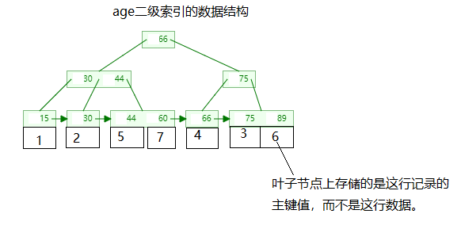

二级索引的查询原理：
假设查询语句为：
```sql
select * from t_user where age = 30;
```


为什么会“回表”？因为使用了`select *`
避免“回表【回到原数据表】”是提高SQL执行效率的手段。例如：select id from t_user where age = 30; 这样的SQL语句是不需要回表的。

### 覆盖索引

覆盖索引（Covering Index），顾名思义，是指某个查询语句可以通过索引的覆盖来完成，而不需要回表查询真实数据。其中的覆盖指的是在执行查询语句时，查询需要的所有列都可以从索引中提取到，而不需要再去查询实际数据行获取查询所需数据。
当使用覆盖索引时，MySQL可以直接通过索引，也就是索引上的数据来获取所需的结果，而不必再去查找表中的数据。这样可以显著提高查询性能。

假设有一个用户表（user）包含以下列：id, username, email, age。

常见的查询是根据用户名查询用户的邮箱。如果为了提高这个查询的性能，可以创建一个覆盖索引，包含（username, email）这两列。

创建覆盖索引的SQL语句可以如下：

```sql
CREATE INDEX idx_user_username_email ON user (username, email);
```

当执行以下查询时：

```sql
SELECT email FROM user WHERE username = 'lucy';
```

MySQL可以直接使用覆盖索引（idx_user_username_email）来获取查询结果，而不必再去查找用户表中的数据。这样可以减少磁盘I/O并提高查询效率。而如果没有覆盖索引，MySQL会先使用索引（username）来找到匹配的行，然后再回表查询获取邮箱，这个过程会增加更多的磁盘I/O和查询时间。

值得注意的是，覆盖索引的创建需要考虑查询的字段选择。如果查询需要的字段较多，可能需要创建包含更多列的覆盖索引，以满足完全覆盖查询的需要。

覆盖索引具有以下优点：

1.  提高查询性能：覆盖索引能够满足查询的所有需求，同时不需要访问表中的实际数据行，从而可以提高查询性能。这是因为DBMS可以直接使用索引来执行查询，而不需要从磁盘读取实际的数据行。 
2.  减少磁盘和内存访问次数：当使用覆盖索引时，DBMS不需要访问实际的数据行。这样可以减少磁盘和内存访问次数，从而提高查询性能。 
3.  减少网络传输：由于在覆盖索引中可以存储所有查询所需的列，因此可以减少数据的网络传输次数，从而提高查询的性能。 
4.  可以降低系统开销：在高压力的数据库系统中，使用覆盖索引可以减少系统开销，从而提高系统的可靠性和可维护性。 

覆盖索引的缺点包括：

1.  需要更多的内存：覆盖索引需要存储查询所需的所有列，因此需要更多的内存来存储索引。在大型数据库系统中，这可能会成为一项挑战。 
2.  会使索引变得庞大：当索引中包含了许多列时，它们可能会使索引变得非常庞大，从而影响查询性能，并且可能会占用大量的磁盘空间。 
3.  只有在查询中包含了索引列时才能使用：只有当查询中包含了所有的索引列时才能使用覆盖索引。如果查询中包含了其他列，DBMS仍然需要访问实际的数据行，并且无法使用覆盖索引提高查询性能。 

### 索引下推
索引下推（Index Condition Pushdown）是一种 MySQL 中的优化方法，它可以将查询中的过滤条件下推到索引层级中处理，从而减少回表次数，优化查询性能。

具体来说，在使用索引下推时，MySQL 会在索引的叶节点层级执行查询的过滤条件，过滤掉无用的索引记录，仅返回符合条件的记录的主键，这样就可以避免查询时回表读取表格的数据行，从而缩短了整个查询过程的时间。

假设有以下表结构：

表名：users

| id | name | age | city |
| --- | --- | --- | --- |
| 1 | John | 25 | New York |
| 2 | Alice | 30 | London |
| 3 | Bob | 40 | Paris |
| 4 | Olivia | 35 | Berlin |
| 5 | Michael | 28 | Sydney |


现在我们创建了一个多列索引：（索引下推通常是基于多列索引的。）

```
ALTER TABLE users ADD INDEX idx_name_city_age (name, city, age);
```

假设我们要查询年龄大于30岁，并且所在城市是"London"的用户，假设只给age字段添加了索引，它就不会使用索引下推。传统的查询优化器会将所有满足年龄大于30岁的记录读入内存，然后再根据城市进行筛选。

使用索引下推优化后，在索引范围扫描的过程中，优化器会判断只有在城市列为"London"的情况下，才会将满足年龄大于30岁的记录加载到内存中。这样就可以避免不必要的IO和数据传输，提高查询性能。

具体的查询语句可以是：

```
SELECT * FROM users WHERE age > 30 AND city = 'London';
```

在执行这个查询时，优化器会使用索引下推技术，先根据索引范围扫描找到所有满足条件的记录，然后再回到原数据表中获取完整的行数据，最终返回结果。

### 单列索引（单一索引）

单列索引是指对数据库表中的某一列或属性进行索引创建，对该列进行快速查找和排序操作。单列索引可以加快查询速度，提高数据库的性能。

举个例子，假设我们有一个学生表（student），其中有以下几个列：学生编号（student_id）、姓名（name）、年龄（age）和性别（gender）。

如果我们针对学生表的学生编号（student_id）列创建了单列索引，那么可以快速地根据学生编号进行查询或排序操作。例如，我们可以使用以下SQL语句查询学生编号为123456的学生信息：

```sql
SELECT * FROM student WHERE student_id = 123456;
```

由于我们对学生编号列建立了单列索引，所以数据库可以直接通过索引快速定位到具有学生编号123456的那一行记录，从而加快查询速度。

### 复合索引（组合索引）

复合索引（Compound Index）也称为多列索引（Multi-Column Index），是指对数据库表中多个列进行索引创建。

与单列索引不同，复合索引可以包含多个列。这样可以将多个列的值组合起来作为索引的键，以提高多列条件查询的效率。

举个例子，假设我们有一个订单表（Order），其中包含以下几个列：订单编号（OrderID）、客户编号（CustomerID）、订单日期（OrderDate）和订单金额（OrderAmount）。

如果我们为订单表的客户编号和订单日期这两列创建复合索引（CustomerID, OrderDate），那么可以在查询时同时根据客户编号和订单日期来快速定位到匹配的记录。

例如，我们可以使用以下SQL语句查询客户编号为123456且订单日期为2021-01-01的订单信息：

```sql
SELECT * FROM Order WHERE CustomerID = 123456 AND OrderDate = '2021-01-01';
```

由于我们为客户编号和订单日期创建了复合索引，数据库可以使用这个索引来快速定位到符合条件的记录，从而加快查询速度。复合索引的使用能够提高多列条件查询的效率，但需要注意的是，复合索引的创建和维护可能会增加索引的存储空间和对于写操作的影响。

**相对于单列索引，复合索引有以下几个优势：**

1. 减少索引的数量：复合索引可以包含多个列，因此可以减少索引的数量，减少索引的存储空间和维护成本。
2. 提高查询性能：当查询条件中涉及到复合索引的多个列时，数据库可以使用复合索引进行快速定位和过滤，从而提高查询性能。
3. 覆盖查询：如果复合索引包含了所有查询需要的列，那么数据库可以直接使用索引中的数据，而不需要再进行表的读取，从而提高查询性能。
4. 排序和分组：由于复合索引包含多个列，因此可以用于排序和分组操作，从而提高排序和分组的性能。

---
## 索引的优缺点

索引是数据库中一种重要的数据结构，用于加速数据的检索和查询操作。它的优点和缺点如下：

优点：

1. 提高查询性能：通过创建索引，可以大大减少数据库查询的数据量，从而提升查询的速度。
2. 加速排序：当查询需要按照某个字段进行排序时，索引可以加速排序的过程，提高排序的效率。
3. 减少磁盘IO：索引可以减少磁盘IO的次数，这对于磁盘读写速度较低的场景，尤其重要。

缺点：

1. 占据额外的存储空间：索引需要占据额外的存储空间，特别是在大型数据库系统中，索引可能占据较大的空间。
2. 增删改操作的性能损耗：每次对数据表进行插入、更新、删除等操作时，需要更新索引，会导致操作的性能降低。
3. 资源消耗较大：索引需要占用内存和CPU资源，特别是在大规模并发访问的情况下，可能对系统的性能产生影响。

---
## 何时用索引

在以下情况下建议使用索引：

1.  频繁执行查询操作的字段：如果这些字段经常被查询，使用索引可以提高查询的性能，减少查询的时间。 
2.  大表：当表的数据量较大时，使用索引可以快速定位到所需的数据，提高查询效率。 
3.  需要排序或者分组的字段：在对字段进行排序或者分组操作时，索引可以减少排序或者分组的时间。 
4.  外键关联的字段：在进行表之间的关联查询时，使用索引可以加快关联查询的速度。 

在以下情况下不建议使用索引：

1.  频繁执行更新操作的表：如果表经常被更新数据，使用索引可能会降低更新操作的性能，因为每次更新都需要维护索引。 
2.  小表：对于数据量较小的表，使用索引可能并不会带来明显的性能提升，反而会占用额外的存储空间。 
3.  对于唯一性很差的字段，一般不建议添加索引。当一个字段的唯一性很差时，查询操作基本上需要扫描整个表的大部分数据。如果为这样的字段创建索引，索引的大小可能会比数据本身还大，导致索引的存储空间占用过高，同时也会导致查询操作的性能下降。 

总之，索引需要根据具体情况进行使用和权衡，需要考虑到表的大小、查询频率、更新频率以及业务需求等因素。
