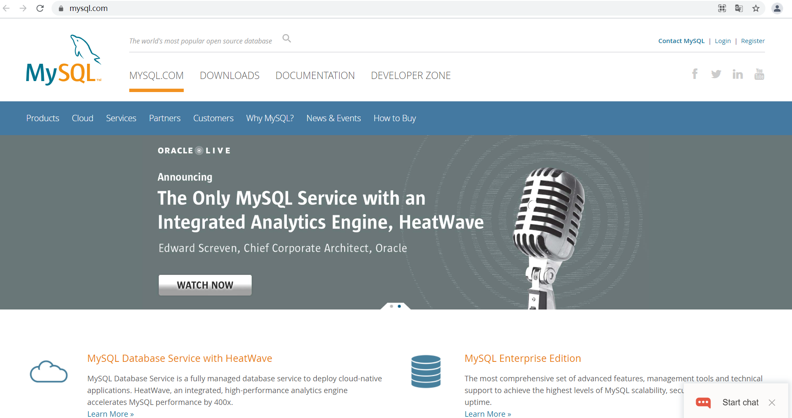
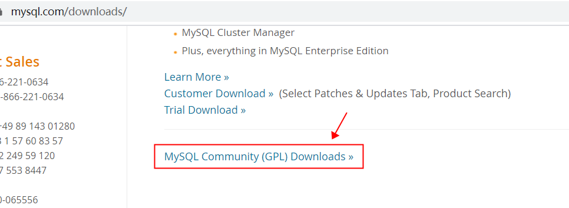
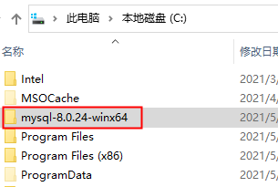
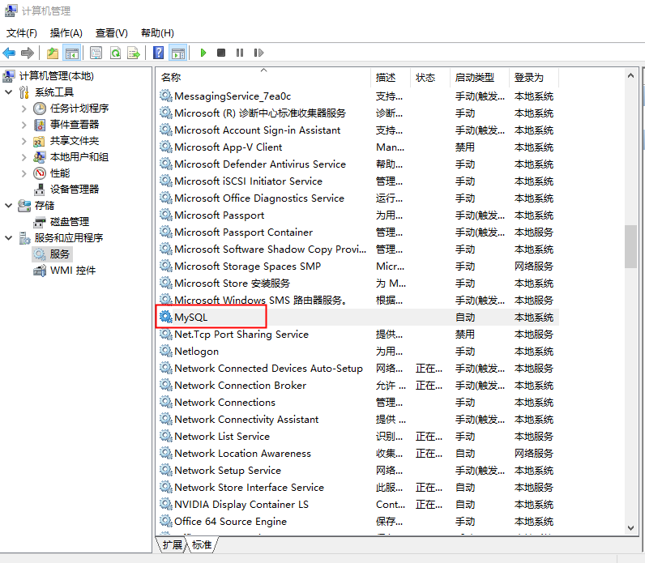
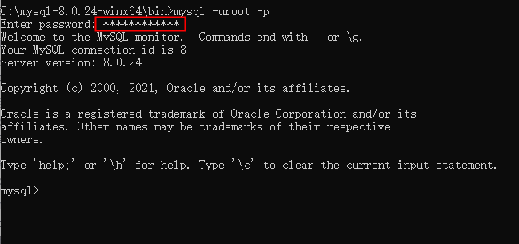
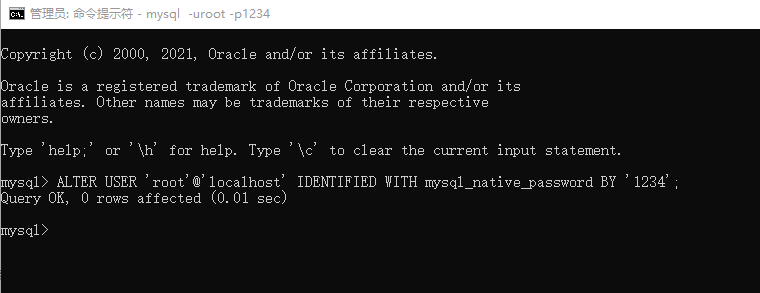
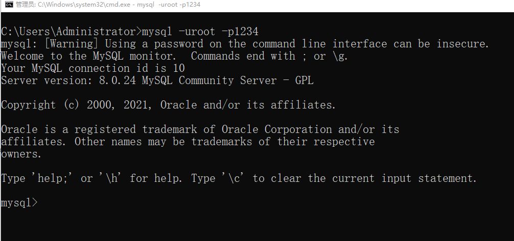
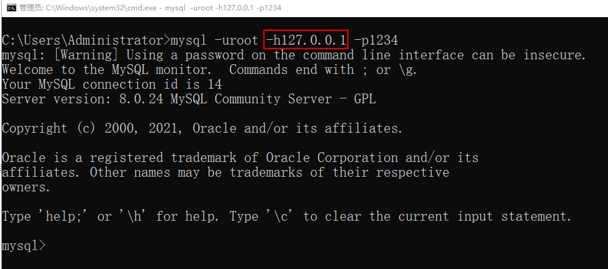

# MySQL安装

---
## MySQL概述

- MySQL是一个关系型数据库管理系统，由瑞典MySQL AB公司开发，MySQL AB公司被Sun公司收购，Sun公司又被Oracle公司收购，目前属于Oracle公司。
- MySQL是目前最流行的关系型数据库管理系统，在WEB应用方面MySQL是最好的RDBMS应用软件之一。 国内淘宝网站就使用的是MySQL集群。
- MySQL特点
   - MySQL有开源版本和收费版本，你使用开源版本是不收费的。
   - MySQL支持大型数据库，可以处理上千万记录的大型数据库。
   - MySQL使用标准的SQL数据库语言形式。
   - MySQL在很多系统上面都支持。
   - MySQL对Java，C都有很好的支持，当然其他的语言也支持比如Python、PHP。
   - MySQL是可以定制的，采用了GPL协议，你可以修改源码来开发自己的MySQL系统。

---
## MySQL的下载

### 官网下载

- 第一步：打开MySQL官网[https://www.mysql.com/](https://www.mysql.com/)
	

- 第二步：点击"DOWNLOADS"
	

- 第三步：当前页继续下拉，直到找到下图链接
	

- 第四步：点击上图链接，进入下面页面，其中“MySQL Community Server”是解压版mysql，“MySQL Installer for Windows”是安装版，这里我们选择解压版
	

- 第五步：点击上图“MySQL Community Server”
	

- 第六步：点击上图第1个“Download”
	

- 第七步：点击上图“No thanks, just start my download.”开始下载，直到下载完毕。
	
### 网盘下载
链接：[https://pan.baidu.com/s/1lRWC069K8GE-8rxr259ArQ?pwd=2009](https://pan.baidu.com/s/1lRWC069K8GE-8rxr259ArQ?pwd=2009) 提取码：2009

---
## MySQL安装与配置

### windows 安装
- 将下载的zip压缩包解压，我这里直接解压到C盘的根目录下
	
	
* mysql的根目录为：C:\mysql-8.0.24-winx64
- 将C:\mysql-8.0.24-winx64\bin目录配置到环境变量path当中
	
- 初始化data目录：使用管理员身份打开dos命令窗口（按win键，输入cmd，点击管理员身份运行）
	
* cd命令切换到mysql的bin目录下，执行`mysqld --initialize --console`进行data目录初始化，此时会在控制台生成一个随机密码，下图红框中就是随机密码
	
	技巧：左键选中密码，直接点击右键，此时密码已经复制到剪贴板中了，然后随便找一个文件，将密码粘贴到文件中保存起来。
- 安装MySQL服务（windows独有，mac不用这个操作）：cd命令切换到bin目录下，执行命令`mysqld -install`
	
- 查看mysql服务名称：此电脑-右键-管理-服务和应用程序-服务-找MySQL服务，如下图mysql服务名称：MySQL
	

### 客户端基本操作
- 启动MySQL服务：`net start mysql`，注意start后面是mysql服务的名称
	
	停止mysql服务的命令：`net stop mysql`
	注意：启停mysql服务也可以在上一步的图中点击右键进行启停服务。
- 登录mysql：输入`mysql -uroot -p`，然后回车，输入刚才的随机密码，然后回车，看到下图表示成功登录mysql
	
- 修改MySQL的root账户密码：`ALTER USER 'root'@'localhost' IDENTIFIED WITH mysql_native_password BY '新密码';`
	
* 退出数据库
	1. `exit`
	2. `quit`
	3. `ctrl + c`
* 查看当前mysql版本
	* 登陆后：`select version();`（sql）
	* 登陆前：`mysql --version`（bash）
---
## 登录MySQL

### 本地登录

- 如果mysql的服务是启动的，打开dos命令窗口，输入：mysql -uroot -p，回车，然后输入root账户的密码
	
	解释`mysql -uroot -p`：
	* mysql是一个命令，在bin目录下，对应的命令文件是mysql.exe，如果将bin目录配置到环境
	* 变量path中，才可以在以上位置使用该命令。
	* -uroot 表示登录的用户是root，u实际上是user单词的首字母。
	* -p 表示登录时使用密码，p实际上是password单词的首字母。
	* 也可以将密码以明文的形式写到-p后面，这样做可能会导致你的密码泄露
	

### 远程登录

- 假设mysql安装在A机器上，现在你要在B机器上连接mysql数据库，此时需要使用远程登录，远程登录时加上远程机器的ip地址即可
	
	* -h中的h实际上是host单词的首字母。在-h后面的是远程计算机的ip地址。
	* 127.0.0.1是计算机默认的本机IP地址。127.0.0.1又可以写作：localhost，他们是等效的。
	* 注意：mysql默认情况下root账户是不支持远程登录的，其实这是一种安全策略，为了保护root账户的安全。如果希望root账户支持远程登录，这是需要进行设置的。
	- mysql8 开放root账户远程登录权限（危险动作）
		- 第一步：现在本地使用root账户登录mysql
		- 第二步：`use mysql;`
		- 第三步：`update user set host = '%' where user = 'root';`
		- 第四步：`flush privileges;`
