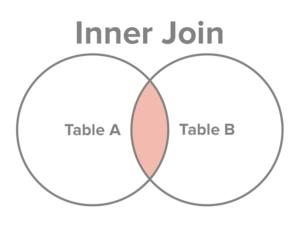
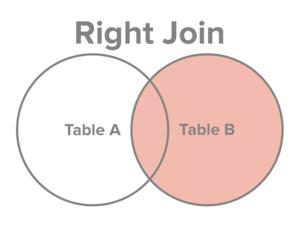

# 连接查询

> 本章案例的数据初始化：[powerpoint-init-data](../details/powerpoint-init-data.md)

---
## 简介
### 什么是连接查询

1. 从一张表中查询数据称为单表查询。
2. 从两张或更多张表中联合查询数据称为多表查询，又叫做连接查询。
3. 什么时候需要使用连接查询？比如这样的需求：员工表中有员工姓名，部门表中有部门名字，要求查询每个员工所在的部门名字，这个时候就需要连接查询。

### 连接查询的分类

1. 根据语法出现的年代进行分类：
    1. SQL92（这种语法很少用，可以不用学。）
    2. SQL99（我们主要学习这种语法。）
2. 根据连接方式的不同进行分类：
    1. 内连接
        1. 等值连接
        2. 非等值连接
        3. 自连接
    2. 外连接
        1. 左外连接（左连接）
        2. 右外连接（右连接）
    3. 全连接
  
### 笛卡尔积现象

  
1. 🌟什么是笛卡尔积现象：当两张表进行连接查询时，如果没有任何条件进行过滤，**最终的查询结果条数是两张表条数的乘积**。[cartesian-product-example](../details/cartesian-product-example.md)
2. 为了避免笛卡尔积现象的发生，需要添加条件进行筛选过滤。
3. 需要注意：添加条件之后，虽然避免了笛卡尔积现象，但是匹配的次数没有减少。
4. 为了SQL语句的可读性，为了执行效率，建议给表起别名。

---
## 内连接

### 什么叫内连接

满足条件的记录才会出现在结果集中。


### 内连接之等值连接

连接时，**条件为等量关系**。

案例：查询每个员工所在的部门名称，要求显示员工名、部门名。

```sql
select e.ename,d.dname from emp e
inner join dept d
on e.deptno = d.deptno;
-- inner可以省略。
```

```sql
mysql> select e.ename,d.dname from emp e
    -> join dept d
    -> on e.deptno = d.deptno;
+--------+------------+
| ename  | dname      |
+--------+------------+
| SMITH  | RESEARCH   |
| ALLEN  | SALES      |
| WARD   | SALES      |
| JONES  | RESEARCH   |
| MARTIN | SALES      |
| BLAKE  | SALES      |
| CLARK  | ACCOUNTING |
| SCOTT  | RESEARCH   |
| KING   | ACCOUNTING |
| TURNER | SALES      |
| ADAMS  | RESEARCH   |
| JAMES  | SALES      |
| FORD   | RESEARCH   |
| MILLER | ACCOUNTING |
+--------+------------+
14 rows in set (0.037 sec)
```

### 内连接之非等值连接

连接时，**条件是非等量关系**。

案例：查询每个员工的工资等级，要求显示员工名、工资、工资等级。
```sql
select e.ename,e.sal,s.grade from emp e
join salgrade s
on e.sal between s.losal and s.hisal;
```

```sal
mysql> select e.ename, s.grade from emp e join salgrade s
    -> on e.sal between s.losal and s.hisal;
+--------+-------+
| ename  | grade |
+--------+-------+
| SMITH  |     1 |
| ALLEN  |     3 |
| WARD   |     2 |
| JONES  |     4 |
| MARTIN |     2 |
| BLAKE  |     4 |
| CLARK  |     4 |
| SCOTT  |     4 |
| KING   |     5 |
| TURNER |     3 |
| ADAMS  |     1 |
| JAMES  |     1 |
| FORD   |     4 |
| MILLER |     2 |
+--------+-------+
14 rows in set (0.001 sec)
```

### 内连接之自连接

连接时，**一张表看做两张表，自己和自己进行连接**。

案例：找出每个员工的直属领导，要求显示员工名、领导名。

```sql
select e.ename 员工名, l.ename 领导名 from emp e
join emp l on e.mgr = l.empno;
```

```sal
mysql> select e.ename 员工, l.ename 领导 from emp e join emp l
    -> on e.mgr = l.empno;
+--------+--------+
| 员工   | 领导   |
+--------+--------+
| SMITH  | FORD   |
| ALLEN  | BLAKE  |
| WARD   | BLAKE  |
| JONES  | KING   |
| MARTIN | BLAKE  |
| BLAKE  | KING   |
| CLARK  | KING   |
| SCOTT  | JONES  |
| TURNER | BLAKE  |
| ADAMS  | SCOTT  |
| JAMES  | BLAKE  |
| FORD   | JONES  |
| MILLER | CLARK  |
+--------+--------+
13 rows in set (0.001 sec)
```

注意：<u>KING这个员工没有查询出来</u>。如果想将KING也查询出来，需要使用外连接。

---
## 外连接

### 什么叫外连接

内连接是满足条件的记录查询出来。也就是两张表的交集。

外连接是除了满足条件的记录查询出来，再将其中一张表的记录全部查询出来，**另一张表如果没有与之匹配的记录，自动模拟出NULL与其匹配**。

左外连接：


右外连接：


### 外连接之左外连接（左连接）

* 注意：outer可以省略。
* 任何一个左连接都可以写作右连接。

案例：查询每个员工对应的领导，如果没有领导的员工也要显示（这就要外连接了）
```sql
mysql> select e.ename 员工, l.ename 领导 from emp e 
    -> left join emp l
    -> on e.mgr = l.empno;
+--------+--------+
| 员工   | 领导   |
+--------+--------+
| SMITH  | FORD   |
| ALLEN  | BLAKE  |
| WARD   | BLAKE  |
| JONES  | KING   |
| MARTIN | BLAKE  |
| BLAKE  | KING   |
| CLARK  | KING   |
| SCOTT  | JONES  |
| KING   | NULL   |
| TURNER | BLAKE  |
| ADAMS  | SCOTT  |
| JAMES  | BLAKE  |
| FORD   | JONES  |
| MILLER | CLARK  |
+--------+--------+
14 rows in set (0.001 sec)
```

可以看到这次的 KING 有显示了。

### 外连接之右外连接（右连接）

还是上面的案例，可以写作右连接。

```sql
mysql> select e.ename 员工, l.ename 领导 from emp l 
    -> right join emp e
    -> on e.mgr = l.empno;
```

---
## 全连接

什么是全连接？

MySQL不支持full join。oracle数据库支持。


两张表数据全部查询出来，没有匹配的记录，各自为对方模拟出NULL进行匹配。

客户表：t_customer

| cid | cname    |
| --- | -------- |
| 1   | zhangsan |
| 2   | lisi     |
| 3   | wangwu   |

订单表：t_order

| oid | price | cid  |
| --- | ----- | ---- |
| 100 | 3400  | 1    |
| 200 | 6600  | 2    |
| 300 | 9900  | NULL |

案例：查询所有的客户和订单。

```sql
select
c.*,o.*
from
t_customer c
full join
t_order o
on
c.cid = o.cid;
```

  
---
## 多张表连接

三张表甚至更多张表如何进行表连接

案例：找出每个员工的部门，并且要求显示每个员工的薪资等级。

```sql
select
    e.ename,d.dname,s.grade
from
    emp e
join
    dept d
on
    e.deptno = d.deptno
join
    salgrade s
on
    e.sal between s.losal and s.hisal;
```

```shell
+--------+------------+-------+
| ename  | dname      | grade |
+--------+------------+-------+
| SMITH  | RESEARCH   |     1 |
| ALLEN  | SALES      |     3 |
| WARD   | SALES      |     2 |
| JONES  | RESEARCH   |     4 |
| MARTIN | SALES      |     2 |
| BLAKE  | SALES      |     4 |
| CLARK  | ACCOUNTING |     4 |
| SCOTT  | RESEARCH   |     4 |
| KING   | ACCOUNTING |     5 |
| TURNER | SALES      |     3 |
| ADAMS  | RESEARCH   |     1 |
| JAMES  | SALES      |     1 |
| FORD   | RESEARCH   |     4 |
| MILLER | ACCOUNTING |     2 |
+--------+------------+-------+
14 rows in set (0.001 sec)
```

