# 企业真题

## 第一题

```sql
drop table if exists t_student;
create table t_student(
name varchar(255),
kecheng varchar(255),
fenshu double(3,1)
);
insert into t_student values('张三', '语文', 81);
insert into t_student values('张三', '数学', 75);
insert into t_student values('王五', '英语', 90);
select * from t_student;
```

有以上数据，用一条SQL语句，查询出每门课都大于80分的学生姓名。

答案：
```sql
-- 找出有未大于80分的学生姓名
select name from t_student where fenshu <= 80 group by name;
-- 答案的写法，gpt说效率一样，但是更清晰
select distinct name from t_student where fenshu <= 80;
-- 出每门课都大于80分的学生姓名
select name from t_student where name not in (select name from t_student where fenshu <= 80 group by name);
```

## 第二题

```sql
drop table if exists g_cardapply;
create table g_cardapply(
g_applyno varchar(8) primary key,
g_applydate varchar(255),
g_state varchar(2)
);
insert into g_cardapply values(1,'2008-08-08', '01');
insert into g_cardapply values(2,'2022-10-11', '01');
insert into g_cardapply values(3,'2023-03-23', '01');
insert into g_cardapply values(4,'2007-12-12', '02');
insert into g_cardapply values(5,'2009-12-11', '02');
select * from g_cardapply;

drop table if exists g_cardapplydetail;
create table g_cardapplydetail(
g_applyno varchar(8),
g_name varchar(8),
g_idcard varchar(30),
g_state varchar(2)
);
insert into g_cardapplydetail values('1','张三','440401430103082','01');
insert into g_cardapplydetail values('2','张三','440401430103082','01');
insert into g_cardapplydetail values('3','张三','440401430103082','01');
insert into g_cardapplydetail values('4','李四','440401430111111','02');
insert into g_cardapplydetail values('5','王五','440401430122222','02');
select * from g_cardapplydetail;
```


其中，两个表的关联字段为申请单号。

模拟数据：考试做这种题目最重要的是要冷静下来，只有静下来SQL才能写好。要模拟数据。看到数据SQL就好写了。


1）查询身份证号为440401430103082的申请日期。
2）查询同一个身份证号码有两条以上记录的身份证号码及记录个数。
3）将身份证号码为440401430103082的记录在两个表中的申请状态均改为07。 
4）删除g_cardapplydetail表中所有姓李的记录。

答案
1）查询身份证号为440401430103082的申请日期。
```sql
select a.g_applydate from g_cardapply a 
join g_cardapplydetail c on c.g_applyno=a.g_applyno
where c.g_idcard='440401430103082';
```
2）查询同一个身份证号码有两条以上记录的身份证号码及记录个数。
```sql
select count(*) num, g_idcard from g_cardapplydetail group by g_idcard having num>=2;
```
3）将身份证号码为440401430103082的记录在两个表中的申请状态均改为07。 
```sql
update
    g_cardapply a
join
    g_cardapplydetail b
on 
    a.g_applyno = b.g_applyno and b.g_idcard = '440401430103082'
set
    a.g_state = '07', b.g_state = '07';
```
4）删除g_cardapplydetail表中所有姓李的记录。
```sql
delete t1,t2 from g_cardapply t1 join g_cardapplydetail t2 on t1.g_applyno=t2.g_applyno where t2.g_name like '李%';
```


## 第三题

```sql
drop table if exists stuscore;
create table stuscore(
name varchar(255),
subject varchar(255),
score int,
stuid int
);
insert into stuscore values('张三','数学',89,1);
insert into stuscore values('张三','语文',80,1);
insert into stuscore values('张三','英语',70,1);
insert into stuscore values('李四','数学',90,2);
insert into stuscore values('李四','语文',70,2);
insert into stuscore values('李四','英语',80,2);
select * from stuscore;
```

表名：stuscore
1）统计如下：课程不及格[0~59]的多少个，良[60~80]多少个，优[81-100]多少个。
2）计算科科及格的人的平均成绩。

答案：
```sql
select count(*) from stuscore where score between 0 and 59;
select count(*) from stuscore where score between 60 and 80;
select count(*) from stuscore where score between 81 and 100;
```
```sql
-- 有不合格的人
select distinct name from stuscore where score < 60;
-- 计算科科及格的人的平均成绩
select avg(score),name from stuscore group by name having name not in (select distinct name from stuscore where score < 60);
```

## 第四题

```sql
drop table if exists WCMEmploy;
create table WCMEmploy(
    no int,
    name varchar(255),
    dname varchar(255),
    job varchar(255),
    sal double(10,2)
);
insert into WCMEmploy values(1, '张三', 'A', '钳工', 1500);
insert into WCMEmploy values(2, '李四', 'A', '钳工', 2800);
insert into WCMEmploy values(3, '王五', 'A', '油漆工', 3000);
insert into WCMEmploy values(4, '赵六', 'A', '水电工', 4500);
insert into WCMEmploy values(5, '钱七', 'B', '钳工', 1800);
insert into WCMEmploy values(6, '小毛', 'B', '钳工', 2600);
insert into WCMEmploy values(7, '小明', 'B', '油漆工', 2800);
insert into WCMEmploy values(8, '小刚', 'B', '水电工', 5000);
insert into WCMEmploy values(9, '孙悟空', 'C', '油漆工', 6000);
insert into WCMEmploy values(10, '猪八戒', 'C', '钳工', 2000);
insert into WCMEmploy values(11, '沙和尚', 'C', '水电工', 5000);
insert into WCMEmploy values(12, '武松', 'C', '钳工', 2000);
insert into WCMEmploy values(13, '阮小七', 'D', '水电工', 5000);
insert into WCMEmploy values(14, '哪吒', 'D', '油漆工', 2500);
insert into WCMEmploy values(15, '三太子', 'D', '钳工', 3000);
insert into WCMEmploy values(16, '龙王', 'D', '钳工', 4000);
insert into WCMEmploy values(17, '露西', 'D', '钳工', 3300);
select * from WCMEmploy;
```

1）请用一条SQL语句查询出不同部门中担任“钳工”的职工平均工资。
2）请用一条SQL语句查询出不同部门中担任“钳工”的职工平均工资高于2000的部门。

答案：
```sql
select
    dname,avg(sal)
from
    WCMEmploy
where
    job = '钳工'
group by
    dname;
```
```sql
-- 1
select * from (select dname,avg(sal) avgsal from WCMEmploy where job = '钳工' group by dname) t where t.avgsal > 2000;
-- 2
select
    dname,avg(sal) avgsal
from
    WCMEmploy
where
    job = '钳工'
group by
    dname
having
    avgsal > 2000;
```

## 第五题

```sql
drop table if exists Employee;
create table Employee(
    `person-name` varchar(255) primary key,
    street varchar(255),
    city varchar(255)
);
insert into Employee values('bob','街道1','天津');
insert into Employee values('frank','街道2','天津');
insert into Employee values('jack','街道3','天津');
insert into Employee values('lucy','街道4','天津');
insert into Employee values('周二','街道5','石家庄');
insert into Employee values('张三','街道6','北京');
insert into Employee values('李四','街道7','北京');
insert into Employee values('王五','街道8','北京');
insert into Employee values('赵六','街道9','石家庄');
insert into Employee values('钱七','街道10','石家庄');
select * from Employee;

drop table if exists Company;
create table Company(
    `company-name` varchar(255) primary key,
    city varchar(255)
);
insert into Company values('Small Bank Corporation', '北京');
insert into Company values('公司B', '石家庄');
insert into Company values('公司C', '天津');
select * from Company;

drop table if exists Works;
create table Works(
    `person-name` varchar(255) primary key,
    `company-name` varchar(255),
    salary double(10,2)
);
insert into Works values('bob','公司C', 22000);
insert into Works values('frank','公司C', 99999);
insert into Works values('jack','公司C', 6000);
insert into Works values('lucy','公司C', 11000);
insert into Works values('周二','公司B', 31000);
insert into Works values('张三','Small Bank Corporation', 11000);
insert into Works values('李四','Small Bank Corporation', 5000);
insert into Works values('王五','Small Bank Corporation', 8000);
insert into Works values('赵六','公司B', 12000);
insert into Works values('钱七','公司B', 21000);
select * from Works;

drop table if exists Manages;
create table Manages(
    `person-name` varchar(255) primary key,
    `manager-name` varchar(255)
);
insert into Manages values('bob','frank');
insert into Manages values('frank',NULL);
insert into Manages values('jack','lucy');
insert into Manages values('lucy','bob');
insert into Manages values('周二','jack');
insert into Manages values('张三','李四');
insert into Manages values('李四','王五');
insert into Manages values('王五','赵六');
insert into Manages values('赵六','钱七');
insert into Manages values('钱七','周二');
select * from Manages;
```

Employee是雇员信息表：
    雇员姓名（主键）：person-name
    街道：street
    城市：city
Company是公司信息表：
    公司名称（主键）：company-name
    城市：city
Works是雇员工作信息表：
    雇员姓名（主键）：person-name
    公司名称：company-name
    年薪：salary
Manages是雇员工作关系表：
    雇员姓名（主键）：person-name
    经理姓名：manager-name

模拟数据：
员工表：employee

公司表：company
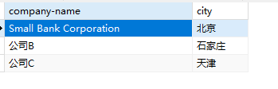
雇员工作信息表：Works
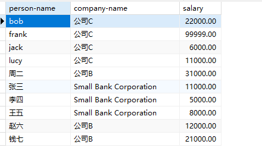
雇员工作关系表：Manages
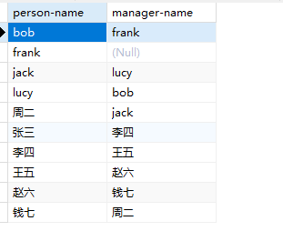

请给出下面每一个查询的SQL语句：

1. 找出所有居住地与工作的公司在同一城市的员工的姓名。
2. 找出比Small Bank Corporation的所有员工收入都高的所有员工的姓名。
3. 找出平均年薪在10000美元以上的公司及其平均年薪。

答案：
```sql
select
    e.`person-name`, e.city
from
    Works w
join
    employee e
on 
    w.`person-name` = e.`person-name`
join
    company c
on
    w.`company-name` = c.`company-name`
where
    e.city = c.city;
```

```sql
-- Small Bank Corporation的最高收入员工
select max(salary) from Works where `company-name`='Small Bank Corporation';
-- 
select
    w.`person-name`
from
    Works w
where
    w.salary > (select max(salary) from Works where `company-name`='Small Bank Corporation');
```

```sql
-- 公司平均年薪
select avg(salary) from Works group by `company-name`;
-- 
select `company-name`,avg(salary) from Works group by `company-name` having avg(salary)>10000;
```

## 第六题

```sql
drop table if exists Client;
create table Client(
    client_id int,
    client_name varchar(255),
    phone varchar(255),
    address varchar(255)
);
insert into Client values(1,'Zhao', 12522542470, '海淀区');
insert into Client values(2,'Wang', 12522542471, '朝阳区');
insert into Client values(3,'Sun', 12522542472, '大兴区');
insert into Client values(4,'Li', 12522542473, '东城区');
select * from Client;

drop table if exists `Order`;
create table `Order`(
    order_id int,
    book_id int
);
insert into `Order` values(11,21);
insert into `Order` values(12,22);
insert into `Order` values(13,23);
insert into `Order` values(14,24);
insert into `Order` values(15,21);
insert into `Order` values(16,22);
insert into `Order` values(17,23);
insert into `Order` values(18,24);
select * from `Order`;

drop table if exists ClientOrder;
create table ClientOrder(
    client_id int,
    order_id int
);
insert into ClientOrder values(1,11);
insert into ClientOrder values(1,12);
insert into ClientOrder values(2,13);
insert into ClientOrder values(2,14);
insert into ClientOrder values(3,15);
insert into ClientOrder values(3,16);
insert into ClientOrder values(4,17);
insert into ClientOrder values(4,18);
select * from ClientOrder;

drop table if exists Book;
create table Book(
    book_id int,
    book_name varchar(255),
    price double(10,2)
);
insert into Book values(21, '管理学', 30);
insert into Book values(22, '计算机网络', 50);
insert into Book values(23, '国家地理杂志', 90);
insert into Book values(24, '西游记', 20);
select * from Book;
```

客户表Client
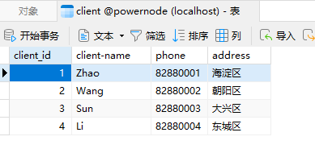
订单表Order

客户订单表ClientOrder

图书表Book


1. 请写出一条SQL语句，查询出每个客户的所有订单并按照地址排序，要求输出格式为：address client_name phone order_id
2. 请写出一条SQL语句，查询出每个客户订购的图书总价。要求输出格式为：client_name total_price
3. 如果要求每个订单可以包含多种图书，应该如何修改Order表的主键？为了保证每个订单只被一个客户拥有，应该在ClientOrder表上增加怎样的约束？

```sql
select
    c.address,c.client_name,c.phone,co.order_id
from
    Client c
join
    ClientOrder co
on
    c.client_id = co.client_id
order by
    c.address;
```

```sql
select
    c.client_name, sum(b.price) total_price
from Client c 
join ClientOrder co on c.client_id = co.client_id
join `Order` o on o.order_id = co.order_id
join Book b on b.book_id = o.book_id
group by c.client_name;
```

```txt
1. `Order`表 把 order_id 和 book_id 联合起来作为符合主键
2. `ClientOrder`表的 order_id 增加 unique
```

## 第七题

```sql
drop table if exists student;
create table student(
    `s#` int,
    sname varchar(255),
    sage int,
    ssex char(1)
);
insert into student values(1,'学生1', 20, '男');
insert into student values(2,'学生2', 20, '男');
insert into student values(3,'学生3', 20, '男');
insert into student values(4,'学生4', 20, '男');
insert into student values(5,'学生5', 20, '女');
select * from student;

drop table if exists course;
create table course(
    `c#` int,
    cname varchar(255),
    `t#` int
);
insert into course values(1,'数学',1);
insert into course values(2,'语文',1);
insert into course values(3,'英语',2);
insert into course values(4,'政治',2);
select * from course;

drop table if exists sc;
create table sc(
    `s#` int,
    `c#` int,
    score int
);
insert into sc values(1,1,65);
insert into sc values(1,2,66);
insert into sc values(1,3,66);
insert into sc values(1,4,69);
insert into sc values(2,1,55);
insert into sc values(2,2,66);
insert into sc values(2,3,75);
insert into sc values(2,4,86);
insert into sc values(3,1,96);
insert into sc values(3,2,99);
insert into sc values(3,3,70);
insert into sc values(3,4,60);
insert into sc values(4,3,65);
insert into sc values(4,4,99);
select * from sc;

drop table if exists teacher;
create table teacher(
    `t#` int,
    tname varchar(255)
);
insert into teacher values(1,'叶平');
insert into teacher values(2,'李白');
select * from teacher;
```

模拟数据：
学生表：student

课程表：course
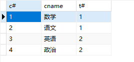
成绩表：sc

教师表：teacher
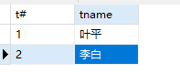

1. 查询1号课比2号课成绩高的所有学生学号。
2. 查询平均成绩大于60分的学号和平均成绩。
3. 查询所有学生学号、姓名、选课数、总成绩。
4. 查询姓“李”的老师的个数。
5. 查询没学过“叶平”老师课的学号、姓名。

答案：
1. 查询1号课比2号课成绩高的所有学生学号。
    ```sql
    select
        sc1.`s#`, sc1.score score1, sc2.score score2
    from
        sc sc1
    join
        sc sc2
    on
        sc1.`s#` = sc2.`s#` and sc1.`c#` = 1 and sc2.`c#` = 2
    where
        sc1.score > sc2.score; 
    ```
2. 查询平均成绩大于60分的学号和平均成绩。
    ```sql
    select
        `s#`, avg(score)
    from
        sc
    group by
        `s#`
    having
        avg(score) > 60;
    ```
3. 查询所有学生学号、姓名、选课数、总成绩。
    ```sql
    select
        s.`s#`, s.sname, count(sc.score) class_num, coalesce(sum(sc.score), 0) score_sum
    from
        student s
    left join -- 保留没选科的学生
        sc
    on
        s.`s#` = sc.`s#`
    group by
        s.`s#`, s.sname;
    ```
4. 查询姓“李”的老师的个数。
    ```sql
    select count(*) from teacher where tname like '李%';
    ```
5. 查询没学过“叶平”老师课的学号、姓名。
```sql
-- 叶平老师id
select `t#` from teacher where tname = '叶平';
-- 叶平老师的课id
select `c#` from course join teacher on course.`t#`=teacher.`t#` where teacher.tname = '叶平';
-- 选了这些课的人id
select distinct `s#` from sc where `c#` in (select `c#` from course join teacher on course.`t#`=teacher.`t#` where teacher.tname = '叶平');
-- 其他人的id
select
    `s#`, sname
from
    student
where
    `s#` not in (select distinct `s#` from sc where `c#` in (select `c#` from course join teacher on course.`t#`=teacher.`t#` where teacher.tname = '叶平'));
```

## 第八题

```sql
drop table if exists student;
create table student(
s_id int,
sname varchar(255)
);
insert into student values(1,'学生1');
insert into student values(2,'学生2');
insert into student values(3,'学生3');
insert into student values(4,'学生4');
select * from student;

drop table if exists `class`;
create table `class`(
c_id varchar(255),
c_name varchar(255)
);
insert into `class` values('C1', 'java');
insert into `class` values('C2', 'oracle');
insert into `class` values('C3', 'mysql');
select * from `class`;

drop table if exists chosen_class;
create table chosen_class(
id int,
s_id int,
c_id varchar(255),
grade int
);
insert into chosen_class values(1,1,'C1', 66);
insert into chosen_class values(2,2,'C1', 77);
insert into chosen_class values(3,3,'C2', 88);
insert into chosen_class values(4,3,'C3', 99);
insert into chosen_class values(5,3,'C1', 22);
insert into chosen_class values(7,4,'C2', 33);
insert into chosen_class values(8,4,'C3', 56);
select * from chosen_class;
```

学生表：student

课程表：class

选课表：chosen_class
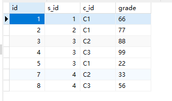

1. 没有选修课程编号为C1的学生姓名
2. 列出每门课程名称和平均成绩，并按照成绩排序
3. 选了2门课以上的学生姓名。

答案
1. 没有选修课程编号为C1的学生姓名
    ```sql
    -- 选了c1的学生id
    select distinct s_id from chosen_class where c_id = 'C1';
    -- 其他id的姓名
    select sname from student where s_id not in (select distinct s_id from chosen_class where c_id = 'C1');
    ```
2. 列出每门课程名称和平均成绩，并按照成绩排序
    ```sql
    select
        c.c_name, avg(cc.grade)
    from 
        class c
    join
        chosen_class cc
    on
        c.c_id = cc.c_id
    group by
        c.c_id, c.c_name
    order by
        avg(cc.grade) desc;
    ```
3. 选了2门课以上的学生姓名。
```sql
-- 两门课以上的学生id
select s_id from chosen_class group by s_id having count(*) > 2;
-- 这些id的学生姓名
select
    s.sname
from
    (select s_id from chosen_class group by s_id having count(*) > 2) t
join
    student s
on
    t.s_id = s.s_id;
```

## 第九题

```sql
drop table if exists t_temp;
create table t_temp(
year int,
season varchar(255),
count int
);
insert into t_temp values(2010,'一季度',100);
insert into t_temp values(2010,'二季度',200);
insert into t_temp values(2010,'三季度',300);
insert into t_temp values(2010,'四季度',400);
insert into t_temp values(2011,'一季度',150);
insert into t_temp values(2011,'二季度',250);
insert into t_temp values(2011,'三季度',350);
insert into t_temp values(2011,'四季度',450);
select * from t_temp;
```


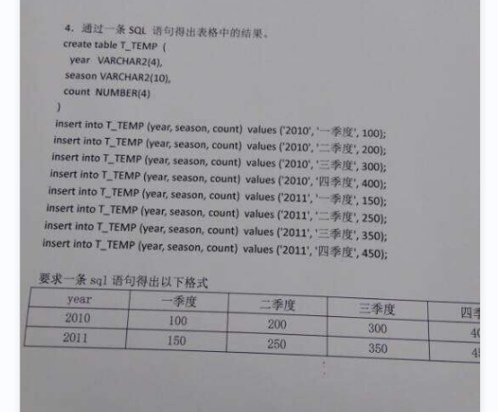
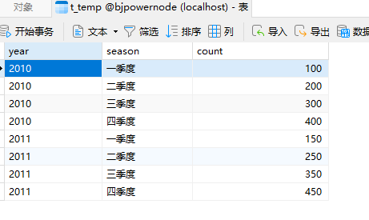
要转换成：
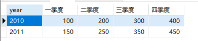

答案：这个是行转列的问题
```sql
select
    year,
    max(case season when '一季度' then count else 0 end) as '一季度',
    max(case season when '二季度' then count else 0 end) as '二季度',
    max(case season when '三季度' then count else 0 end) as '三季度',
    max(case season when '四季度' then count else 0 end) as '四季度'
from
    t_temp
group by
    year;
```

## 第十题

 参考：[window](window.md)

```sql
drop table if exists t;
create table t(
A int
);
insert into t values(1);
insert into t values(2);
insert into t values(3);
insert into t values(5);
insert into t values(6);
insert into t values(7);
insert into t values(8);
insert into t values(10);
select * from t;
```


```sql
select 
    x.a 开始数字, y.a 结束数字
from 
    (select m.a,row_number() over(order by m.a) as rownum from (select a, lag(a) over(order by a asc) as pre_a from t) m where m.a - m.pre_a != 1 or m.pre_a is null) x 
join 
    (select n.a,row_number() over(order by n.a) as rownum from (select a, lead(a) over(order by a asc) as next_a from t) n where n.next_a - n.a != 1 or n.next_a is null) y 
on 
    x.rownum = y.rownum;
```


## MySQL行转列

MySQL行转列又叫做**数据透视**。什么叫做行转列？将原本横向排列的数据透视成纵向排列的数据，进而进行计算、分析、展示等操作。

假设有一个学生选课成绩表，包含学生姓名（stu_name）、课程名称（course_name）和分数（score）三个字段。在原始数据中，每个学生在不同的课程中都有自己的得分情况，数据样例如下：

| stu_name | course_name | score |
| --- | --- | --- |
| 张三 | 数学 | 80 |
| 张三 | 英语 | 85 |
| 张三 | 历史 | 90 |
| 李四 | 数学 | 75 |
| 李四 | 英语 | 92 |
| 李四 | 历史 | 85 |
| 王五 | 数学 | 88 |
| 王五 | 英语 | 90 |
| 王五 | 历史 | 95 |

可以使用行转列操作，将每个学生在不同课程中的分数拆分成多条记录，每条记录包含一个课程以及对应的分数。转换后的数据样例如下：

| stu_name | 数学 | 英语 | 历史 |
| --- | --- | --- | --- |
| 张三 | 80 | 85 | 90 |
| 李四 | 75 | 92 | 85 |
| 王五 | 88 | 90 | 95 |

从上表中可以看出，在行转列之后，每一行记录都表示了一个学生在不同课程中的分数。这样更便于对不同科目的分数进行比较、计算平均值等分析操作。

使用case when+group by完成

```sql
drop table if exists t_student;
create table t_student(
  stu_name varchar(10),
  course_name varchar(10),
  score int
);
insert into t_student(stu_name, course_name, score) values('张三', '数学', 80);
insert into t_student(stu_name, course_name, score) values('张三', '英语', 85);
insert into t_student(stu_name, course_name, score) values('张三', '历史', 90);
insert into t_student(stu_name, course_name, score) values('李四', '数学', 75);
insert into t_student(stu_name, course_name, score) values('李四', '英语', 92);
insert into t_student(stu_name, course_name, score) values('李四', '历史', 85);
insert into t_student(stu_name, course_name, score) values('王五', '数学', 88);
insert into t_student(stu_name, course_name, score) values('王五', '英语', 90);
insert into t_student(stu_name, course_name, score) values('王五', '历史', 95);
commit;
select * from t_student;
```
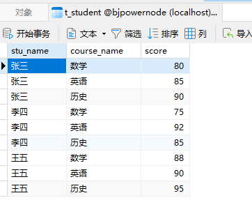
行转列后的效果是：
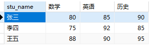
sql如下：
```sql
select
    stu_name,
    max(case course_name when '数学' then score else 0 end) as '数学',
    max(case course_name when '英语' then score else 0 end) as '英语', 
    max(case course_name when '历史' then score else 0 end) as '历史' 
from 
    t_student
group by 
    stu_name;
```

