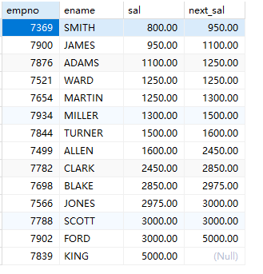
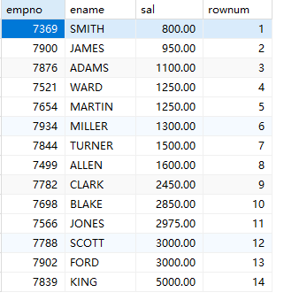
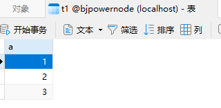
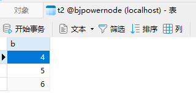
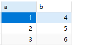
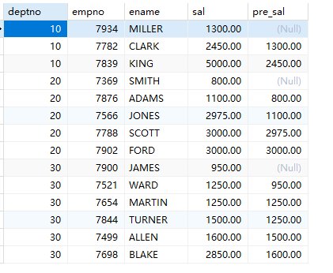

# 窗口函数

MySQL 8.0及以上版本中支持如下常用的窗口函数：

1. `ROW_NUMBER()`：排名函数，返回当前结果集中每个行的行号；
2. `RANK()`：排名函数，计算分组结果中的排名，相同的行排名相同且没有空缺，下一个行排名跳过空缺；
3. `DENSE_RANK()`：排名函数，计算分组结果中的排名，相同的行排名相同，排名连续，没有空缺；
4. `NTILE()`：将分组结果等分为指定的组数，计算每组的大小；
5. `LAG()`：返回分组内前一行的值；
6. `LEAD()`：返回分组内后一行的值；
7. `FIRST_VALUE()`：返回分组内第一个值；
8. `LAST_VALUE()`：返回分组内最后一个值；
9. `AVG()`、`SUM()`、`COUNT()`、`MIN()`、`MAX()`：聚合函数，可以配合`OVER()`进行窗口操作。

**lag函数**：获取当前行的上一行数据
```sql
select empno,ename,sal,(lag(sal) over(order by sal asc)) as pre_sal from emp;
```

注意：over函数用来指定“在.....范围内”，通常和lag函数联用。

**lead函数**：获取当前行的下一行数据
```sql
select empno,ename,sal,(lead(sal) over(order by sal asc)) as next_sal from emp;
```

注意：over函数用来指定“在.....范围内”，通常和lead函数联用。

**row_number函数**：可以为查询结果集生成行号：
```sql
select empno,ename,sal,row_number() over(order by sal) as rownum from emp;
```


利用row_number函数，将两个不相关的列拼接在一起显示：


```sql
select 
    x.a, y.b 
from 
    (select a,row_number() over(order by a) as rownum from t1) x 
join 
    (select b,row_number() over(order by b) as rownum from t2) y 
on 
    x.rownum = y.rownum;
```


CTE语法（公用表表达式）：Common Table Expression。创建临时表的一种语法：
```sql
-- 查询每个部门平均工资的工资等级
-- 第一种写法
select 
    t.deptno,t.avgsal,s.grade 
from 
    (select deptno,avg(sal) as avgsal from emp group by deptno) t 
join 
    salgrade s 
on 
    t.avgsal between s.losal and s.hisal;

-- 第二种写法：使用CTE语法
with cte_exp as(select deptno,avg(sal) as avgsal from emp group by deptno)
select 
    cte_exp.deptno,cte_exp.avgsal,s.grade
from
    cte_exp
join
    salgrade s
on
    cte_exp.avgsal between s.losal and s.hisal;
```

partition by：将数据分区，和group by区别是：group by是分组，然后和分组函数一起用。partition by分区不需要和分组函数一起使用
```sql
select deptno, empno,ename,sal,(lag(sal) over(partition by deptno order by sal asc)) as pre_sal from emp;
```


需要注意的是，MySQL的窗口函数和其他DBMS中的窗口函数相比较，可能略有不同，需要根据MySQL的文档进行使用。 
