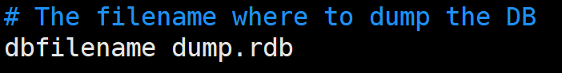
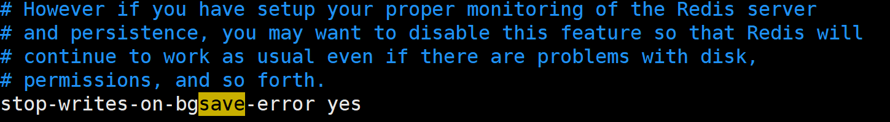
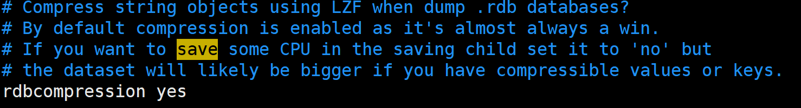
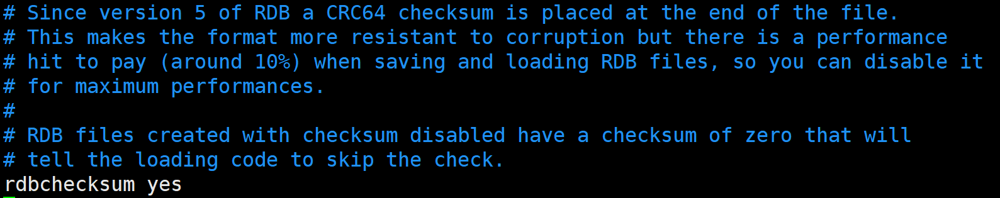
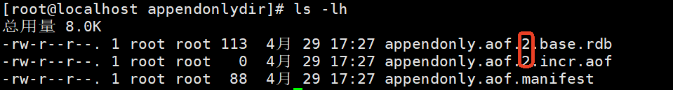

# Redis的持久化


Redis提供了两种持久化：

1. 第一种：RDB（Redis DataBase）,默认情况下这种方式就是启动的。(全量备份)
2. 第二种：AOF（Append Only File），默认情况下这种方式不开启。（增量备份）

---
## RDB

### 什么是RDB？

在指定的**时间间隔**内将内存中的**数据集快照**写入磁盘。恢复数据时会将当时的快照文件直接导入到内存中。

+ 时间间隔：例如每隔1小时，每隔5分钟，每隔1分钟等。
+ 数据集快照：当前时间点下的Redis缓存中的数据。(保存时新改变的内容会被忽略)

1. RDB以二进制的格式存储数据。
2. 文件名默认：dump.rdb（可配置）
3. 文件存放目录默认和`redis-server`在同级目录下。（可配置）
4. 我的docker的redis也可以看到dump.rdb
    ```shell
    D:\project\PKM>docker exec -it iia-redis /bin/sh
    /data # ls
    dump.rdb
    ```

### 触发 RDB 快照

* 手动触发：使用 `redis-cli SAVE` 命令或 `redis-cli BGSAVE` 命令。
    + `redis-cli SAVE` 会阻塞服务器直到 RDB 文件创建完毕
    + `redis-cli BGSAVE` 会创建一个**子进程**（不是线程）来处理 RDB 文件的创建，不会阻塞服务器。
+ 自动触发
    + 在`redis.conf`文件中进行如下配置，方可开启自动触发。例如，可以配置在满足一定条件下（如**多少秒**内有**多少次写**操作，两个条件）自动执行 BGSAVE。
    ```nginx
    save 3600 1      # 在1小时内至少有1次写操作，则执行BGSAVE
    save 300 100     # 在5分钟内至少有100次写操作，则执行BGSAVE
    save 60 10000    # 在1分钟内至少有10000次写操作，则执行BGSAVE
    # 以上的配置是Redis7的默认配置。
    ```
    * 查看当前的配置情况
    ```shell
    redis-cli CONFIG GET save
    ```
* 自动触发逻辑：（假设配置信息`save 30 3`）
    1. 从用户的第一次`写操作`开始计时，并记录写的次数为1。
    2. Redis 内部有一个周期性任务（默认每 100 毫秒检查一次）。
    3. 检查内容：当 `计时器 >= 30秒 并且 写的次数 >= 3`条件成立时，则触发RDB快照。
    4. 底层只要开始执行 `BGSAVE`命令，计时器就立即进入下一个计时周期。（**注意：不会等 BGSAVE 执行结束后才进入下一个计时周期**）
    5. 当下一个计时周期达到，并且满足写的次数，会再次执行 `BGSAVE`保存。（**小细节：如果上一次的 BGSAVE 执行比较耗时，超过了下一个计时周期，那么新的执行周期对应的 BGSAVE 会延迟执行**）

### RDB备份的执行过程

当执行`BGSAVE`命令时，redis会单独`fork`一个子进程（**fork可以理解为复刻/复制一个和主进程完全一样的进程，这表示主进程不进行任何IO操作，确保redis极高性能**），该进程会将当下redis内存中的数据写入到一个**临时文件**中，当内存中的数据全部同步到临时文件后，临时文件再替换上一次的`dump.rdb`。

为什么要用临时文件？而不是直接写入dump.rdb文件？

| **方式** | **直接写入dump.rdb** | **临时文件 + 原子替换** |
| --- | --- | --- |
| **崩溃一致性** | 可能生成部分损坏的 RDB 文件 | 旧文件始终完整，新文件全量校验 |
| **并发安全** | 其他进程可能读取到不完整文件 | 替换是原子操作，无中间状态 |
| **实现复杂度** | 需额外逻辑处理中断恢复 | 简单可靠 |

另外大家再思考一个问题：上述描述中提到子进程会将内存中的数据写入到一个临时文件中，那如果在写到临时文件的过程中**主进程又进行了写操作**，内存中的数据又变化了，子进程会把变化后的数据写入到临时文件中吗？不会的。永远要记住，RDB备份的是内存快照，备份的是某一个时刻的内存数据。快照是如何实现的呢？**底层使用了写时复制技术（著名的COW技术：Copy On Write）**。


**写时复制技术原理**

1. fork() 机制：
+ 当触发 RDB 持久化时，Redis 主进程会调用 fork() 创建一个子进程。子进程与父进程共享相同的内存数据（物理内存页）
2. 写操作触发复制（写时复制）：
+ 读操作：父子进程继续共享内存页。
+ 写操作：当父进程修改某块数据时，**操作系统****复制该内存页****，主进程修改副本，子进程仍读原页（****这里的原页可以理解为内存快照****）**。


**COW 的一个形象的比喻：**

```plain
📚 实体书 = 物理内存
📇 借书卡A = 主进程的页表
📇 借书卡B = 子进程的页表（fork产生）
👤 我 = Redis主进程（处理写请求）
👥 哥们 = Redis子进程（负责备份）

✅ 动作：
1. 我要改书（主进程SET）
2. 不能直接改实体书（因为哥们看着）
3. 复印我改的那一页（COW复制内存页）
4. 我改复印页（主进程写入新副本）
5. 哥们继续看原页（子进程保持原数据）
```

### RDB备份之后的数据如何恢复
redis服务在启动之后，自动去找`redis.conf`配置文件中配置的`dump.rdb`文件，自动恢复数据到内存中。

### RDB缺点
1. **数据丢失风险**  
    - 最后一次快照之后的数据可能丢失（因故障宕机时，未到达下一次持久化时间点的数据会永久消失）
2. **性能影响**  
    - 生成快照时会 fork 子进程，数据集过大时可能导致 Redis 服务短暂阻塞
3. **实时性不足**  
    - 仅支持定时持久化，无法像 AOF 那样实现秒级数据安全
4. **版本兼容性问题**  
    - 老版本 Redis 生成的 RDB 文件可能无法兼容新版本
5. **存储空间不灵活**  
    - **全量备份**机制下，单个 RDB 文件体积较大（相比 **AOF 的增量**日志）

### RDB的相关配置
在`redis.conf`中搜索`SNAPSHOTTING`：


设置RDB备份规则：


以上英文翻译为：你可以通过取消以下行的注释来显式设置这些参数


设置文件名：




设置存储目录：


设置备份失败是否停止写入：默认是yes，表示RDB备份失败后，redis的set、hset、lpush等写操作将无法使用。但读取命令仍然可用。



设置是否压缩rdb文件：默认yes



当配置 rdbcompression yes（默认开启）时，Redis 在生成 RDB 快照文件（如 dump.rdb）时会对数据进行二进制压缩，显著减少磁盘占用。

Redis 使用 LZF 压缩算法（一种轻量级实时压缩算法）。修改算法的话就需要修改Redis的源码。

设置是否校验RDB文件的完整性：默认是yes



当配置 rdbchecksum yes（默认开启）时，Redis 会在 RDB 文件末尾 写入一个 CRC64 校验和（8字节）。

主要用于在 加载 RDB 文件时验证数据完整性，防止因磁盘损坏、传输错误或文件篡改导致的数据异常。

**以下是生产环境下的建议配置：**

|**参数**​|**推荐值**​|**说明**​|
|---|---|---|
|`save`|`save 900 1`  <br>`save 300 10`  <br>`save 60 10000`|**多级备份规则**：  <br>+ 15分钟1次修改 → 备份  <br>+ 5分钟10次修改 → 备份  <br>+ 1分钟1万次修改 → 备份|
|`stop-writes-on-bgsave-error`|`yes`|**备份失败时拒绝写入**，避免数据不一致（需配合监控）。|
|`rdbcompression`|`yes`|**启用压缩**（LZF算法），减少磁盘占用（CPU换空间）。|
|`rdbchecksum`|`yes`|**启用CRC64校验**，防止损坏的RDB文件被加载。|
|`dbfilename`|`dump-${port}.rdb`|**按端口命名文件**（多实例部署时避免冲突）。|
|`dir`|`/data/redis/rdb`|**指定备份目录**：  <br>+ 使用独立磁盘分区  <br>+ 避免与AOF日志混存|

### RDB选择建议

如果需要快速恢复大数据集，并且对数据恢复的完整性不是非常敏感，可以选择RDB方式。
为什么这种方式恢复的快？因为这种方式生成的dump.rdb文件是一个紧凑的二进制文件

---
## AOF

### 什么是AOF

AOF（Append-Only File）以日志的形式来记录每个写操作，将Redis执行过的所有**<font style="color:#DF2A3F;">写指令</font>**记录下来，读操作不记录，只许以追加的方式写入aof文件。（AOF文件中记录的时候以普通文本形式记录，将所有的写的操作命令记录到日志文件中。）

Redis启动时，会读取aof文件，然后将aof文件中的所有指令全部执行一次，以完成数据的恢复。

AOF支持秒级实时同步，但文件体积较大，恢复速度慢于RDB。（因为AOF文件是普通文本文件，不是二进制文件，另外也需要让所有的指令从头到尾执行一遍，因此恢复较慢。）

### 开启AOF功能
默认情况下AOF是不开启的。

修改配置来开启AOF：

```nginx
appendonly yes
```


### AOF文件名及存储目录
**Redis7之前**只有以下这一项配置，设置文件名：

```nginx
appendfilename "appendonly.aof"
```

会在redis的`/usr/local/bin`目录下生成`appendonly.aof`文件。

**Redis7之后**有以下两项配置：

第一项配置：设置文件名，这一项配置在redis7+之后不起作用。依然保留的原因是为了兼容旧版本。

```nginx
appendfilename "appendonly.aof"
```

第二项配置：设置存储目录，这是Redis7的新特性，新增的配置。

```nginx
appenddirname "appendonlydir"
```

会在redis的`/usr/local/bin`目录下新建`appendonlydir`目录，在该目录下存储以下三类文件：

+ xxx.base.rdb
+ xxx.incr.aof
+ xxx.manifest

### base.rdb、incr.aof、manifest文件

在高版本 Redis（7.0+）中，`appenddirname "appendonlydir"` 表示 **AOF 文件的存储目录**，但文件结构与传统 AOF 不同，采用了**多文件混合持久化**设计。以下是对**AOF 分段存储机制**的具体解释：

#### 文件作用说明
| 文件名 | 类型 | 作用 |
| --- | --- | --- |
| `appendonly.aof.1.base.rdb` | **RDB 文件** | 全量数据快照（AOF 重写时生成，二进制压缩格式，体积小，恢复速度快） |
| `appendonly.aof.1.incr.aof` | **AOF 文件** | 增量写命令（记录 `base.rdb` 后的新操作，文本格式，实时性强） |
| `appendonly.aof.manifest` | **清单文件** | 记录当前有效的 `base.rdb` 和 `incr.aof` 组合（JSON 格式，维护文件关系） |


#### 设计原理（Redis 7.0+）
+ **混合持久化**：  
    - **<font style="color:rgb(15, 17, 21);">混合持久化</font>**<font style="color:rgb(15, 17, 21);">就是</font>**<font style="color:rgb(15, 17, 21);">用RDB格式存“老数据”快照（base.rdb），用AOF格式存“新变动”日志（incr.aof），重启时先读快照再补日志，实现又快又全的恢复</font>**<font style="color:rgb(15, 17, 21);">。</font>
+ **分段滚动更新**：  
    - <font style="color:rgb(15, 17, 21);">“分段”体现在将完整数据</font>**<font style="color:rgb(15, 17, 21);">拆成基础快照(base.rdb)和增量日志(incr.aof)两个文件</font>**<font style="color:rgb(15, 17, 21);">；</font>
    - <font style="color:rgb(15, 17, 21);">“滚动”体现在通过</font>**<font style="color:rgb(15, 17, 21);">原子切换清单(manifest)</font>**<font style="color:rgb(15, 17, 21);">来版本升级，像翻书一样无感更替。</font>

#### 文件生成逻辑

1. **首次启用 AOF**：  
    - 生成 `base.rdb`（全量数据） + 空的 `incr.aof`。
2. **写入新命令**：  
    - 增量操作追加到 `incr.aof`（如 `SET`/`DEL`）。
3. **触发 AOF 重写**：  
    - 创建新的 `base.rdb`（当前数据快照）和新的 `incr.aof`，更新 `manifest`。

****

#### 生产环境建议

+ **不要手动删除文件**：依赖 Redis 自动管理（通过 `manifest` 维护）。  
+ **备份策略**：同时备份 `appendonlydir/` 整个目录（需包含 `manifest` 文件）。

****

#### 与传统 AOF 的对比
| **特性** | **旧版 AOF（单文件）** | **Redis 7.0+ AOF（多文件）** |
| --- | --- | --- |
| **文件结构** | 单一 `.aof` 文本文件 | `base.rdb` + `incr.aof` + `manifest` |
| **恢复速度** | 慢（需重放所有命令） | 快（优先加载 `base.rdb`） |
| **磁盘占用** | 较大（纯文本） | 更小（RDB 压缩 + 增量 AOF） |
| **兼容性** | 所有版本 | Redis 7.0+ |


### 怎么触发AOF？

在 Redis 7 及更高版本中，**AOF（Append-Only File）持久化的触发方式**分为 **自动触发** 和 **手动触发** 两种，以下是详细说明：

#### 手动触发
手动执行这个命令：redis-cli BGREWRITEAOF


执行该命令后，查看文件是否更新：



#### 自动触发
1. **<font style="color:#DF2A3F;"></font>****实时写入（默认开启）**

+ 每个写命令（如 `SET`、`DEL`）会立即追加到 **增量 AOF 文件**（`appendonly.aof.?.incr.aof`），由 `appendfsync` 控制刷盘策略：

```nginx
appendfsync always   # 每个命令刷盘（最安全，性能最低）
appendfsync everysec # 每秒刷盘（默认推荐）
appendfsync no       # 依赖操作系统刷盘（最快，可能丢数据）
```

2. **AOF 重写（满足条件时自动触发）**

+ **触发条件**：  
    - 根据 `auto-aof-rewrite-percentage` 和 `auto-aof-rewrite-min-size` 参数判断：  **两个是并且关系，同时满足时才会触发 AOF 重写。**

```nginx
auto-aof-rewrite-percentage 100  # 当前AOF文件比上次重写后增长100%时触发
auto-aof-rewrite-min-size 64mb   # AOF文件最小达到64MB才触发
```

+ **重写过程**：  
    1. 创建子进程，生成 **全量数据的 RDB 快照**（写入 `appendonly.aof.1.base.rdb`）。  
    2. 后续增量命令写入新的 `incr.aof` 文件。  
    3. 更新 `manifest` 文件记录有效文件组合。

#### 总结
Redis 7+ 的 AOF 触发机制通过**实时追加 + 条件化重写** 实现，结合 RDB 快照提升性能。多文件设计解决了传统 AOF 体积过大和恢复慢的问题，同时保持数据安全性。

### RDB和AOF同时开启会怎样
在 Redis 7 及更高版本中，**当 RDB 和 AOF 持久化同时开启时，Redis 会同时维护两种持久化机制**，但它们的用途和触发逻辑是独立的，具体行为如下：

#### 同时开启时的关键行为
**(1) 数据写入流程**

+ **AOF 优先**：所有写命令会**实时追加到 AOF 文件**（`incr.aof`），确保操作日志不丢失。  
+ **RDB 异步触发**：根据 `save` 配置或手动命令生成快照，**不影响 AOF 的实时记录**。

**(2) 数据恢复流程**

+ **重启加载时**：Redis 会**优先加载 AOF 文件**（因为 AOF 记录更完整），仅当 AOF 关闭或文件不存在时才会加载 RDB。  

#### 注意事项
+ **磁盘空间**：同时开启会占用更多存储（需监控 `dir` 目录）。  
+ **性能影响**：RDB 的 `BGSAVE` 和 AOF 的 `BGREWRITEAOF` **不会同时运行**（Redis 内部有任务调度机制）。

#### 如何验证当前持久化状态？
```bash
# 检查 RDB 最后一次保存时间
redis-cli INFO PERSISTENCE | grep rdb_last_save_time

# 检查 AOF 是否生效
redis-cli INFO PERSISTENCE | grep aof_enabled

# 查看 AOF 文件类型（Redis 7+）
# ls -lh 这里的linux命令中带了 -h 参数，这样文件大小显示更加人性化。这个参数和redis没有关系。
ls -lh /usr/local/bin/appendonlydir/
```

#### 总结
**在 Redis 7+ 中，RDB 和 AOF 同时开启时会并行工作，但 AOF 在数据恢复时优先级更高。推荐生产环境同时启用两者，利用 RDB 的快照优势和 AOF 的实时安全性，通过 **`aof-use-rdb-preamble`** 进一步优化性能。**

### AOF的所有建议配置
以下是 Redis 7 中 AOF（Append Only File）持久化相关配置的整理，并附上生产环境建议配置：

| **配置项** | **白话描述** | **生产环境建议** |
| --- | --- | --- |
| `appendonly` | 是否开启 AOF 持久化，默认不开启（RDB是默认的）。 | 如果需要高数据安全性，建议设为 `yes`。 |
| `appendfilename` | AOF 文件的名称，默认是 `appendonly.aof`。 | 通常不用改，保持默认即可。 |
| `appendfsync` | 控制 AOF 文件同步到磁盘的频率：   - `no`：让操作系统决定何时同步（最快但最不安全）。   - `everysec`：每秒同步一次（折中方案，默认值）。   - `always`：每次写命令都同步（最安全但最慢）。 | 推荐 `everysec`，兼顾性能和数据安全。如果对数据一致性要求极高（如金融场景），可以用 `always`，但性能会下降。 |
| `no-appendfsync-on-rewrite` | AOF 重写时是否禁止 `fsync`（同步到磁盘），默认 `no`（允许同步）。如果设为 `yes`，重写期间可能丢失数据，但能减轻磁盘 I/O 压力。 | 如果对数据丢失有一定容忍度（如缓存场景），可以设为 `yes` 提升性能。否则保持 `no`。 |
| `auto-aof-rewrite-percentage` | AOF 文件比上次重写后增长多少百分比时触发重写（默认 `100%`，即翻倍）。 | 保持默认即可，或根据磁盘空间调整（如设为 `80%` 更频繁重写）。 |
| `auto-aof-rewrite-min-size` | AOF 文件至少达到多大才会触发重写（默认 `64MB`）。 | 生产环境建议调大（如 `1GB`），避免频繁重写小文件。 |
| `aof-load-truncated` | 如果 AOF 文件末尾损坏（比如服务器突然崩溃），是否加载截断的文件（默认 `yes`）。 | 保持 `yes`，至少能恢复大部分数据。如果对完整性要求极高，可以设为 `no` 并配合人工修复。 |
| `aof-use-rdb-preamble` | 是否启用混合模式。默认值 yes（这就是我们上面所说的新特性） | 强烈建议保持 `yes`，兼顾速度和可读性。 |
| `aof-rewrite-incremental-fsync` | AOF 重写时是否分批同步数据到磁盘（默认 `yes`），避免单次 `fsync` 卡顿。 | 保持 `yes`，减少对主线程的影响。 |
