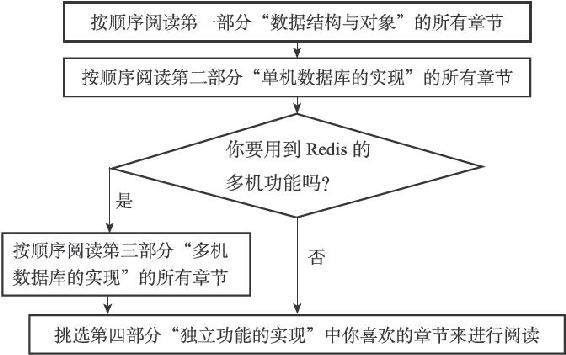

1.3 推荐的阅读方法

因为Redis的单机功能是多机功能的子集，所以无论读者使用的是单机模式的Redis，还是多机模式的Redis，都应该阅读本书的第一部分和第二部分，这两个部分包含的知识是所有Redis使用者都必然会用到的。

如果读者要使用Redis的多机功能，那么在阅读本书的第一部分和第二部分之后，应该接着阅读本书的第三部分。如果读者只使用Redis的单机功能，那么可以跳过第三部分，直接阅读第四部分。

本书的前三个部分都是以自底向上（bottom-up）的方式来写的，也就是说，排在后面的章节会假设读者已经读过了排在前面的章节。如果一个概念在前面的章节已经介绍过，那么后面的章节就不会再重复介绍这个概念，所以读者最好按顺序阅读这三部分的各个章节。

本书的第四部分包含的各章是完全独立的，读者可以按自己的兴趣来挑选要读的章节。在本书的第四部分中，除了第20章的其中一节涉及多机功能的内容之外，其他章节都没有涉及多机功能的内容，所以第四部分的大部分章节都可以在只阅读了本书第一部分和第二部分的情况下阅读。

图1-1对上面描述的阅读方法进行了总结。

图1-1 推荐阅读方法
